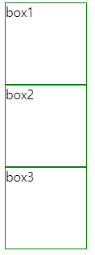
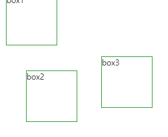
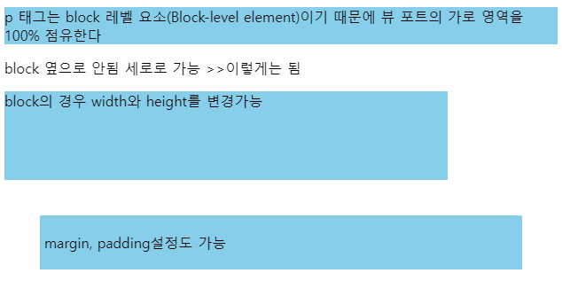

## 2022-11-11-webStudy[2일차]

## 목차

## 01.CSS 속성 공부

### 01.1 Position

- Position은 이름 그대로 위치를 결정하는 속성
  - 요소의 위치를 어떤 기준으로,
    - 어디에 배치시킬 것인지 표현 할 수 있음
- Position의 Value
  - static: 초기값, 기준 위치를 설정하지 않음
  - relative: 현재 위치를 기준으로 상대위치를 지정
  - absolute:  부모 위치를 기준으로 절대 위치를 지정
  - fixed: 윈도우(브라우저 창)를 기준으로 절대 위치를 지정하여 요소를 그 위치에 고정
  - sticky: 지정된 위치에 뷰포트가 도달했을 때,
    - 요소가 그 위치에 고정됨

#### 01.1.1 실습

#### html

```html
/*index.html*/
<!DOCTYPE html>
<html>
  <head>
    <title>Title</title>
    <meta charset="UTF-8" />
    <link rel="stylesheet" href="index.css" />
  </head>

  <body>
    <div class="box one">box1</div>
    <div class="box two">box2</div>
    <div class="box three">box3</div>
  </body>
</html>
```

#### static

```css
.box {
    position: static;
    width: 100px;
    height: 100px;
    border: 1px solid green;
  }
  .box.one {

    right: 10px;
  }
  .box.two {
    /* box의 position 값이 static이기 때문에,
    실제로는 bottom 값이 적용되지 않음 */
    bottom: 20px;
  }
  .box.three {
    /* box의 position 값이 static이기 때문에,
    실제로는 top 값이 적용되지 않음 */
    top: 50px;
  }
```

- static의 경우

  - position의 기본값,  position을 지정하지 않아도 기본적으로 적용 
  - top, left, bottom, right, z-index를 지정해도 위치 변경 안됨

  

####  relative

```css
.box {
    position: relative;
    width: 100px;
    height: 100px;
    border: 1px solid green;
  }
  .box.one {
    right: -10px;
    bottom: 20px;
  }
  .box.two {
    top: 30px;
    left: 50px;
  }
  .box.three {
    bottom: 100px;
    left: 200px;
  }
```




- relative의 경우
  - top, left, bottom, right의 지정이 가능
  - zindex의 지정 가능
  - relative의 기준점은 자기 자신이 원래 배치되었던 위치
  - absolute의 기준 위치가됨

#### absolute

- html

  ```html
  <!DOCTYPE html>
  <html>
    <head>
      <title>Title</title>
      <meta charset="UTF-8" />
      <link rel="stylesheet" href="index.css" />
    </head>
  
    <body>
      <div class="parent">
          <div class="box one">box1</div>
          <div class="box two">box2</div>
          <div class="box three">box3</div>
      </div>
    </body>
  </html>
  
  ```

- css

  ```css
  .parents{
    position: relative;
    width: 400px;
    height: 400px;
    background: skyblue ;
  }
  
  .box {
      position: absolute;
      width: 100px;
      height: 100px;
      border: 1px solid green;
    }
    .box.one {
      right:  20px;
      bottom: 10px;
    }
    .box.two {
      top: 30px;
      left: 50px;
    }
    .box.three {
      bottom: 100px;
      left: 200px;
    }
  ```

- absolute의 경우
  - relative나 fixed가 지정된 부모 위치를 기준으로 자신의 위치를 지정
  - div.parents가 box들의 부모
    - 부모인 parents에 position: relative를 지정한 수 
    - parents의 자식 요소인 box들에게 absolute를 설정
  - top, left, bottom, right등에 구체적인 위치 조절

#### fixed

- 브라우저 화면(윈도우)을 기준으로 요소를 정해진 위치에 고정 시킬 수 있음

- html

  ```html
  /*html*/
  <!DOCTYPE html>
  <html lang="en">
      <head>
          <meta charset="UTF-8">
          <meta http-equiv="X-UA-Compatible" content="IE=edge">
          <meta name="viewport" content="width=device-width, initial-scale=1.0">
          <title>fixed</title>
          <link rel="stylesheet" href="index.css" />
        </head>
  <body>
      <h1 id="title">스크롤 끝까지 내려보세요.</h1>
      <p>스크롤 내리기</p>
      <p>스크롤 내리기</p>
      <p>스크롤 내리기</p>
      <p>스크롤 내리기</p>
      <p>스크롤 내리기</p>
      <p>스크롤 내리기</p>
      <p>스크롤 내리기</p>
      <p>스크롤 내리기</p>
      <p>스크롤 내리기</p>
      <p>스크롤 내리기</p>
      <p>스크롤 내리기</p>
      <p>스크롤 내리기</p>
      <p>스크롤 내리기</p>
      <p>스크롤 내리기</p>
      <p>스크롤 내리기</p>
      <p>스크롤 내리기</p>
      <p>스크롤 내리기</p>
      <p>스크롤 내리기</p>
      <p>스크롤 내리기</p>
      <p>스크롤 내리기</p>
      <p>스크롤 내리기</p>
      <p>스크롤 내리기</p>
      <p>스크롤 내리기</p>
      <p>스크롤 내리기 하더라도 ️⬆은 고정</p>
      <p>스크롤 내리기</p>
      <p>스크롤 내리기</p>
      <p>스크롤 내리기</p>
      <p>스크롤 내리기</p>
      <p>스크롤 내리기</p>
      <p>스크롤 내리기</p>
      <p>스크롤 내리기</p>
      <p>스크롤 내리기</p>
      <p>스크롤 내리기</p>
      <p>스크롤 내리기</p>
      <p>스크롤 내리기</p>
      <p>스크롤 내리기</p>
      <p>스크롤 내리기</p>
      <p>스크롤 내리기</p>
      <p>스크롤 내리기</p>
      <p>스크롤 내리기</p>
      <a class="btn-top" href="#title">⬆️</a>
  </body>
  </html>
  ```

- css

  ```css
  body{
      height: 1000px;
  }
  
  a{
      text-decoration: none;
  }
  
  .btn-top{
      position: fixed;
      width: 30px;
      height: 30px;
      right: 20px;
      bottom: 60px;
      border-radius:50%;
      text-align: center;
      line-height: 2.1;
      background: black;
  }
  ```


- fixed의 경우
  - 브라우저 화면 전체가 기준점
  - 스크롤을 해도 요소가 지정된 위치에 계속 고정
  - top, left, bottom, right, z-index 지정이 가능

####  sticky

- 요소가 지정된 기준점(top, left, bottom, right 등으로 설정해둔 위치)에 도달 했을 때, 
  - 그 기준점에 요소를 고정

- html

  ```html
  <!DOCTYPE html>
  <html lang="en">
      <head>
          <meta charset="UTF-8">
          <meta http-equiv="X-UA-Compatible" content="IE=edge">
          <meta name="viewport" content="width=device-width, initial-scale=1.0">
          <title>fixed</title>
          <link rel="stylesheet" href="index.css" />
        </head>
  <body>
      <h1 id="title">스크롤 끝까지 내려보세요.</h1>
      <p>스크롤 내리기</p>
      <p>스크롤 내리기</p>
      <p>스크롤 내리기</p>
      <p>스크롤 내리기</p>
      <p>스크롤 내리기</p>
      <p>스크롤 내리기</p>
      <p>스크롤 내리기</p>
      <p>스크롤 내리기</p>
      <div class="menu">menu</div>
      <p>스크롤 내리기</p>
      <p>스크롤 내리기</p>
      <p>스크롤 내리기</p>
      <p>스크롤 내리기</p>
      <p>스크롤 내리기</p>
      <p>스크롤 내리기</p>
      <p>스크롤 내리기</p>
      <p>스크롤 내리기</p>
      <p>스크롤 내리기</p>
      <p>스크롤 내리기</p>
      <p>스크롤 내리기</p>
      <p>스크롤 내리기</p>
      <p>스크롤 내리기</p>
      <p>스크롤 내리기</p>
      <p>스크롤 내리기</p>
      <p>스크롤 내리기</p>
      <p>스크롤 내리기</p>
      <p>스크롤 내리기</p>
      <p>스크롤 내리기</p>
      <p>스크롤 내리기</p>
      <p>스크롤 내리기</p>
      <p>스크롤 내리기</p>
      <p>스크롤 내리기</p>
      <p>스크롤 내리기</p>
      <p>스크롤 내리기</p>
      <p>스크롤 내리기</p>
      <p>스크롤 내리기</p>
      <p>스크롤 내리기</p>
      <p>스크롤 내리기</p>
      <p>스크롤 내리기</p>
      <p>스크롤 내리기</p>
  </body>
  </html>
  ```

- css

  ```css
  body {
      height: 1000px;
    }
  
    .menu {
     /* position: -webkit-sticky; /* Safari 호환을 위한 Vendor prefix */
      position: sticky;
      height: 30px;
      top: 0;
      text-align: center;
      line-height: 2;
      background: #c98986;
      color: #fff;
    }
  ```

- sticky의 경우

  - 브라우저 화면 전체가 기준점
    - 기준점에 도달했을 때 요소가 그 위치에 고정됨
    - top, left, bottom, right, z-index 지정이 가능

### 01.2 Display

- 요소를 블록과 인라인 요소 중 어느 쪽으로 처리할 지와 함께
  - 플로우, 그리드, 플렉스처럼 자식 요소를 배치할 때 사용할 레이아웃을 설정
- display-outside, display-inline그룹으로 나뉨

#### display-outside 그룹

- 요소의 외부적인 성질을 설정할 수 있음
  - 설정된 성질에 따라 요소의 배치 방법, 레이아웃이 달라짐
- block, inline, inline-block이 있음

#### display-inside 그룹

- 요소의 내부의 자신 요소를 배치하는 방법을 설정할 수 있음
- flex, grid, table이 있음

#### display: block

- html

  ```html
  <!DOCTYPE html>
  <html lang="en">
  <head>
      <meta charset="UTF-8">
      <meta http-equiv="X-UA-Compatible" content="IE=edge">
      <meta name="viewport" content="width=device-width, initial-scale=1.0">
      <link rel="stylesheet" href="index.css" />
      <title>block테스트</title>
  </head>
  <body>
      <p>
          p 태그는 block 레벨 요소(Block-level element)이기 때문에 뷰 포트의 가로
          영역을 100% 점유한다
      </p>
      <span>block 옆으로 안됨 세로로 가능</span>
      <span>>>이렇게는 됨</span>
      <p class="width-height">block의 경우 width와 height를 변경가능</p>
      <p class="margin-padding">margin, padding설정도 가능</p>
  </body>
  </html>
  ```

- css

  ```css
  p{
      background-color: skyblue;
  }
  
  .width-height{
      width:500px;
      height:100px;
  }
  
  .margin-padding{
      margin: 40px;
      padding: 20px 5px;
  }
  ```

  

- block은 요소가 뷰포트의 가로 영역을 100% 점유하게 되는 특징 있음
  - 그렇기 때문에 block 특성을 가진 요소와 인접된 다른 요소는 양 옆으로 배치 될 수 없고,
  - 블럭이 쌓이듯 세로로 배열이 됨
    - width, height, margin, padding 설정이 가능
    - 사이즈나 외관을 제어하기 용이함
- block 특성을 가진 요소는 
  - `<div>. <p>. <h1>, <ul>등이 있음`

#### display: inline

- html

  ```html
  <!DOCTYPE html>
  <html lang="en">
  <head>
      <meta charset="UTF-8">
      <meta http-equiv="X-UA-Compatible" content="IE=edge">
      <meta name="viewport" content="width=device-width, initial-scale=1.0">
      <title>Document</title>
      <link rel="stylesheet" href="index.css"/>
  </head>
  <body>
      <div>
          <p>
              span과 a 태그는 대표적인 inline 요소이므로 요소들이 양 옆으로 나열된다
          </p>
          <span>span 태그</span>
          <a href="#">a 태그</a>
          <a href="#">a 태그</a>
          <a href="#">a 태그</a>
      </div>
      <div>
          <a class="margin-test" href="#">
              inline요소에게 margin은 좌우만 적용
              상하 margin은 적용되지 않음
          </a>
      </div>
      <div>
          <b class="padding-test bg-green">
              padding은 상하좌우 설정이 가능하지만, 상하의 padding은 다른 요소에게
          영향을 줄 수 없기 때문에 겹쳐지는 모습.
          </b>
          <b class="padding-test bg-yellow">
              padding은 상하좌우 설정이 가능하지만, 상하의 padding은 다른 요소에게
          영향을 줄 수 없기 때문에 겹쳐지는 모습.
          </b>
      </div>
  </body>
  </html>
  ```

- css

  ```css
  div{
      margin: 100px 0;
  }
  
  div:first-child{
      margin: 0;
  }
  
  span{
      width: 100px;
      height: 500px;
  }
  
  a.margin-test{
      margin-top:100px;
      margin-bottom:200px;
      margin-left: 30px;
      margin-right: 50px;
      background: pink;
  }
  
  b.padding-test{
      padding-top: 50px;
      padding-bottom: 30px;
      padding-left: 20px;
      padding-right: 40px; 
  }
  
  .bg-green{
      background-color: green;
  }
  
  .bg-yellow{
      background-color: yellow;
  }
  ```

  - 인접된 요소의 양 옆으로 나열 되는 것이 가능
    - 단, width, height값을 적용할 수 없음
    - 즉, 속성이 지닌 요소의 사이즈의 경우 
      - 내부 컨텐츠 자체의 사이즈
        - 폰트 사이즈, 테스트량, 이미지의 가로 세로의 크기에 따라 결정됨
    - block과는 달리 margin 좌우 값만 적용됨
      - padding은 상하좌우 설정이 가능하나
        - 상하 패딩의 경우 다른 요소에게 영향을 끼치지 못함
  - inline 특성을 가진 요소
    - <a>, <span>, , <svg> 등이 있음

- inline의 특징은

  - 요소를 가로로 나열할 수 있음
  - width, height설정이 불가능
  - margin 좌우 값만 설정이 가능
  - padding은 상하좌우 설정 가능하나
    - 다른 요소에게 영향 못줌
  - text-align와 vertical-aligh을 지정하는 것이 가능

#### display: inline-block

- html

  ```html
  <!DOCTYPE html>
  <html lang="en">
  <head>
      <meta charset="UTF-8">
      <meta http-equiv="X-UA-Compatible" content="IE=edge">
      <meta name="viewport" content="width=device-width, initial-scale=1.0">
      <title>Document</title>
      <link rel="stylesheet" href="index.css"/>
  </head>
  <body>
      <p>ul, li는 기본적으로 block 요소임</p>
      <nav class="nav">
          <ul>
              <li>HOME</li>
              <li>HTML</li>
              <li>CSS</li>
          </ul>
      </nav>
  </body>
  </html>
  ```

- css

  ```css
  ul{
      text-align: center;
  }
  
  li{
      display: inline-block;
      width: 80px;
      height: 18px;
      margin: 10px 0;
      padding: 10px 0;
      background: skyblue;
      font-weight: bold;
      color: white;
  }
  ```

- inline과 block이 섞인 속성

  - 요소의 배치의 경우 inline적인 성질을 가지고 있음
  - 요소의 형태는 block적인 성질

- inline처럼 요소가 옆으로 나열되는 특징

- block처럼 width, height의 설정이 가능

  - 여백의 설정에 관해서는 block처럼
  - margin과 padding값을 자유롭게 설정하는 것이 가능

- inline-block속성을 기본값으로 가지고 있는 html요소가 없기 때문에

  - 속성을 활용하기 위해서는 개별적으로 inline-block선언해줘야함
  - 자유롭게 가로 폭, 높이, 여백을 조절할 수 있어서 다방면에 사용

- inline-block의 특징은

  - `inline`처럼 요소를 가로로 나열할 수 있다.

  - `block`처럼 `width`, `height`의 설정이 가능하다.

  - `block`처럼 상하좌우에 `margin`, `padding`의 설정이 가능하다.

  - `inline`처럼 `text-align`, `vertical-align`을 사용하는 것이 가능하다.

#### 01.2.1 display속성 사용시 주의

- block은 inline을 포괄하는 더 큰 개념

  - inline속성의 요소안에 block속성의 요소를 배치시키는 것은 웹표준에 어긋남

- 하면안되는 것

  ```html
  <span>
  	<h1>
         안녕하세요! 
      </h1>
  </span>
  ```

- 지향해야 하는 것

  ```html
  <h1>
  	<span>
         안녕하세요! 
      </span>
  </h1>
  ```

  

