## 2022-11-16-#2-[2021-UPDATE]-WELCOME-TO-JAVASCRIPT

## 목차

## 2.0 Your First JS Project

- 자바스크립트 사용

  - console이용하기

    ```js
    alert("hi")
    ```

    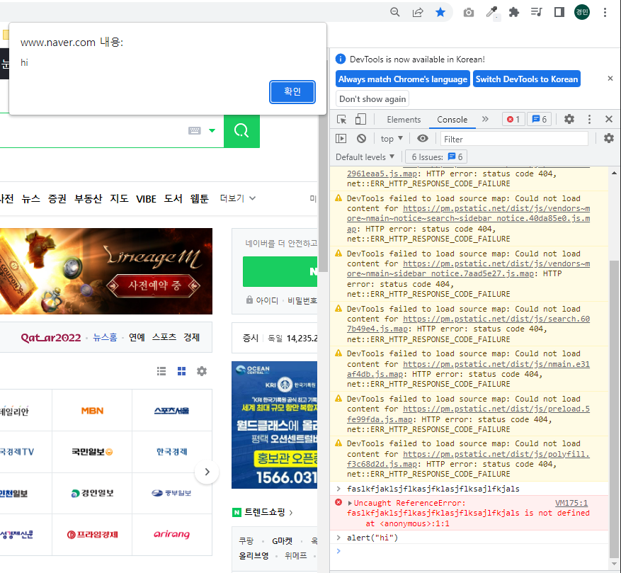

- 자바스크립트로 뭘하고 싶으면 console에서 하면됨

  - 대신 이해할 수 있는 코드여야함

- 콘솔은 긴 코드를 쓰는 용도는 아님

  - 긴것은 하기 힘듦
  - 한줄씩만 작성할 수 있어서 임
  - 그래서 자바스크립트 파일을 만들어야함

- 새로운 폴더를 momentum으로 생성하자.

  

  - 기본적인 세개의 문서를 만들어 주자.

    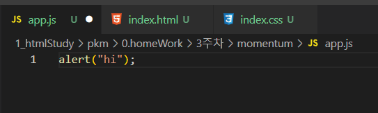

    - 아까 console에 작성했던 코드를 app.js에 넣어주고 웹창에 끌어넣어도 되지는 않음

      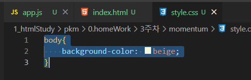

      - css도 마찬가지임

- 자바스크립트 파일 실행하기

  - 그래서 우리는 html를 써서 보여줘야함 html이 그 접착제임
  
  ```html
  <!DOCTYPE html>
  <html lang="en">
  <link>
      <meta charset="UTF-8">
      <meta http-equiv="X-UA-Compatible" content="IE=edge">
      <meta name="viewport" content="width=device-width, initial-scale=1.0">
      <link rel="stylesheet" href="style.css"></link>
      <title>Momentum</title>
  </head>
  <body>
      <script src="app.js"></script>
  </body>
  </html>
  ```

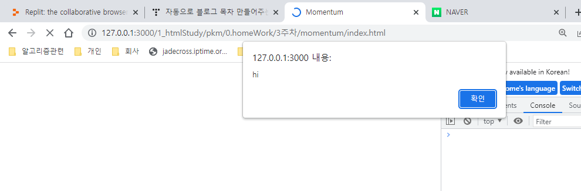

- 저렇게 완성하면 위와 같은 결과를 얻을 수 있음

## 2.1 Basic Data Types

- Console에서 기본적인 두 가지 데이터 타입 배우기

  - integer

    - 2

  - float

    - 1.5

  - text

    - hello

      - 이렇게만 하면 안됨

    - "hello"

      - 이렇게 해야 문제 없음

      - "hello" + "3dpit"

        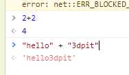

## 2.2 Variables

```js
console.log(5454545454);
```

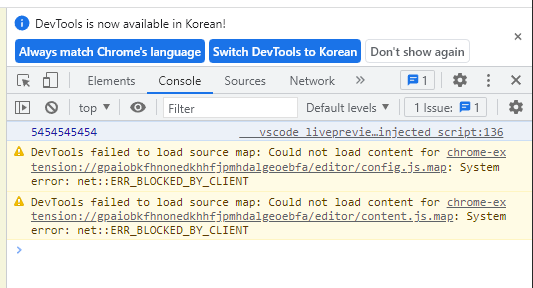

- 저렇게 콘솔로 찍힐 수 있음

- string도 넣을 수 있음

  - "string"
  - 'string'
    - 위의 작은따옴표도 가능하나? 가능하다. 대신 섞어쓰지만 않는다면

- 변수의 가치

  ```js
  console.log(5+2);
  console.log(5*2);
  console.log(5/2);
  ```

  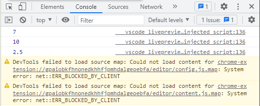

- 값을 변경 하고 싶다면?

  - 세개의 숫자를 다시 바꿔야함
  - 세개 계산기가 있는데 숫자를 바꾸고 싶지 않음

- variable사용해서 해결하기

  ```js
  const a = 5;
  const b = 2;
  
  console.log(a + b);
  console.log(a * b);
  console.log(a / b);
  ```

  - 변수의 값을 바꾸면 자동으로 바꾸게됨

- 자바스크립트에서는 카멜표기법을 사용함

  - 다른것을 써도 에러가 없지만 카멜표기법쓰는것을 권장함

## 2.3 const and let 

- 다른 변수 만드는 법

- let을 사용하기

  - let과const의 차이는 ? 

    - const의 경우 상수이고 즉, 그래서 변할 수 없고,
    - let의 경우는 값이 변할 수 있음

    ```js
    let a = 5;
    let b = 2;
    
    console.log(a + b);
    console.log(a * b);
    console.log(a / b);
    ```

    - 결과는 변화가 없지만 
    - a=7;하고 콘솔을 하려면  const가 아닌 let을 사용해야함 
      - 개발자라면 알고 있으니 가볍게 보자.

- 자바스크립트는 이전에 사용했던 것그래도 쓸 수 있음

- var?
  - var의 경우는 원하는 어느곳이든 업데이트 할 수 있음
  - 어떤 규칙을 가지고 있지 않음
  - var로한다면 정확히 무엇을 하는지 알 수 없다고함

- **즉, 기본적으로 const를 쓰고, 필요할 때만 let을 쓰되, var은 쓰지 말것** 

## 2.4 Booleans

- boolean

  - true 아니면 false

  ```js
  const amIFat = true;
  const amIFat = false;
  ```

  

- 단순히 켜져있는지 꺼저 있는지? 이런것

  ```js
  const amIFat = null;
  ```

  - null의 경우 이 변수에 아무것도 없다는 것임
    - 말그대로 아무 것도 없다임

- undefine

  ```js
  const amIFat = null;
  let something;
  console.log(something);
  ```

  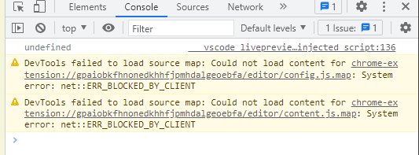

  - 즉, 정의 안한것, 메모리 안에는 존재하지만 공간은 있지만 값이 존재하지 않음

- null과 undefined는 다름

## 2.5 Arrays

- 데이터 정리하는 법
  - 데이터 구조에 관한 것
  - 자료의 검색이나 삽입을 빠르게 하는 것
  - 데이터를 어떻게 정리할지 고민함

- 배열이라고 함

  - 배열 사용전

    ```js
    const mon = "mon";
    const tue = "tue";
    const wed ="wed";
    const thu ="thu";
    const fri ="fri";
    const sat = "sat";
    const sun ="sum";
    const daysOfWeek = mon + the + wed + thu + fri + sat + sun;
    console.log(daysOfWeek);
    ```

  - 배열 사용후

    ```js
    const mon = "mon";
    const tue = "tue";
    const wed ="wed";
    const thu ="thu";
    const fri ="fri";
    const sat = "sat";
    const sun ="sun";
    const daysOfWeek = [mon ,tue, wed, thu, fri , sat , sun];
    const nonsense = [1,2,"hello",false,null,true,undefined,"3dpit"];
    console.log(daysOfWeek,nonsense);
    ```

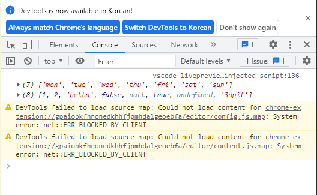

- 배열 요소에 접근하기

  ```js
  const mon = "mon";
  const tue = "tue";
  const wed ="wed";
  const thu ="thu";
  const fri ="fri";
  const sat = "sat";
  const sun ="sun";
  const daysOfWeek = [mon ,tue, wed, thu, fri , sat , sun];
  
  console.log(daysOfWeek[0]); //mon
  console.log(daysOfWeek[1]); //tue
  console.log(daysOfWeek[2]); //wed
  
  ```

  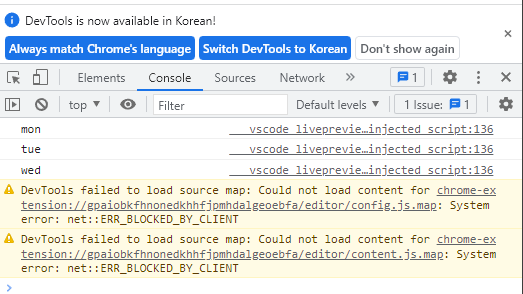

- 배열에 요소 추가하기

  ```js
  const mon = "mon";
  const tue = "tue";
  const wed ="wed";
  const thu ="thu";
  const fri ="fri";
  const sat = "sat";
  const sun ="sun";
  const daysOfWeek = [mon ,tue, wed, thu, fri , sat , sun];
  console.log(daysOfWeek); //mon
  daysOfWeek.push("3dpitDay");
  console.log(daysOfWeek[7]); //mon
  console.log(daysOfWeek); //mon
  ```

  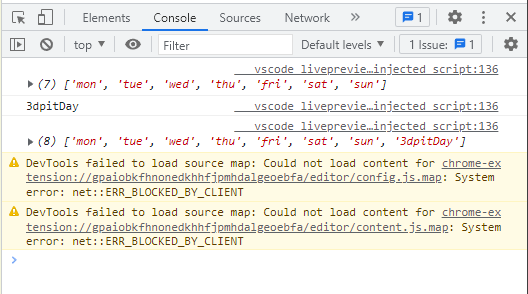

## 2.6 Objects

- 비디오 게임 예시

  - 플레이어를 만든다고 했을대

  - object가 없으면

    ```js
    const playerName ="3dpit";
    const playerPoints = 121212;
    const playerHandsome = true;
    const playerFat ="little bit";
    ```

    - player. 해서 뭘 하고 싶은것
      - `player.name, player.handsome`이런것 하고 싶은것임

- object 만들기

  ```js
  const player = {
      name: "3dpit",
      point: 121212,
      handsome: true,
      fat: "litte bit"
  };
  console.log(player);
  console.log(player.name);
  console.log(player.point);
  console.log(player.handsome);
  console.log(player.fat);
  ```

  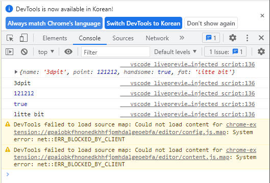

  ```js
  console.log(player["name"]);
  console.log(player["point"]);
  console.log(player["handsome"]);
  console.log(player["fat"]);
  ```

  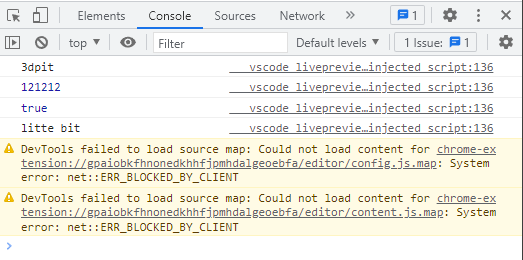

- 업데이트 방법

  ```js
  player.fat =false;
  console.log(player["name"]);
  console.log(player["point"]);
  console.log(player["handsome"]);
  console.log(player["fat"]);
  ```

  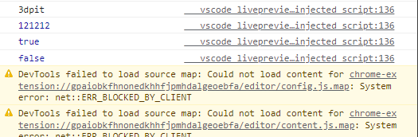

- object 내용 추가하는 법

  ```js
  console.log(player);
  player.address = "매탄동";
  console.log(player);
  ```

  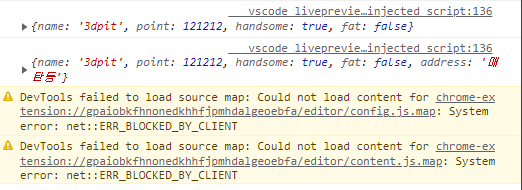

## 2.7 Functions part One

- function은 계속반복해서 사용할 수 있는 코드 조각

  ```js
  console.log("Hello my name is 3dpit");
  console.log("Hello my name is 3dpit");
  console.log("Hello my name is 3dpit");
  console.log("Hello my name is 3dpit");
  ```

  - 이런 반복을 줄이고 싶다면 이렇게

  ```js
  // Function
  function sayHello(){
      console.log("Hello!");
  }
  sayHello();
  sayHello();
  sayHello();
  ```

  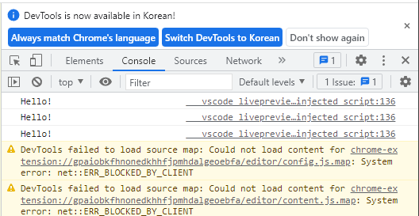

  

## 2.8 Functions part Two

```js
function sayHello(nameOfPerson){
    console.log("Hello! " + nameOfPerson);
}
sayHello("3dpit");
sayHello("4dpit");
sayHello("5dpit");
```

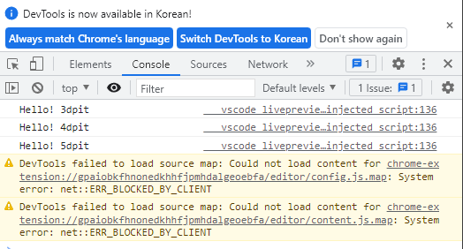

- 응용 사용법

  ```js
  const player ={
      name : "3dpit",
      sayHello : function(){
          console.log("Hello");
      },
  };
  console.log(player.name);
  player.sayHello();
  ```

  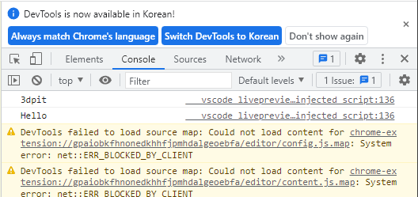