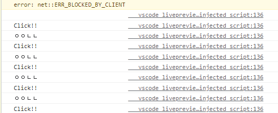
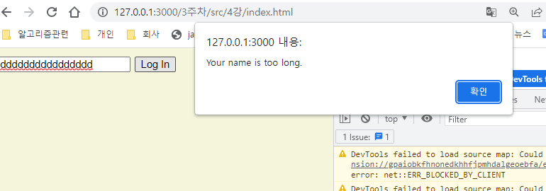

## 2022-11-20-#4-[2021-UPDATE]-LOGIN

##  4.0 Input Values

- html

  ```html
  <body>
      <div id="login-form">
              <input type:"text" placeholder="what is your name?"/>
  <button>Log In</button>
      </div>
  
  </body>
  
  ```

- js

  ```js
  const loginForm = document.getElementById("login-form");
  
  const loginInput=loginForm.querySelector("input");
  const loginButton=loginForm.querySelector("button");
  ```

  - 짧은 방법

    ```js
    const loginInput=document.querySelector("#login-form input");
    const loginButton=document.querySelector("#login-form button");
    ```

  ```js
  const loginInput=document.querySelector("#login-form input");
  const loginButton=document.querySelector("#login-form button");
  
  function onLoginBtnClick(){
      console.log(loginInput.value);
      console.log("Click!!");
  }
  
  loginButton.addEventListener("click",onLoginBtnClick);
  ```

  

## 4.1 Form Submission

- 유효성 검사

  ```js
  const loginInput=document.querySelector("#login-form input");
  const loginButton=document.querySelector("#login-form button");
  
  function onLoginBtnClick(){
      const username = loginInput.value;
      if(username===""){
          alert("Please write your name");
      }else if(username.length>15){
          alert("Your name is too long.")
      }
  }
  
  loginButton.addEventListener("click",onLoginBtnClick);
  ```

  

- input 유효성 검사하기

  - html

    ```html
        <form id="login-form">
            <input
                   required
                   maxlength="15"
                   type="text"
                   placeholder="what is your name?"/>
            <input type="submit" value="Log In/">
        </form>
    ```

    - 버튼 클릭시 자동으로 submit으로 실행 되서 새로 고침됨
    - 브라우저가 새로침안하게 저장하게 해야함

  ## 4.2 Events

  ```js
  const loginForm=document.querySelector("#login-form");
  const loginInput=document.querySelector("#login-form input");
  
  function onLoginSubmit() {
       const username = loginInput.value;
       console.log(username);
  }
  loginForm.addEventListener("submit",onLoginSubmit);
  ```

  - 이렇게 하는 경우 
    - 50프로 정도 성공, 하지만 자꾸 새로 고침함
  - 개선하기

  ```js
  const loginForm=document.querySelector("#login-form");
  const loginInput=document.querySelector("#login-form input");
  
  function onLoginSubmit(event) {
      info.preventDefault();
      console.log(loginInput.value);
  }
  loginForm.addEventListener("submit",onLoginSubmit);
  
  ```

  - 이렇게 하면 우리가 원했던 것이 거의 완성됨

## 4.3 Events part Two

- html

  ```html
      <body>
          <form id="login-form">
              <input
              required
              maxlength="15"
              type="text"
              placeholder="what is your name?"/>
       <input type="submit" value="Log In/">
          </form>
          <a href="https://www.naver.com">Go to courses</a>
      </body>
  ```

- js

  ```js
  const loginForm=document.querySelector("#login-form");
  const loginInput=document.querySelector("#login-form input");
  
  const link = document.querySelector("a");
  
  function onLoginSubmit(event) {
      info.preventDefault();
      // const username = loginInput.value;
      // console.log(username);
      console.log(loginInput.value);
  }
  
  function handleLinkClick(){
      alert("Clicked");
  }
  
  loginForm.addEventListener("submit",onLoginSubmit);
  link.addEventListener("click", handleLinkClick);
  ```

  - 이렇게 하면 alert가 막고 확인누르면 웹사이트 다시 실행해줌

- 개선하기

  ```js
  const loginForm=document.querySelector("#login-form");
  const loginInput=document.querySelector("#login-form input");
  
  const link = document.querySelector("a");
  
  function onLoginSubmit(event) {
      event.preventDefault();
      // const username = loginInput.value;
      // console.log(username);
      console.log(loginInput.value);
  }
  
  function handleLinkClick(event){
     	event.preventDefault;
      console.log(event);
      alert("Clicked");
  }
  
  loginForm.addEventListener("submit",onLoginSubmit);
  link.addEventListener("click", handleLinkClick);
  ```

  - 마우스 클릭 위치 등등 다양한 정보를 제공함
  - 무튼 prevent를 사용하면 바로 링크가 동작하지 않음

  ## 4.4 Getting Username

  

  