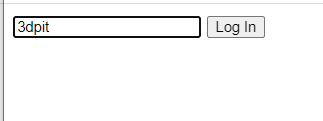
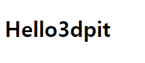
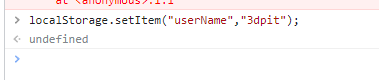
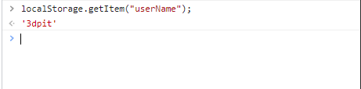
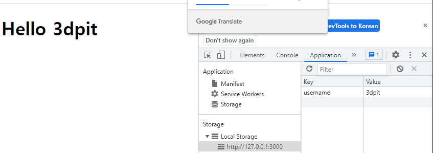

## 2022-11-20-#4-[2021-UPDATE]-LOGIN

## 목차

> 4.0 Input Values
>
> 4.1 Form Submission
>
> 4.2 Events
>
> 4.3 Events part Two
>
> 4.4 Getting Username
>
> 4.5 Saving Username
>
> 4.6 Loading Username
>
> 4.7 Super Recap

##  4.0 Input Values

- html

  ```html
  <body>
      <div id="login-form">
              <input type:"text" placeholder="what is your name?"/>
  <button>Log In</button>
      </div>
  
  </body>
  
  ```

- js

  ```js
  const loginForm = document.getElementById("login-form");
  
  const loginInput=loginForm.querySelector("input");
  const loginButton=loginForm.querySelector("button");
  ```

  - 짧은 방법

    ```js
    const loginInput=document.querySelector("#login-form input");
    const loginButton=document.querySelector("#login-form button");
    ```

  ```js
  const loginInput=document.querySelector("#login-form input");
  const loginButton=document.querySelector("#login-form button");
  
  function onLoginBtnClick(){
      console.log(loginInput.value);
      console.log("Click!!");
  }
  
  loginButton.addEventListener("click",onLoginBtnClick);
  ```

  

## 4.1 Form Submission

- 유효성 검사

  ```js
  const loginInput=document.querySelector("#login-form input");
  const loginButton=document.querySelector("#login-form button");
  
  function onLoginBtnClick(){
      const username = loginInput.value;
      if(username===""){
          alert("Please write your name");
      }else if(username.length>15){
          alert("Your name is too long.")
      }
  }
  
  loginButton.addEventListener("click",onLoginBtnClick);
  ```

  

- input 유효성 검사하기

  - html

    ```html
        <form id="login-form">
            <input
                   required
                   maxlength="15"
                   type="text"
                   placeholder="what is your name?"/>
            <input type="submit" value="Log In/">
        </form>
    ```

    - 버튼 클릭시 자동으로 submit으로 실행 되서 새로 고침됨
    - 브라우저가 새로침안하게 저장하게 해야함

## 4.2 Events

```js
const loginForm=document.querySelector("#login-form");
const loginInput=document.querySelector("#login-form input");

function onLoginSubmit() {
     const username = loginInput.value;
     console.log(username);
}
loginForm.addEventListener("submit",onLoginSubmit);
```

- 이렇게 하는 경우 
  - 50프로 정도 성공, 하지만 자꾸 새로 고침함
- 개선하기

```js
const loginForm=document.querySelector("#login-form");
const loginInput=document.querySelector("#login-form input");

function onLoginSubmit(event) {
    info.preventDefault();
    console.log(loginInput.value);
}
loginForm.addEventListener("submit",onLoginSubmit);

```

- 이렇게 하면 우리가 원했던 것이 거의 완성됨

## 4.3 Events part Two

- html

  ```html
      <body>
          <form id="login-form">
              <input
              required
              maxlength="15"
              type="text"
              placeholder="what is your name?"/>
       <input type="submit" value="Log In/">
          </form>
          <a href="https://www.naver.com">Go to courses</a>
      </body>
  ```

- js

  ```js
  const loginForm=document.querySelector("#login-form");
  const loginInput=document.querySelector("#login-form input");
  
  const link = document.querySelector("a");
  
  function onLoginSubmit(event) {
      info.preventDefault();
      // const username = loginInput.value;
      // console.log(username);
      console.log(loginInput.value);
  }
  
  function handleLinkClick(){
      alert("Clicked");
  }
  
  loginForm.addEventListener("submit",onLoginSubmit);
  link.addEventListener("click", handleLinkClick);
  ```

  - 이렇게 하면 alert가 막고 확인누르면 웹사이트 다시 실행해줌

- 개선하기

  ```js
  const loginForm=document.querySelector("#login-form");
  const loginInput=document.querySelector("#login-form input");
  
  const link = document.querySelector("a");
  
  function onLoginSubmit(event) {
      event.preventDefault();
      // const username = loginInput.value;
      // console.log(username);
      console.log(loginInput.value);
  }
  
  function handleLinkClick(event){
     	event.preventDefault;
      console.log(event);
      alert("Clicked");
  }
  
  loginForm.addEventListener("submit",onLoginSubmit);
  link.addEventListener("click", handleLinkClick);
  ```

  - 마우스 클릭 위치 등등 다양한 정보를 제공함
  - 무튼 prevent를 사용하면 바로 링크가 동작하지 않음

## 4.4 Getting Username

- form을 없애고 싶을때

  - html 요소를 없애기

    - css 이용하기

      ```css
      .hidden{
          display: none;
      }
      ```

    - html 

      ```html
          <body>
              <form id="login-form">
                  <input
                  required
                  maxlength="15"
                  type="text"
                  placeholder="what is your name?"/>
           <input type="submit" value="Log In/">
              </form>
              <a href="https://www.naver.com">Go to courses</a>
          </body>
      ```

    - js

      ```js
      
      const loginForm=document.querySelector("#login-form");
      const loginInput=document.querySelector("#login-form input");
      
      function onLoginSubmit(event) {
          event.preventDefault();
          const username = loginInput.value;
          loginForm.classList.add("hidden");
          console.log(username);
      }
      
      loginForm.addEventListener("submit",onLoginSubmit);
      
      ```

      - 위와 같이 구현하면 로그인 창에 입력을 하고 확인을 하면 로그인창이 사라짐

- html 추가

  ```html
  <h1 id="greeting" class="hidden"></h1>
  ```

- js

  ```js
  
  const loginForm=document.querySelector("#login-form");
  const loginInput=document.querySelector("#login-form input");
  const greeting = document.querySelector("#greeting");
  
  function onLoginSubmit(event) {
      event.preventDefault();
      const username = loginInput.value;
      loginForm.classList.add("hidden");
      greeting.innerText ="Hello" + username;
  	greeting.clasSList.remove("hidden");
  }
  
  loginForm.addEventListener("submit",onLoginSubmit);
  
  ```

  

  - Login 클릭 후

    

  - 최종 js

    ```js
    const loginForm=document.querySelector("#login-form");
    const loginInput=document.querySelector("#login-form input");
    const greeting = document.querySelector("#greeting");
    
    const HIDDEN_CLASSNAME ="hidden";
    
    function onLoginSubmit(event) {
        event.preventDefault();
        loginForm.classList.add(HIDDEN_CLASSNAME);
        const username = loginInput.value;
        //greeting.innerText = "Hello" + username;
    	greeting.innerText = `Hello ${username}`;
        greeting.classList.remove(HIDDEN_CLASSNAME);
    }
    
    loginForm.addEventListener("submit",onLoginSubmit);
    ```

- String  형식

  ```js
      //greeting.innerText = "Hello" + username;
  	greeting.innerText = `Hello ${username}`;
  ```

## 4.5 Saving Username 

- localStorage가 있음
- 위와 같은 종류로는 
  - Session Storage, Indexed DB, Web SQL, Cookies등

- setItem를 이용하면 저장할 수 있음

```js
localStorage.setItem("userName","3dpit");
```




- getItem으로 저장된 정보 가져오기

  ```js
  localStorage.getItem("userName");
  ```

  

- 삭제 하기

  ```js
  localStorage.removeItem("userName");
  ```

- 개선한 js 코드

  ```js
  const loginForm=document.querySelector("#login-form");
  const loginInput=document.querySelector("#login-form input");
  const greeting = document.querySelector("#greeting");
  
  const HIDDEN_CLASSNAME ="hidden";
  
  function onLoginSubmit(event) {
      event.preventDefault();
      loginForm.classList.add(HIDDEN_CLASSNAME);
      const username = loginInput.value;
      localStorage.setItem("username",username);
      //greeting.innerText = "Hello" + username;
  	greeting.innerText = `Hello ${username}`;
      greeting.classList.remove(HIDDEN_CLASSNAME);
  }
  
  loginForm.addEventListener("submit",onLoginSubmit);
  
  ```

## 4.6 Loading Username

- 현재 위에 같이 하면 form을 보여주는 것이므로

  - h1만 보이게 할 것임

- html

  ```html
      <body>
          <form id="login-form" class="hidden">
              <input
              required
              maxlength="15"
              type="text"
              placeholder="what is your name?"/>
       <input type="submit" value="Log In"/>
          </form>
          <h1 id="greeting" class="hidden"></h1>
      </body>
  ```

  

  ```js
  const loginForm=document.querySelector("#login-form");
  const loginInput=document.querySelector("#login-form input");
  const greeting = document.querySelector("#greeting");
  
  const HIDDEN_CLASSNAME ="hidden";
  const USERNAME_KEY ="username";
  
  function onLoginSubmit(event) {
      event.preventDefault();
      loginForm.classList.add(HIDDEN_CLASSNAME);
      const username = loginInput.value;
      localStorage.setItem(USERNAME_KEY,username);
      //greeting.innerText = "Hello" + username;
  	greeting.innerText = `Hello ${username}`;
      greeting.classList.remove(HIDDEN_CLASSNAME);
  }
  
  const savedUsername = localStorage.getItem(USERNAME_KEY);
  
  if(savedUsername === null){
  	loginForm.classList.remove(HIDDEN_CLASSNAME);
      loginForm.addEventListener("submit",onLoginSubmit);
  }else{
      greeting.innerText=`Hello ${savedUsername}`;
      greeting.classList.remove(HIDDEN_CLASSNAME);
  }
  ```

- 리팩토링 하기

  ```js
  const loginForm=document.querySelector("#login-form");
  const loginInput=document.querySelector("#login-form input");
  const greeting = document.querySelector("#greeting");
  
  const HIDDEN_CLASSNAME ="hidden";
  const USERNAME_KEY ="username";
  
  function onLoginSubmit(event) {
      event.preventDefault();
      loginForm.classList.add(HIDDEN_CLASSNAME);
      const username = loginInput.value;
      localStorage.setItem(USERNAME_KEY,username);
      //greeting.innerText = "Hello" + username;
  	paintGreeting(username);
  }
  
  function paintGreeting(username){
          greeting.innerText=`Hello ${username}`;
      greeting.classList.remove(HIDDEN_CLASSNAME);
  }
  const savedUsername = localStorage.getItem(USERNAME_KEY);
  
  if(savedUsername === null){
  	loginForm.classList.remove(HIDDEN_CLASSNAME);
      loginForm.addEventListener("submit",onLoginSubmit);
  }else{
  	paintGreeting(savedUsername);
  }
  ```

  

  - 이렇게 로그인하면 지우지 않는 이상 새로고침해도 풀리지 않음

## 4.7 Super Recap 

- js가 없는 경우 두개의 html 속성이 있음
  - form, h1이 있음
- 처음에 css로 항목을 가려주고 시작함
- 자바스크립트가 먼저 들어와서 local storage확인
  - 우리는 브라우저에서 사용하는 DB를 확인 했고,
    - localStorage.getItem("username");
      - 없는 경우 null을 반환 함을 확인함
- 순서는 null을 가져오면 hidden 요소를 제거해서 폼이 나오게함
  - 그리고 기본적으로 브라우저가 새로고침을 하는데 이를 막아주고
  - 이전에 나왔던 form을 다시 숨겨줌
  - 키값을 저장하고  h1에 인자추가하고 h1의 hidden삭제

```js
const loginForm=document.querySelector("#login-form");
const loginInput=document.querySelector("#login-form input");
const greeting = document.querySelector("#greeting");

const HIDDEN_CLASSNAME ="hidden";
const USERNAME_KEY ="username";

function onLoginSubmit(event) {
    event.preventDefault();
    loginForm.classList.add(HIDDEN_CLASSNAME); localStorage.setItem(USERNAME_KEY,loginInput.value);
    //greeting.innerText = "Hello" + username;
	paintGreeting();
}

function paintGreeting(){
    const username = localStorage.getItem(USERNAME_KEY);
    greeting.innerText=`Hello ${username}`;
    greeting.classList.remove(HIDDEN_CLASSNAME);
}
const savedUsername = localStorage.getItem(USERNAME_KEY);

if(savedUsername === null){
	loginForm.classList.remove(HIDDEN_CLASSNAME);
    loginForm.addEventListener("submit",onLoginSubmit);
}else{
	paintGreeting();
}
```

