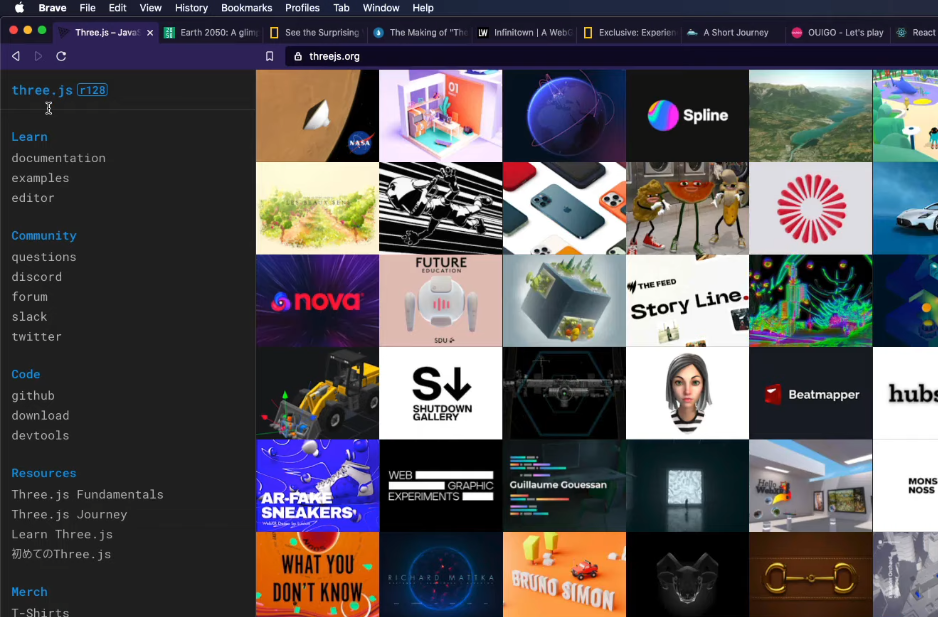

## 2022-11-16-#1-[2021-UPDATE]-INTRODUCTION

## 목차

> 1.0 Welcome
>
> 1.1 What Are We Building
>
> 1.2 Requirements
>
> 1.3 Software Requirements
>
> 1.4 Why JS
>
> 1.5 Wht JS II
>
> 1.6 Online IDE

## 1.0 Welcome

- 이전 자바 강의보다 더 디테일해짐
- 초보자를 위한 강의가 될 것
- 초보자를 위한 이론도 추가되어 있음
- 프로그래밍 경험 없어도 됨
- 왜? 자바스크립트인지 설명해준다고 함

## 1.1 What Are We Building

- 모멘텀을 만들것
  - 로그인 만들기
  - 이름 기억 하는지 배우기
  - 시계를 어떻게 만들지
  - 위치랑 날씨, 위치명(GEO location사용)
  - 명언 받아서 사용자에게 저장
  - todo list도 만들것임

## 1.2 Requirements

- 지식이 없어도 된다?
- 정말 없어도 되지만 html, css는 기본임
  - 웹사이트 만들줄 알아야 자바스크립트 사용할 수 있음

## 1.3 Software Requirements

- vscode를 설치해야함
  - 무료고 완전 좋다
- 크로미움 기반 브라우저가 좋당
  - 크롬이랑 브레이브는 개발자를 위해 항상 최신 기능 줌

## 1.4 Why JS

- 왜? 자바 스크립트
  - 잘배우면 왜 좋나?
- 자바 스크립트 역사
  - 1995년 12월에 만듦
  - 10일만에 만들고 괴물 언어가 될 것이라고 생각 못함
  - 만든이유 넷스케이프였음
    - 훌륭한 네비게이터임
    - 이때는 html, css 뿐임 그래서 인터랙티브 하기를 원했음
    - 프로그래밍 하나 만들자해서 탄생함
  - 자바스크립트는 프론트 엔드로 쓸 수 있는 유일한 언어
  - 자바스크립트는 바뀔 일이 없어서 보장된다. 걱정안해도 됨 갑자기 다른 언어를 쓸일이 없음
  - 다른 언어는 설치해야하는데 자바스크립트는 설치해야하는 적 있었나?
    - 그런적 없음 브라우저에 내장되서 나오기 때문에 설치할 필요도 없는 것임
    - 이전에는 flash없으면 동영상 실행안되는 것은 있었지만 설치할 필요 없음
    - 모든 브라우저에 포함 되어 있다는 것이 포인트임
  - 백엔드의 경우에서는 다른 언어를 선택해도 되지만
    - 프론트엔드에서는 딱하나 자바스크립트만 알면됨
  - 이 한가지만 잘 배우면  되는 것?
    - 왜? 바뀔일 없으니까, 이것만 사용하면 되기때문에

## 1.5 Why JS II

- 자바 스크립트 잘배울때 할 수 있는 것

  

- 비디오 게임도 가능함
- 3d모델링 관련해서도 등등 
- 자바스크립트 더 잘 배우고 싶으면 프레임 워크 사용하면됨
  - 리액트
  - 일렉트론
    - 페북, 메신저, 슬랙, 피그마도 만듦
- 이제는 자바스크립트로 백엔드도 돌릴 수 있음
  - 이전에는 불가능했음
  - Wetube 클론 코딩
    - 자바스크립트로 백엔드 만드는 것 가르쳐줌
  - 3d로 뭘 하고 싶다면 자바스크립트로 하면 좋음
- 자바스크립트로는 머신러닝도 가능하다.
  - ml5.js를 쓰면 머신러닝 모델을 생성하는 웹사이틀르 구축해서 모델을 훈련시킬 수 있음

## 1.6 Online IDE

- 설치가 어렵다면?
- Replit [사이트](https://replit.com)
  - 계정을 생성하고 들어가서  + 버튼 클릭 후 
  - 필요한 언어를 클릭함
- 그렇게만 한다면 바로 쓸 수 있음
- 단, 이번 강의는 이것보다는 vs를 사용해서 보여주는것이 만긴할 것임

