## 2022-11-18-#3-[2021-UPDATE]-JAVASCRIPT-ON-THE-BROWSER

## 목차

> 3.0 The Document Object
>
> 3.1 HTML in Javascript 
>
> 3.2 Searching For Elements
>
> 3.3 Events
>
> 3.4 Events part Two
>
> 3.5 More Events
>
> 3.6 CSS in Javascript
>
> 3.7 CSS in Javascript part Two
>
> 3.8 CSS in Javascript part Three

## 3.0 The Document Object

- html의 소스는 

  - document에 존재함
  - 접근할 수 있는 객체를 가짐

  ```js
  document;
  
  console.dir(document); 
  ```

  - object로 보여줌

    ```js
    document.title
    ```

    

    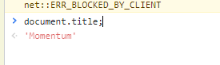

- 즉, 자바스크립트로 변경가능

  ```js
  document.title = "test js";
  ```

  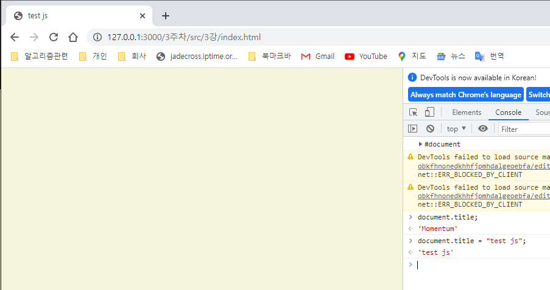

- 자바스크립트와 html  이미 연결되어 있고,
  - 그 항목을 볼 수 있음을 알게됨

## 3.1 HTML in Javascript

- body에 h1 추가

  ```html
  <body>
      <h1 id="title">Grab me!</h1>
      <script src="app.js"></script>
  </body>
  ```

  - `document.getElementById("title");`

    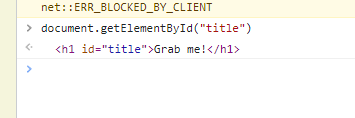

```js
const title = document.getElementById("title");

console.dir(title);
```

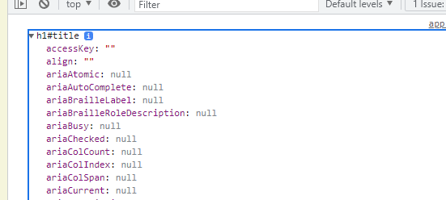

```js
<h1 autofocus className="hello" id="title">Grab me!</h1>
```

- html에 autofocus, className="hello" 추가하면 다시 조회시 그 값이 적용됨을 볼 수 있음

## 3.2 Searching For Elements

- id가 있어야 찾아서 그 항목을 바꿀 수 있음

- html

  ```html
  <!DOCTYPE html>
  <html lang="en">
  <link>
      <meta charset="UTF-8">
      <meta http-equiv="X-UA-Compatible" content="IE=edge">
      <meta name="viewport" content="width=device-width, initial-scale=1.0">
      <link rel="stylesheet" href="style.css"></link>
      <title>Momentum</title>
  </head>
  <body>
      <!-- <h1 autofocus className="hello" id="title">Grab me!</h1> -->
      <h1 class="hello">Grab me!</h1>
      <h1 class="hello">Grab me!</h1>
      <h1 class="hello">Grab me!</h1>
      <h1 class="hello">Grab me!</h1>
      <h1 class="hello">Grab me!</h1>
      <h1 class="hello">Grab me!</h1>
      <script src="app.js"></script>
  </body>
  </html>
  ```

- js

  ```js
  const hellos = document.getElementsByClassName("hello");
  console.log(hellos);
  ```

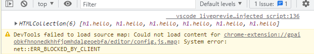

- 6개의 항목을 가진 배열로 받아옴

- hellos.1으로 안됨

- h1 가져오기

  ```js
      <div class="hello">
          <h1>Grab me!</h1>
      </div>
  ```

  ```js
  const title = document.getElementsByTagName("h1");
  
  console.log(title)
  ```

  - 이건 우리가 원하는 것이 아님 저대로 안나옴

    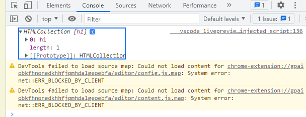

  ```js
  const title = document.querySelector(".hello h1");
  
  console.log(title);
  ```

  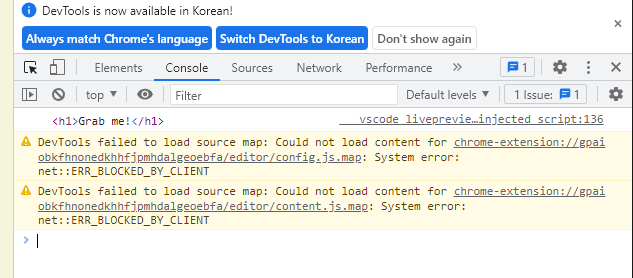

  - css 같이 쓸수 있어서 좋음
    - querySelector 자주 쓸것이고 이 강의에서 자주 쓸것임
    - 같은 것이 여러개 있는 경우
      - 배열로 여러개를 가져올까?
        - 아니다.
      - 그냥 제일 첫번째것만 가져옴
      - 세개다 가져오고 싶으면 all써야함

  - html

    ```html
        <div class="hello">
            <h1>Grab me!</h1>
        </div>
        <div class="hello">
            <h1>Grab me!</h1>
        </div>
        <div class="hello">
            <h1>Grab me!</h1>
        </div>
    ```

  - js

    ```js
    //전부 다 가져오기
    const title = document.querySelectorAll(".hello h1");
    
    console.log(title);
    ```

    

  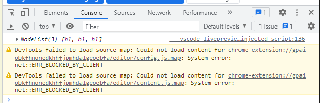

## 3.3 Events

- 그중에서 querySelector가 최고라고 생각함

  - css 자체를 그대로 찾아낼 수 있어서

- dir로 해서 검색하면 모든 object를 볼 수 있음

- style

  - 이것 역시 element도 자바스크립트로 작성되어 있음

  - 색상 바꾸는 법

    - h1.style.color="blue";

      ```js
      const title = document.querySelector("div.hello:first-child h1");
      console.dir(title);
      title.style.color="blue";
      
      const title = document.querySelector("div.hello h1");
      console.dir(title);
      title.style.color="blue";
      ```

-  **click**

  ```js
  const title = document.querySelector("div.hello h1");
  
  function handleTitleClick(){
      console.log("title was clicked");
  }
  title.addEventListener("click",handleTitleClick);
  ```

  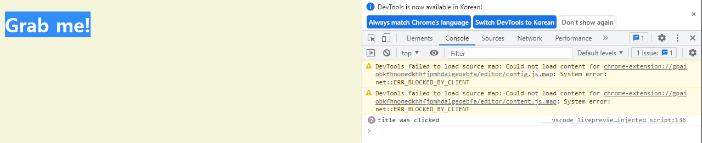

  - Grab me를 클릭하면 계속 콘솔이 찍힘

## 3.4 Events part Two

- event 찾는 방법
  - h1 html element mdn 으로 검색
    - [HTML Heading Element - Web APIs | MDN](https://developer.mozilla.org/en-US/docs/Web/API/HTMLHeadingElement)
      - [Html element](https://developer.mozilla.org/en-US/docs/Web/API/HTMLElement)

- console.dir(h1);

  - 이렇게 해도 사용가능한 event 찾을 수 있음
    - on으로 시작하는것 

- 실습하기

  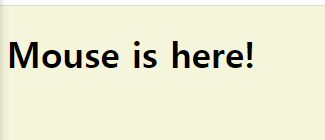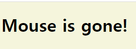

  ```js
  const title = document.querySelector("div.hello h1");
  
  function handleTitleClick(){
      //console.log("title was clicked");
      title.style.color="blue";
  }
  title.addEventListener("click",handleTitleClick);
  
  function handleMouseEnter(){
      // console.log("mouse is here!")
      title.innerText = "Mouse is here!"
  }
  title.addEventListener("mouseenter",handleMouseEnter);
  
  function handleMouseLeave(){
      title.innerText = "Mouse is gone!"
  }
  title.addEventListener("mouseleave",handleMouseLeave);
  ```

## 3.5 More Events

```js
//사용법 1
title.addEventListener("click",handleTitleClick);
//사용법 2
title.onclick = handleTitleClick;
```

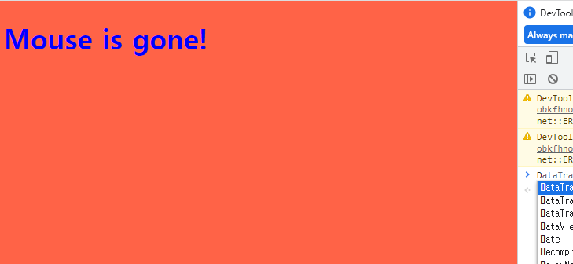

```js
const h1 = document.querySelector("div.hello h1");


function handleWindowResize(){
    document.body.style.backgroundColor = "tomato";
}

window.addEventListener("resize", handleWindowResize);
```

- copy 여부 판단

  ```js
  function handleWindowCopy(){
      alert("copier");
  }
  window.addEventListener("copy",handleWindowCopy);
  ```

## 3.6 CSS in Javascript

```js
const h1 = document.querySelector("div.hello h1");
function handleTitleClick(){
    if(h1.style.color==="blue"){
        h1.style.color = "tomato";
    }else{
        h1.style.color ="blue";
    }
}
h1.addEventListener("click",handleTitleClick);
```

- 클릭시 글자 색상 변경

  - 리팩토링

    ```cs
    const h1 = document.querySelector("div.hello h1");
    function handleTitleClick(){
        const currentColor = h1.style.color;
        let newColor;
        if(currentColor==="blue"){
            newColor = "tomato";
        }else{
            newColor ="blue";
        }
        h1.style.color = newColor;
    }
    h1.addEventListener("click",handleTitleClick);
    ```

- 이렇게 스타일 자체는 자바스크립트에서 별로라고 한다.

## 3.7 CSS in Javascript part Two

- css

  ```css
  body{
      background-color: beige;
  }
  h1{
      color: cornflowerblue;
  }
  
  .active{
      color : tomato;
  }
  ```

- js

  ```js
  const h1 = document.querySelector("div.hello h1");
  function handleTitleClick(){
      h1.className ="active";
  }
  h1.addEventListener("click",handleTitleClick);
  ```

```js
//3.7 CSS in Javascript part Two
const h1 = document.querySelector("div.hello:first-child h1");
function handleTitleClick(){
    if(h1.className==="active"){
        h1.clasName = "";
    }else {
        h1.className ="active";
    }
}

h1.addEventListener("click",handleTitleClick);
```

- 개선

  ```js
  //3.7 CSS in Javascript part Two
  const h1 = document.querySelector("div.hello:first-child h1");
  function handleTitleClick(){
      const clickedClass = "clicked";
      if(h1.className===clickedClass){
          h1.clasName = "";
      }else {
          h1.className =clickedClass;
      }
  }
  
  h1.addEventListener("click",handleTitleClick);
  ```

- css

  ```css
  body{
      background-color: beige;
  }
  h1{
      color: cornflowerblue;
  	transition: color 0.5s ease-in-out;
  }
  
  .active{
      color : tomato;
  }
  ```

  - 그전 class 가 있어서도 바꿔버림 현재는

## 3.8 CSS in Javascript part Three

- 개선하기

  ```js
  const h1 = document.querySelector("div.hello:first-child h1");
  function handleTitleClick(){
      const clickedClass = "clicked";
      if(h1.classList.contains(clickedClass)){
          h1.clasList.remove(clickedClass);
      }else {
          h1.classList.add(clickedClass);
      }
  }
  
  h1.addEventListener("click",handleTitleClick);
  ```

- 더 좋은 펑션

  ```js
  const h1 = document.querySelector("div.hello:first-child h1");
  function handleTitleClick(){
      h1.classList.toggle("clicked");
  }
  
  h1.addEventListener("click",handleTitleClick);
  ```

  - 초클러 더 간단히 가능함
