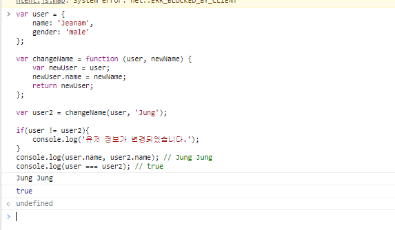
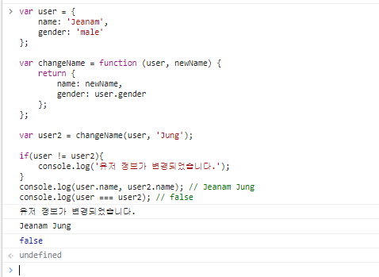
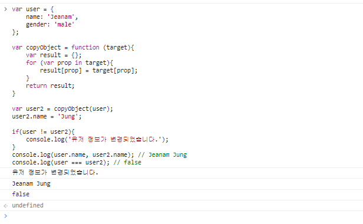
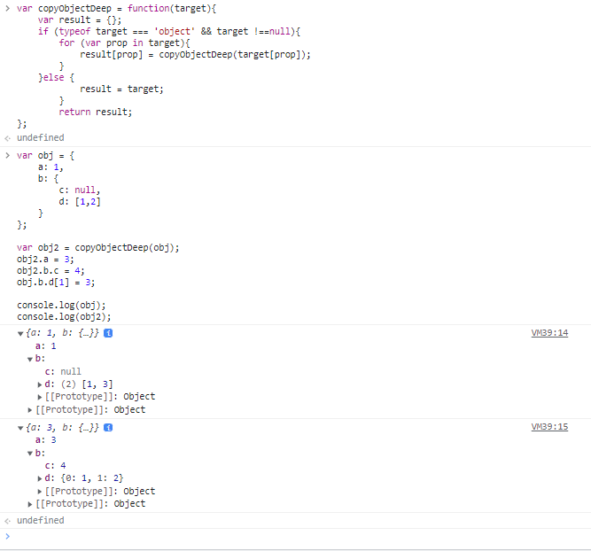
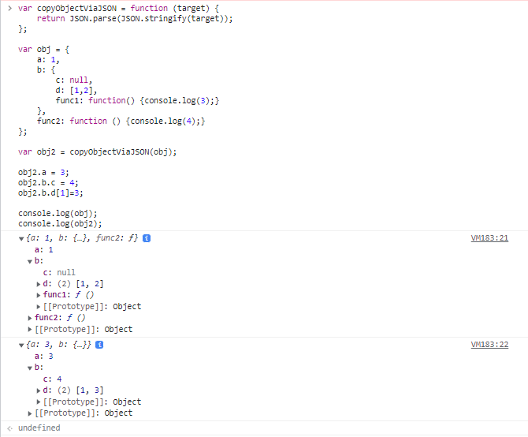

## 2022-11-21-코어-자바스크립트

## 목차
>01.데이터 타입의 종류
>
>02.데이터 타입에 관한 배경지식
>
>> 1-2-1 메모리와 데이
>>
>> 1-2-2 식별자와 변수
>
>04.기본형 데이터와 참조형 데이터
>
>> 1-4-1 불변값
>>
>> 1-4-2 가변값
>>
>> 1-4-3 변수 복사 비교
>
>05.불변 객체
>
>> 1-5-1 불변 객체를 만드는 간단한 방법
>>
>> 1-5-2 얕은 복사와 깊은 복사
>
>06.undefined와 null
>
>07.정리

## 01.데이터 타입의 종류

- 기본형
  - 원시형, primitive type
    - 숫자, 문자열, 불리언, null, undefined등
    - ES6에서 심볼 추가
- 참조형
  - reference type
  - 객체, 배열, 함수, 날짜, 정규표현식등
  - ES6에서 추가된 Map, WeakMap, Set, WeakSet등

- 둘다 복제는 한다.
  - 기본형의 경우 값이 담긴 주솟값을 바로 복제
    - 불변성을 띔
  - 참조형은 값이 담긴 주솟값들로  이루어진 묶임

## 02.데이터 타입에 관한 배경지식

### 1-2-1 메모리와 데이터

- 숫자의 경우 
  - 정수형인지 부동소수형인지 구분하지 않고,
    - 64비트, 즉 8바이트 확보
- 모든 데이터는 바이트 단위의 식별자
  - 메모리 주솟값을 통해 서로 구분하고 연결할 수 있음

### 1-2-2 식별자와 변수

- 변수
  - 변할 수 있는 수
  - 변할 수 있는 무언가(데이터)
- 식별자
  - 어떤 데이터를 식별하는 데 사용하는 이름
    - 즉, 변수명

### 04.기본형 데이터와 참조형 데이터

### 1-4-1 불변값

- 변수와 상수를 구분 짓는 것
  - 변경 가능성
- 변경 가능성의 대상은 **변수 영역 메모리**
  - 한 번 데이터 할당이 이뤄진 변수 공간에 다른 데이터 재할당 할 수 있는지
- 불변성 여부를 구분시
  - 변경 가능성의 대상은 **데이터 영역 메모리**
- 변경의 경우 새로 만드는 동작을 통해서만 이뤄짐

### 1-4-2 가변값

- 기본형 데이터가 불변값이라면
- 참조형이 그럼 가변값인가?
  - 기본적인 성질은 가변값인 경우가 많음
  - 설정에 따라 변경 불가능한 경우도 있고,
    - 아예 불변값으로 할용하는 방안도 있음

### 1-4-3 변수 복사 비교

```js
var a = 10;
var b = a;

var obj1 ={ c: 10, d: 'ddd'};
var obj2 = obj1;

b = 15;
obj2.c = 20;
```

- 결과

  ```js
  a !==b
  obj1 === obj2
  ```

  - 위의 결과가 기본형과 참조형 데이터의 가장 큰 차이

- 대부분 책에서는

  - 기본형은 값을 복사
  - 참조형은 주솟값을 복사
    - 사실은 어떤 데이터 타입이든 변수에 할당하기 위해서는 주솟값 복사해야함
      - 엄밀히 따지면 자바스크립트의 모든 데이터 타입은 참조형 데이터일 수 밖에 없음
  - 기본형은 주솟값을 복사하는 과정 한 번
    - 사실 기본형도 주솟값 참조하긴함
  - 참조형은 한 단계를 더 거치는 차이가 있음

## 05.불변 객체

### 1-5-1 불변 객체를 만드는 간단한 방법

- 불변 객체가 필요한 상항
  - 값으로 전달받은 객체에 변경을 가하더라도
  - 원본 객체는 변하지 않아야 하는 경우가 종종 발생 이때 필요

- 문제 코드

  ```js
  var user = {
  	name: 'Jeanam',
      gender: 'male'
  };
  
  var changeName = function (user, newName) {
  	var newUser = user;
      newUser.name = newName;
      return newUser;
  };
  
  var user2 = changeName(user, 'Jung');
  
  if(user != user2){
      console.log('유저 정보가 변경되었습니다.');
  }
  console.log(user.name, user2.name); // Jung Jung
  console.log(user === user2); // true
  ```

  - if문을 들어가지 않음

    

- 문제 해결 소스

  ```js
  var user = {
  	name: 'Jeanam',
      gender: 'male'
  };
  
  var changeName = function (user, newName) {
      return {
          name: newName,
          gender: user.gender
      };
  };
  
  var user2 = changeName(user, 'Jung');
  
  if(user != user2){
      console.log('유저 정보가 변경되었습니다.');
  }
  console.log(user.name, user2.name); // Jeanam Jung
  console.log(user === user2); // false
  ```

  

- 기본 정보를 복사해서 새로운 객체를 반환하는 함수

  - 얇은 복사

    ```js
    var copyObject = function (target){
        var result = {};
        for (var prop in target){
    		result[prop] = target[prop];
        }
        return result;
    }
    ```

  - copyObject이용한 객체 복사

    ```js
    var user = {
    	name: 'Jeanam',
        gender: 'male'
    };
    
    var copyObject = function (target){
        var result = {};
        for (var prop in target){
    		result[prop] = target[prop];
        }
        return result;
    }
    
    var user2 = copyObject(user);
    user2.name = 'Jung';
    
    if(user != user2){
        console.log('유저 정보가 변경되었습니다.');
    }
    console.log(user.name, user2.name); // Jeanam Jung
    console.log(user === user2); // false
    ```

    

- 여기서 user 객체 내부의 변경이 필요할 때는 무조건 

  - copyObject함수를 사용하기로 합의하고 그 규칙을 지킨다면
    - user객체가 곧 불변객체라고 할 수 있음
    - 위의 단점은 얇은 복사만 진행하는 것

### 1-5-2 얕은 복사와 깊은 복사 

- 얕은복사는 바로 아래 단계의 값만 복사하는 방법

- 깊은복사는 내부의 모든 값들을 하나하나 찾아서 전부 복사
- 중첩된 객체에서 참조형 데이터가 저장된 프로퍼티를 복사 할때
  - 그 주솟값만 복사한다는 의미
  - 즉, 원본과 사본이 모두 동일한 참조형 데이터의 주소를 가리킴
    - 그렇게 되서 사본을 바꾸면 원본도 바뀌고,
    - 원본을 바꾸면 사본도 바뀜

- 중첩된 객체에 대한 얕은 복사

  ```js
  var user = {
      name: 'Jeanam',
      urls: {
          protfolio: 'http://github.com/3dpit',
          blog: 'http://blog.com',
          facebook: 'http://facebook.com/3dpit'
      }
  };
  
  var user2 = copyObject(user);
  
  user2.name = 'Jung';
  console.log(user.name === user2.name); // flase
  
  user.urls.portfolio = 'http://portfolio.com';
  console.log(uset.urls.portfolio ==== user2.urls.portfolio); // true;
  
  user2.urls.blog = '';
  console.log(user.urls.blog === user2.urls.blog); // true;
  ```

  - 위를 보면 user객체에 직접 속한 프로퍼티에 대해서는 완전히 새로운 데이터가 나오지만
  - 한단계 더 들어간 urls의 내부 프로퍼티들은 기존 데이터를 그대로 참조하는 것
    - 위와 같은 현상이 일어나지 않도록 user.urls프로퍼티에 대해서도 불변 객체로 만들 필요가 있음

- 중첩된 객체에 대한 깊은 복사

  ```js
  var user2 = copyObject(user);
  user2.urls = copyObject(user.urls);
  
  user.urls.portfolio = 'http://portfolio.com';
  console.log(user.urls.portfolio === user2.urls.portfolio);// false
  
  user2.urls.blog = '';
  console.log(user.urls.blog === user2.urls.blog);//false
  ```

  - 포인트
    - **기본형 데이터일 경우에는 그대로 복사**
    - **참조형 데이터는 다시 그 내부의 프로퍼티를 복사**

- 객체의깊은 복사를 수행하는 범용함수

  ```js
  var copyObjectDeep = function(target){
      var result = {};
      if (typeof target === 'object' && target !==null){
          for (var prop in target){
  			result[prop] = copyObjectDeep(target[prop]);
          }
      }else {
  			result = target;
          }
          return result;
  };
  ```

- 깊은 복사 결과 확인

  ```js
  var obj = {
  	a: 1,
      b: {
  		c: null,
          d: [1,2]
      }
  };
  
  var obj2 = copyObjectDeep(obj);
  obj2.a = 3;
  obj2.b.c = 4;
  obj.b.d[1] = 3;
  
  console.log(obj);
  console.log(obj2);
  ```

  

  - hasOwnProperty	메서드를 활용해 프로토타입 체이닝을 통해 상속된 프로퍼티를 복사하지 않게끔 할 수 있음
    - ES5의 getter/setter를 복사하는 방법은 안타깝게도 
      - ES6의 Object.getOwnPropertyDescroptor
        - 또는, ES2017의 object.getOwnPropertyDescroptors외에는 방법이 없음

- json을 이용한 간단한 깊은 복사

  ```js
  var copyObjectViaJSON = function (target) {
  	return JSON.parse(JSON.stringify(target));
  };
  
  var obj = {
      a: 1,
      b: {
  		c: null,
          d: [1,2],
          func1: function() {console.log(3);}
      },
      func2: function () {console.log(4);}
  };
  
  var obj2 = copyObjectViaJSON(obj);
  
  obj2.a = 3;
  obj2.b.c = 4;
  obj2.b.d[1]=3;
  
  console.log(obj);
  console.log(obj2);
  ```

  

## 06.undefined와 null

- 없음을 나타내는 것
- undefined
  - 사용자가 명시적으로 지정할 수 도 있지만
  - 값이 존재하지 않을 때 자바스크립트 엔진이 자동으로 부여
  - 자바스크립트 엔진이 자동 부여하는 경우
    - 1.값을 대입하지 않은 변수, 즉 데이터 영역의 메모리 주소를 지정하지 않은 식별자에 접근할 때
    - 2.객체 내부의 존재하지 않는 프로퍼티에 접근하려고 할 때
    - 3.return문이 없거나 호출되지 않는 함수의 실행 결과

- 자동으로 undefined를 부여하는 경우

  ```js
  var a;
  console.log(a); //1
  
  var obj = {a: 1};
  console.log(obj.a);
  console.log(obj.b);//2
  console.log(b);// c.f)ReferenceError: b is not defined
  
  var func = function(){};
  var c = func(); //3
  console.log(c);
  ```

- undefined와 배열

  ```js
  var arr1 = [];
  arr1.length = 3;
  console.log(arr1);
  
  var arr2 = new Array(3);
  console.log(arr2);
  
  var arr3 = [undefined, undefined, undefined];
  console.log(arr3);
  ```

  - 비어있는 요소와 undefined를 할당한 요소는 출력 결과가 다름
    - 비어있는 요소의 경우 순회와 관련된 많은 배열 메서드들의 순회 대상에서 제외됨

- 빈요소와 배열의 순회

  ```js
  var arr1 = [undefined, 1];
  var arr2 = [];
  arr2[1] = 1;
  
  arr1.forEach(function(v,i){console.log(v,i);});
  // undefined 0 / 1 1
  arr2.forEach(function(v,i){console.log(v,i);});
  // 11
  
  arr1.map(function(v,i){return v + i;});
  // [NaN, 2]
  arr2.map(function(v,i){return v + i;});
  // [empty, 2]
  
  arr1.filter(function(v){return !v;});//[undefined]
  arr2.filter(function(v){return !v;});//[]
  
  arr1.reduce(function(p,c,i){return p + c + i;}, '');
  //undefined011
  arr2.reduce(function(p,c,i){return p + c + i;},'');
  //11
  ```

  - var 변수는 environmentRecord가 인스턴스화 될 때 생성되면서 undefined로 초기화됨

  - 한편 ES6에서 등장한 let, const에 대해서는 undefined를 할당하지 않은 채로 초기화를 마침

    -  let, const변수는 environmentRecord가 인스턴스화될 때 생성되지만 실제 변수가 평가되기 전까지는 접근할 수 없다고 설명하고 있음

    - **직접 undefined를 할당 하지 않으면됨**

- null

  -  비어있음을 명시적으로 나타내고 싶을때
  - 주의 할 점
    - typeof null이 object라는 점
      - 자바스크립트 버그임
      - null여부 판별의 경우 다른 방식을 이용해야함

- undefined와 null의 비교

  ```js
  var n = null;
  console.log(typeof n); //object
  
  consolg.log(n == undefined); // true
  
  console.log(n == null); //true
  
  console.log(n === undefined);// false
  
  console.log(n === null); //true
  ```

  - ==의 경우 동등 연사자 비교할 경우
    - null과 undefined같다고 판별
  - 정확히 알기위해서는 === 일치연산자 사용해야함

## 07.정리

- 자바스크립트
  - 기본형
    - 불변값
  - 참조형
    - 가변값
- 변수는 변경가능한 데이터가 담기는 공간
- 식별자는 변수의 이름


- 변수 선언시
  - 컴퓨터 메모리의 빈 공간에 식별자 저장
  - 그 공간에 자동으로 undefined 할당
    - 이후 그 변수에 기본형 데이터 할당 시 
      - 별도의 공간에 데이터 저장
      - 그 공간의 주소를 변수의 값 영역에 할당


- 참조형 데이터를 할당하고자 할 경우
  - 컴퓨터는 참조형 데이터 내부 프로퍼티들을 위한 변수 영역을
    - 확보해서 주소를 변수에 연결하고
      - 다시 앞서 확보한 변수 영역에 각 프로퍼티의 식별자를 저장
      - 각 데이터를 별도의 공간에 저장해서 그 주소를 식별자들과 매칭
- 두개의 할당 과정의 차이는
  - 참조형 데이터가 여러 개의 프로퍼터(변수)를 모든 그룹이라서
    - 이래서 이차이로 참조형 데이터를 가변값으로 여겨야하는 상황이 발생
    - 그렇다고 해서 불변값으로 사용하는 방법이 없는 것은 아님
      - 내부의 프로퍼티 일일이 복사하면 됨 (깊은 복사)
      - 라이브러리를 쓰는 방법도 있음
- 없음
  - undefined
    - 어떤 변수에 값이 존재하지 않을 경우를 의미 
      - 명시적으로 사용하지 말기
  - null
    - 사용자가 명시적으로 없음을 표현하기 위해 대입한 값