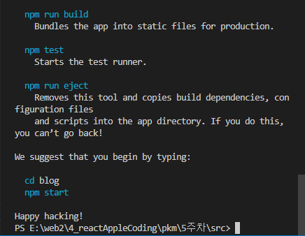
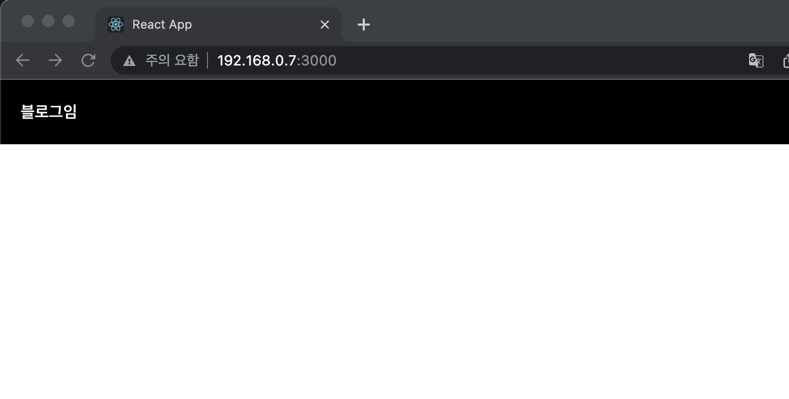
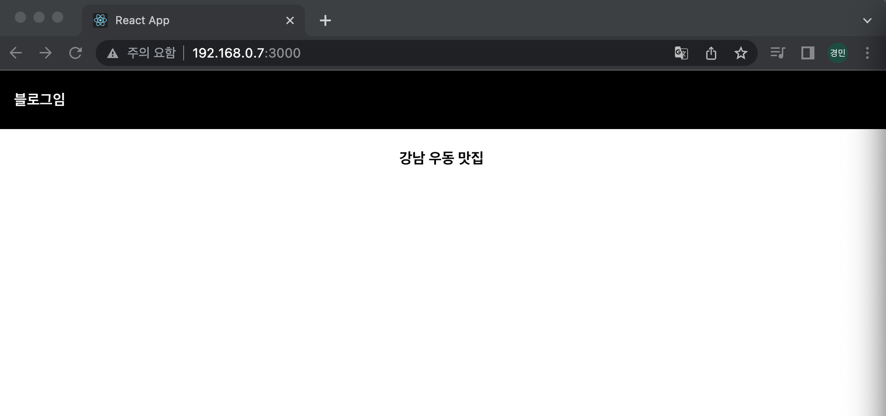
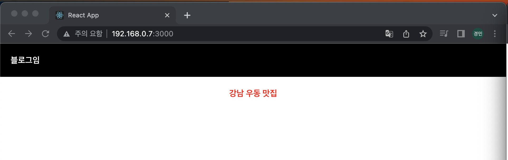
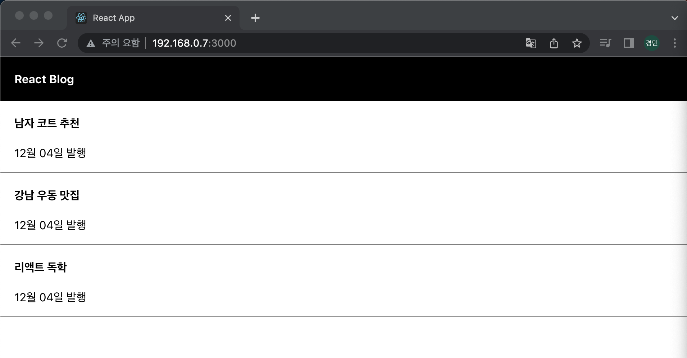
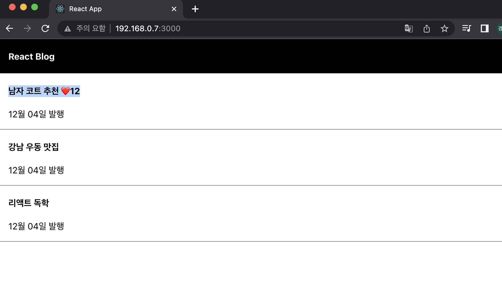
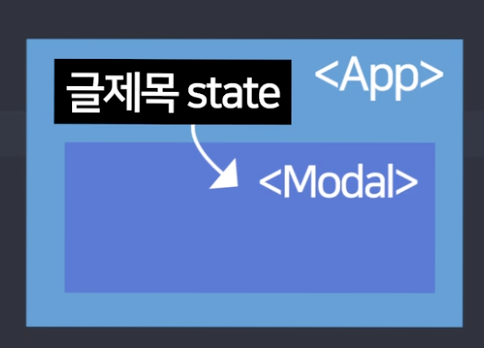
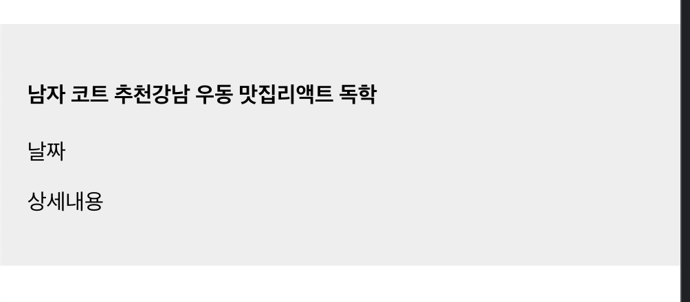

## 2022-12-03-Part1-블로그-제작-&-기초-문법

## 목차

## 01.React 배우기 전에 쓰는 이유부터 알아야

- single page application 만들때 씀

  - 모바일앱이랑 사용성 비슷함

  - 부드러운 html로 가능하고 짧은 소스로 가능함

- 리액트를 쓰면 html 재사용 편리
- 같은 문법으로 앱개발
  - 리액트 네이티브 사용 하면됨

## 02.개발환경 세팅

- Node.js설치 하기
- vscode 설치하기

### 02.1 프로젝트 생성

- 폴더 생성후 터미널 열기

  ```sh
  npx create-react-app 프로젝트명
  ```

  - 위에처럼하면 리액트 생성됨

- 허가되지 않는 스크립트가 나오는 경우

  ```sh
  Set-ExecutionPolicy Unrestricted
  ```

  - 파워셀 관리자 모드로 들어가서 진행하기

- 맥북의 경우

  ```sh
  sudo npx create-react-app blog
  ```



- 이렇게 나오면 성공
- src/app.js
  - 여기서 우리가 만들것임
- npm start 하면 앱을 실행 할 수 있음

### 02.2 프로젝트 파일 설명

- node_modules
  - 프로젝트 구동에 필요한 모든 라이브러리 모아놓은것
- public
  - html, img등 static 파일 모아놓은곳
- src폴더
  - 코드 짜는 곳
  - app.js 
    - 메인페이지임
  - js파일에 html 짜도 되는 이유?
    - app.js에 짠것은 누군가가 index.html에 집어넣어주는것을 해주고 있어서 가능함
      - index.js라는 파일이 해줄것임
- package.json
  - 프로젝트 정보가 있음
    - 이름, 버전, 설치한 라이브러리등이 있음

## 03.리액트 레이아웃 만들때 쓰는 JSX 문법 3개

```react
import logo from './logo.svg';
import './App.css';

function App() {
  return (
    <div className="App">

    </div>
  );
}

export default App;
```

- 이상태로 시작 할 것
- 자바스크립트 안에서html 코드 쓰는데 
  - 어떻게 동작하지 생각할 것임
  - 이것은 html이 아닌  JSX라고 그런것
    - js파일에서 쓰는 html 대용품

- 코드 짜기

  - app.js

    ```js
    import logo from './logo.svg';
    import './App.css';
    
    function App() {
      return (
        <div className="App">
          <div class="black-nav">
            <h4>블로그임</h4>
          </div>
        </div>
      );
    }
    
    export default App;
    ```

  - app.css

    ```css
    .black-nav{
      display: flex;
      background: black;
      width:100%;
      color:white;
      padding-left:20px;
    }
    ```

    

- className

  - 단,  html이 아니기 때문에 class라고 하는게 아니고 jsx이므로 className으로 해야한다.

  - app.js 변경

    ```js
    import logo from './logo.svg';
    import './App.css';
    
    function App() {
      return (
        <div className="App">
          <div className="black-nav">
            <h4>블로그임</h4>
          </div>
        </div>
      );
    }
    
    export default App;
    ```

    - jsx에서 class와 겹치기  때문에

- 중괄호 문법

  ```js
  // 변경 전
  <h4>강남 우동 맛집</h4>
  
  // 변경 후
  let post = '강남 우동 맛집'
  <h4>{post}</h4>
  ```

  - id에서도 가능함 , 왠만하면 어디든 사용가능

  - 변수 넣을 때 사용함

    - 이런것 데이터 바인딩 이라고 함
    - 주로 프론트엔드에서 하는 일임

    

- style 속성 그냥 안에 넣어서 해도됨

  - 하지만 html이 아니라서 이러면 안됨
  - style ="" (x)
  - style ={{color: 'red', fontSize: '16px'}}
    - 이렇게 해야함

  

### 03.1 전체소스

- app.js

  ```js
  import logo from './logo.svg';
  import './App.css';
  
  function App() {
  
    let post = '강남 우동 맛집';
  
    return (
      <div className="App">
        <div className="black-nav">
          <h4>블로그임</h4>
        </div>
        <h4 style ={{color: 'red', fontSize: '16px'}}>{post}</h4>
      </div>
    );
  }
  
  export default App;
  ```

- app.css

  ```css
  .black-nav{
    display: flex;
    background: black;
    width:100%;
    color:white;
    padding-left:20px;
  }
  ```


## 04.중요한 데이터는 변수말고 state에 담습니다.

- 초기 설정

  - app.js

    ```js
    import logo from './logo.svg';
    import './App.css';
    
    function App() {
    
      let post = '강남 우동 맛집';
    
      return (
        <div className="App">
          <div className="black-nav">
            <h4>블로그임</h4>
          </div>
          <div className ="list">
            <h4>글제목</h4>
            <p>12월 04일 발행</p>
          </div>
          <h4 style ={{color: 'red', fontSize: '16px'}}>{post}</h4>
        </div>
      );
    }
    
    export default App;
    ```

  - app.css

    ```css
    div{
      box-sizing: border-box;
    }
    .list{
      padding-left: 20px;
      text-align: left;
      border-bottom: 1px solid grey;
    }
    
    .black-nav{
      display: flex;
      background: black;
      width:100%;
      color:white;
      padding-left:20px;
    }
    ```

### 04.1 state?

- 잠깐 저장할때 변수에 저장하면됨

- 변수는 let, var, const로 만듦

- 자료 잠깐 보관할때 state도 가능함

  ```js'
   let [a,b]= useState('남자 코트 추천');
  ```

  - 사용법임
    - a는 작명하는곳 남자 코드 추천이 나옴
    - b는 state 변경 도와주는곳
      - 함수가 들어감

- 위의 문법은 Destructuring이라는 문법

  - array라는 것이 있는데, 순서대로 저장할 경우 사용하게됨

    - 이때 1, 2가 유용해서 따로 빼고 싶은 경우사용

      ```js
      let num = [1,2];
      
      //문법 적용 전
      let a = num[0];
      let b = num[1];
      
      // Destructuring
      let [a,c] = [1,2];
      ```

- 언제 쓰는가?
  - post변수 변경 했다고 해서 바로 바뀌지 않음
  - state의 경우는
    - 남자 코트에서 여자 코드 라고 바꿔도 재 랜더링이 됨
  - 즉, 변동시 자동으로 html에 반영되게 만들고 싶을때 사용함

- 자주 바뀌지 않는 것은 굳이 쓸필요 없음
  - 그냥 자주 변경되는것에만 쓰면됨

## 04.2 숙제

- app.js

  ```js
  import logo from './logo.svg';
  import './App.css';
  import { useState } from 'react';
  
  function App() {
  
    let post = '강남 우동 맛집';
    let [blogTitle, setLogo]= useState('React Blog');
    let [subTitle1,b1]= useState('남자 코트 추천');
    let [subTitle2,b2]= useState('강남 우동 맛집');
    let [subTitle3,b3]= useState('리액트 독학');
  
  
    return (
      <div className="App">
        <div className="black-nav">
          <h4>{blogTitle}</h4>
        </div>
        <div className ="list">
          <h4>{subTitle1}</h4>
          <p>12월 04일 발행</p>
        </div>
        <div className ="list">
          <h4>{subTitle2}</h4>
          <p>12월 04일 발행</p>
        </div>
        <div className ="list">
          <h4>{subTitle3}</h4>
          <p>12월 04일 발행</p>
        </div>
      </div>
    );
  }
  
  export default App;
  ```

- app.js (2)

  ```js
  import logo from './logo.svg';
  import './App.css';
  import { useState } from 'react';
  
  function App() {
  
    let post = '강남 우동 맛집';
    let [blogTitle, setLogo]= useState('React Blog');
    let [subTitle,b1]= useState(['남자 코트 추천','강남 우동 맛집','리액트 독학']);
  
    return (
      <div className="App">
        <div className="black-nav">
          <h4>{blogTitle}</h4>
        </div>
        <div className ="list">
          <h4>{subTitle[0]}</h4>
          <p>12월 04일 발행</p>
        </div>
        <div className ="list">
          <h4>{subTitle[1]}</h4>
          <p>12월 04일 발행</p>
        </div>
        <div className ="list">
          <h4>{subTitle[2]}</h4>
          <p>12월 04일 발행</p>
        </div>
      </div>
    );
  }
  
  export default App;
  ```



## 05.버튼에 기능개발을 해보자 & 리액트 state변경하는 법

- Error는 에러라 중요

- warning은 무시 가능

  ```js
  esLint-disalbe
  ```

  - 이렇게 하면 warning 사라짐

### 05.1 좋아요 버튼 & 갯수 UI만들기

- onClick
  - 클릭시 동작
    - 이벤트 핸들러 추가

- state 등호로 변경 금지
  - 변경하는법

- app.js

  ```js
  import logo from './logo.svg';
  import './App.css';
  import { useState } from 'react';
  
  function App() {
  
    let [blogTitle, setLogo]= useState('React Blog');
    let [subTitle,b1]= useState(['남자 코트 추천','강남 우동 맛집','리액트 독학']);
    let [like, likeChange]= useState(0);
  
    return (
      <div className="App">
        <div className="black-nav">
          <h4>{blogTitle}</h4>
        </div>
        <div className ="list">
          <h4>{subTitle[0]} <span onClick={()=>{likeChange(like+1)}}>❤️</span>{like}</h4>
          <p>12월 04일 발행</p>
        </div>
        <div className ="list">
          <h4>{subTitle[1]}</h4>
          <p>12월 04일 발행</p>
        </div>
        <div className ="list">
          <h4>{subTitle[2]}</h4>
          <p>12월 04일 발행</p>
        </div>
      </div>
    );
  }
  
  export default App;
  ```



- 이벤트 핸들러 함수를 넣어야하고
- state 변경은  state변경 함수를 써야함

### 05.2 숙제

- 버튼 누르면 첫글이 여자코트 추천으로 변경하게 만들기

- app.js

  ```js
  import logo from './logo.svg';
  import './App.css';
  import { useState } from 'react';
  
  function App() {
  
    let [blogTitle, setLogo]= useState('React Blog');
    let [subTitle, subTitleChange]= useState(['남자 코트 추천','강남 우동 맛집','리액트 독학']);
    let [like, likeChange]= useState(0);
  
    return (
      <div className="App">
        <div className="black-nav">
          <h4>{blogTitle}</h4>
          <span onClick={()=>{subTitleChange(['여자 코트 추천','강남 우동 맛집','리액트 독학'])}}>🔁</span>
        </div>
        <div className ="list">
          <h4>{subTitle[0]} <span onClick={()=>{likeChange(like+1)}}>❤️</span>{like}</h4>
          <p>12월 04일 발행</p>
        </div>
        <div className ="list">
          <h4>{subTitle[1]}</h4>
          <p>12월 04일 발행</p>
        </div>
        <div className ="list">
          <h4>{subTitle[2]}</h4>
          <p>12월 04일 발행</p>
        </div>
      </div>
    );
  }
  
  export default App;
  ```

## 06.array, object state 변경하는 법

- 위와 같은 경우로 하면 확장성이 너무 떨어짐
  - 변경된것을 하나 바꾸는데 다써야하니까
  - 일부분만 바꾸는 방법을 알아보자

```js
<button onClick={()=>{
	subTitle[0] = '여자코트 추천';
    subTitleChange(subTitle);
	}
}></button>

```

- array/ object 다룰 때

  - 원본은 보존하는게 좋음

    ```js
    <span onClick={()=>{
        let = copyTitle = subTitle;
        copyTitle[0]= '여자코트 추천';
        subTitleChange(copyTitle);
    	}
    }>🔁</span>
    
    ```

  - 잘되는 소스

    ```js
            <span onClick={()=>{
        let copyTitle = [...subTitle];
        copyTitle[0]= '여자코트 추천';
        subTitleChange(copyTitle);
    	}
    }>🔁</span>
    ```

- [...subTitle] 로 해야 정상 동작하는 이유

  - state변경 함수 특징

    - 기존state == 신규state의 경우 변경 안해줌
      - 일종의 자원절약이라고 생각하기
    - array/ object 특징
      - 특정공간에 저장해놓고 화살표만 저장됨
        - ram에 저장되고 화살표만 가리킴
    - 변경이 됬더라고 해도 화살표는 수정이 안됨
      - 화살표가 변경이 안되서 기존이랑 신규랑 변화한지 모름

    - 왜 안바뀌나 복사를 했어도 두개를 같은 것으로 인식하기 때문
      - reference data type이라서 그런다고함
        - arry/ object가 그런것임

    - ... 괄호 벗겨주세요 문법
      - 이렇게 쓰면 화살표 달라짐

### 06.1 숙제

- 가나다라마 버튼
  - 제목이 자동으로 정렬되게 하는 버튼

```js
<button onClick={()=>{
  let copy = [...subTitle]
  copy.sort();
  subTitleChange(copy);
}}>
```

## 07.Component : 많은 div들을 한 단어로 줄이고 싶으면

- 상세페이지 모달창 만들것

  - app.js

    ```js
          <div className ="modal">
            <h4>제목</h4>
            <p>날짜</p>
            <p>상세내용</p>
          </div>
    ```

  - app.css

    ```css
    .modal{
      margin-top:20px;
      padding: 20px;
      background: #eee;
      text-align: left;
    }
    ```

- html특징 길어져서 더러워짐

  - 리액트는 한 단어로 축약할 수 있는 기능

    - 컴포넌트로 만들 수 있음

    ```
    <Modal></Modal>
    ```

    - 이렇게 쓸 수 있음

  - 컴포넌트 만드는 법
    - 1.function 만들기
    - 2.retrun()안에 html 담기
    - 3.<함수명></함수명>쓰기

```js
<Modal></Modal>

function Modal (){
  return (
    <div className ="modal">
      <h4>제목</h4>
      <p>날짜</p>
      <p>상세내용</p>
    </div>
  )
}
```

- div 하나로 감싸서 두개를 쓰던지

  - 그냥 <> </>

    - 플래그먼트라는 문법인데 이렇게 해도 

    ```js
          <Modal></Modal>
          <Modal/>
    ```

    - 같은 의미임

### 07.1 컴포넌트 만들면 좋은 것!

- 1.반복적인 html축약할 때
- 2.큰페이지들
- 3.자주변경되는 것들

### 07.2 많이 쓰면 단점

- 막 쓰는것 가능하지만
  - 책임이 따름
  - state할때 그 모달에 넣으면 되지만 그렇게 하면 못찾음
- 1.state 가져다 쓸 때 문제가 생김

### 07.3 컴포넌트 만드는 문법2

```js
const Modal =()=>{
    return (
    	<div></div>
    )
}
```

- const로 하는 경우 이점
  - 실수로 수정시 에러 메세지 출력해줌
    - 왜 수정하는지 알려줌 , 실수 방지해줌

- 즉, function이고 대문자로 시작하면 컴포넌트라고 생각하면됨

## 08.리액트 환경에서 동적인 UI 만드는 법 (모달창만들기)

### 08.1 제목누르면 <Modal>보여주기

- 동적 UI Step
  - 1.html css미리 디자인 완성
  - 2.UI 현재 상태state로 저장
  - 3.state에따라서 UI 어떻게 보일지 작성

```js
  let [modal, setModal]= useState(false);

      {
        modal == true ? <Modal/> : null
      }
```

- 삼항 연산자 써서 조건 주면됨

```js
<div className ="list">
    <h4 onClick={()=>{
        setModal(true);
    }}>{subTitle[2]}</h4>
<p>12월 04일 발행</p>
</div>
{
    modal == true ? <Modal/> : null
}
```

- 전체 소스

  - app.js

    ```js
    import logo from './logo.svg';
    import './App.css';
    import { useState } from 'react';
    
    function App() {
    
      let [blogTitle, setLogo]= useState('React Blog');
      let [subTitle, subTitleChange]= useState(['남자 코트 추천','강남 우동 맛집','리액트 독학']);
      let [like, likeChange]= useState(0);
      let [modal, setModal]= useState(false);
    
    return (
        <div className="App">
          <div className="black-nav">
            <h4>{blogTitle}</h4>
            <span onClick={()=>{
        let copyTitle = [...subTitle];
        copyTitle[0]= '여자코트 추천';
        subTitleChange(copyTitle);
    	}
    }>🔁</span>
    <button onClick={()=>{
      let copy = [...subTitle]
      copy.sort();
      subTitleChange(copy);
    }}>
      가나다라마다사 정렬
    </button>
          </div>
          <div className ="list">
            <h4>{subTitle[0]} <span onClick={()=>{likeChange(like+1)}}>❤️</span>{like}</h4>
            <p>12월 04일 발행</p>
          </div>
          <div className ="list">
            <h4>{subTitle[1]}</h4>
            <p>12월 04일 발행</p>
          </div>
          <div className ="list">
            <h4 onClick={()=>{
              setModal(!modal);
            }}>{subTitle[2]}</h4>
            <p>12월 04일 발행</p>
          </div>
          {
            modal == true ? <Modal/> : null
          }
        </div>
      );
    }
    
    
    function Modal (){
      return (
        <div className ="modal">
          <h4>제목</h4>
          <p>날짜</p>
          <p>상세내용</p>
        </div>
      )
    }
    
    export default App;
    ```

  - app.css

    ```css
    .App {
      text-align: center;
    }
    
    div{
      box-sizing: border-box;
    }
    .list{
      padding-left: 20px;
      text-align: left;
      border-bottom: 1px solid grey;
    }
    
    .modal{
      margin-top:20px;
      padding: 20px;
      background: #eee;
      text-align: left;
    }
    
    .black-nav{
      display: flex;
      background: black;
      width:100%;
      color:white;
      padding-left:20px;
    }
    
    .App-logo {
      height: 40vmin;
      pointer-events: none;
    }
    
    @media (prefers-reduced-motion: no-preference) {
      .App-logo {
        animation: App-logo-spin infinite 20s linear;
      }
    }
    
    .App-header {
      background-color: #282c34;
      min-height: 100vh;
      display: flex;
      flex-direction: column;
      align-items: center;
      justify-content: center;
      font-size: calc(10px + 2vmin);
      color: white;
    }
    
    .App-link {
      color: #61dafb;
    }
    
    @keyframes App-logo-spin {
      from {
        transform: rotate(0deg);
      }
      to {
        transform: rotate(360deg);
      }
    }
    
    ```

### 08.2 숙제 제목 다시 누르면 모달창 지워주는것

- 내가 한 답

  ```js
  <div className ="list">
      <h4 onClick={()=>{
          modal == false ? setModal(true): setModal(false);
      }}>{subTitle[2]}</h4>
  <p>12월 04일 발행</p>
  </div>
  {
      modal == true ? <Modal/> : null
  }
  ```

- 정답

  ```js
  <div className ="list">
      <h4 onClick={()=>{
          setModal(!modal);
      }}>{subTitle[2]}</h4>
  <p>12월 04일 발행</p>
  </div>
  {
      modal == true ? <Modal/> : null
  }
  ```

  ## 09.map : 많은 div들을 반복문으로 줄이고 싶은 충동이 들 때

  ### 09.1 Map

  ```js
  [1,2,3].map(function(){
       console.log(a);
  })
  ```

  - function안에 있는 것 1,2,3 있는것 만큼 동작해줌

  ```js
  [1,2,3].map(function(a){
       console.log(a);
  })
  ```

  - 파라미터 넣으면 해당 1,2,3을 쓸수 있음

  ```js
  [1,2,3].map(function(a){
  	return '1234'
  })
  ```

  - return 하면 1,2,3에 해당 데이터 넣어줌 

### 09.2 div 축약

```js
{
    [1,2,3].map(function(){
        return (<div>안녕</div>) 
    })
}

//<div>안녕</div><div>안녕</div><div>안녕</div>
```

- 사용하기

  ```js
  {
      [1,2,3].map(function(){
          return (      <div className ="list">
                  <h4>{subTitle[1]}</h4>
                  <p>12월 04일 발행</p>
                  </div>) 
                  })
  }
  ```

  - 하드코딩해서 무조건 3개

  - 글제목에 맞게 하려면 이렇게 하면됨

    ```js
    {
        subTitle.map(function(){
            return (      <div className ="list">
                    <h4>{subTitle[1]}</h4>
                     <p>12월 04일 발행</p>
                     </div>) 
    })
    }
    ```

    - 문제가 있음

      - 같은 글만 보이기 때문에 이를 해결하면

      ```js
      {
          subTitle.map(function(a){
              return (      <div className ="list">
                      <h4>{a}</h4>
                       <p>12월 04일 발행</p>
                       </div>) 
      })
      }
      ```

      - function(a,i) 이렇게 하면 i의 경우 0, 1씩 증가함

        ```js
        {
            subTitle.map(function(a,i){
                return (      <div className ="list">
                        <h4>{subTitle[i]}</h4>
                         <p>12월 04일 발행</p>
                         </div>) 
        })
        }
        ```

### 09.3 숙제

```js
{
    subTitle.map(function(a,i){
        return (      
            <div className ="list">
                <h4>{subTitle[i]}<span onClick={()=>{likeChange(like+1)}}>❤️</span>{like}</h4>
                 <p>12월 04일 발행</p>
            </div>
        ) 
	})
}
```

- 같이 올라가는 현상 해결하기
- 따봉공간 한개여서 그런것 힌트

```js
{
    subTitle.map(function(a,i){
        return (      
            <div className ="list" key={i}>
                <h4>{subTitle[i]}<span onClick={()=>{likeChange(like+1)}}>❤️</span>{like}</h4>
                 <p>12월 04일 발행</p>
            </div>
        ) 
	})
}
```

- key={i}추가해야 에러 없음
  - 유니크한 키값을 가져야해서

- 숙제

  ```js
  let [like, likeChange]= useState([0,0,0]);
  
  {
      subTitle.map(function (a, i) {
          return (
              <div className="list" key={i}>
                   <h4>{subTitle[i]}<span onClick={() => {
          let copyLike = [...like];
          copyLike[i] = copyLike[i]+1;
          likeChange(copyLike)
      }}>❤️</span>{like[i]}</h4>
          <p>12월 04일 발행</p>
  </div>
  )
  })
  }
  ```

- 정답

  ```js
  <h4> 
    { 글제목[i] } 
     <span onClick={()=>{ 
        let copy = [...따봉];
        copy[i] = copy[i] + 1;
        따봉변경(copy)  
     }}>👍</span> {따봉[i]} 
  </h4> 
  ```

### 09.4 일반적인 반복분사용법

- 1.html들을 담아둘 array 자료를 하나 만듦
- 2.일반 for반복문을 이용해서 반복문 돌림
- 3.반복될 때 마다 array자료에 <div>하나 씩 추가
- 4.원하는 곳에 {array자료} 사용

```js
function App (){
  
  var 어레이 = [];
  for (var i = 0; i < 3; i++) {
    어레이.push(<div>안녕</div>)
  }
  return (
    <div>
      { 어레이 }
    </div>
  )
}
```

## 10.자식이 부모의 state 가져다쓰고 싶을 때는 props

- 초기 app.js

  ```js
  import logo from './logo.svg';
  import './App.css';
  import { useState } from 'react';
  
  function App() {
  
    let [blogTitle, setLogo] = useState('React Blog');
    let [subTitle, subTitleChange] = useState(['남자 코트 추천', '강남 우동 맛집', '리액트 독학']);
    let [modal, setModal] = useState(false);
    let [like, likeChange] = useState([0, 0, 0]);
  
    return (
      <div className="App">
        <div className="black-nav">
          <h4>{blogTitle}</h4>
          <span onClick={() => {
            let copyTitle = [...subTitle];
            copyTitle[0] = '여자코트 추천';
            subTitleChange(copyTitle);
          }
          }>🔁</span>
          <button onClick={() => {
            let copy = [...subTitle]
            copy.sort();
            subTitleChange(copy);
          }}>
            가나다라마다사 정렬
          </button>
        </div>
        {
          subTitle.map(function (a, i) {
            return (
              <div className="list" key={i}>
                <h4 onClick={()=>setModal(true)}>{subTitle[i]}<span onClick={() => {
                  let copyLike = [...like];
                  copyLike[i] = copyLike[i]+1;
                  likeChange(copyLike)
                   }}>❤️</span>{like[i]}</h4>
                <p>12월 04일 발행</p>
              </div>
            )
          })
        }
  
        {
          modal == true ? <Modal/> : null
        }
      </div>
    );
  }
  
  
  
  
  function Modal() {
    return (
      <div className="modal">
        <h4>제목</h4>
        <p>날짜</p>
        <p>상세내용</p>
      </div>
    )
  }
  
  export default App;
  ```

- app.css

  ```css
  .App {
    text-align: center;
  }
  
  div{
    box-sizing: border-box;
  }
  .list{
    padding-left: 20px;
    text-align: left;
    border-bottom: 1px solid grey;
  }
  
  .modal{
    margin-top:20px;
    padding: 20px;
    background: #eee;
    text-align: left;
  }
  
  .black-nav{
    display: flex;
    background: black;
    width:100%;
    color:white;
    padding-left:20px;
  }
  
  .App-logo {
    height: 40vmin;
    pointer-events: none;
  }
  
  @media (prefers-reduced-motion: no-preference) {
    .App-logo {
      animation: App-logo-spin infinite 20s linear;
    }
  }
  
  .App-header {
    background-color: #282c34;
    min-height: 100vh;
    display: flex;
    flex-direction: column;
    align-items: center;
    justify-content: center;
    font-size: calc(10px + 2vmin);
    color: white;
  }
  
  .App-link {
    color: #61dafb;
  }
  
  @keyframes App-logo-spin {
    from {
      transform: rotate(0deg);
    }
    to {
      transform: rotate(360deg);
    }
  }
  
  ```

- 아래와 같이

  ```js
  function Modal() {
    return (
      <div className="modal">
        <h4>{글제목[0]}</h4>
        <p>날짜</p>
        <p>상세내용</p>
      </div>
    )
  }
  ```

  - 이렇게 state 쓰면 안됨 모르기 때문에

  - 이때 props쓰면됨

  

  - 이런형태면 가능

### 10.1 props 쓰는법

- 1.<자식컴포넌트 작명={state이름}>

  ```js
  {
      modal == true ? <Modal 작명={subTitle}/> : null
  }
  ```

- 2.props 파라미터 등록 후 props.작명 사용

  ```js
  function Modal(props) {
    return (
      <div className="modal">
        <h4>{props.작명}</h4>
        <p>날짜</p>
        <p>상세내용</p>
      </div>
    )
  }
  ```

  

  - 작명 오른쪽 있는것이랑 비슷하게 감

    ```js
    ...
    {
            modal == true ? <Modal subTitle={subTitle}/> : null
          }
        </div>
      );
    }
    
    
    
    
    function Modal(props) {
      return (
        <div className="modal">
          <h4>{props.subTitle[0]}</h4>
          <p>날짜</p>
          <p>상세내용</p>
        </div>
      )
    }
    ```

    - 부모에서 자식만 가능
      - 패륜 불륜 안됨
    - 컴포넌트 많아지면 props 많이 써야함

### 10.2 다양한 색 모달창 필요경우

```js
      {
        modal == true ? <Modal  color ={'skyblue'} subTitle={subTitle}/> : null
      }
    </div>
  );
}


function Modal(props) {
  return (
    <div className="modal" style={{background : props.color}}>
      <h4>{props.subTitle[0]}</h4>
      <p>날짜</p>
      <p>상세내용</p>
    </div>
  )
}
```

- 이렇게 해놓으면 파라미터 문법은 다양한 기능을 하는 함수를 만들때 사용
- 일반 문자도 전송 가능함

## 10.3 숙제 

- 글수정 버튼 눌러서 첫 글 제목이 '여자 코트 추천'으로 변경

```js
...	
	  {
        modal == true ? <Modal  color ={'skyblue'} subTitle={subTitle}/> : null
      }
    </div>
  );
}


function Modal(props) {
  return (
    <div className="modal" style={{background : props.color}}>
      <h4>{props.subTitle[0]}</h4>
      <p>날짜</p>
      <p>상세내용</p>
      <button>글 수정</button>
    </div>
  )
}
```

- state 뿐만 아닌 함수도 가져다 쓸 수 있음이 힌트

- 숙제

  ```js
    function changeWrite(){
      let copyTitle = [...subTitle];
      copyTitle[0] = '여자코트 추천';
      subTitleChange(copyTitle);
    }
  ...
  
  {
          modal == true ? <Modal  color ={'skyblue'} subTitle={subTitle} changeWrite = {changeWrite}/> : null
        }
      </div>
    );
  }
  
  
  function Modal(props) {
    return (
      <div className="modal" style={{background : props.color}}>
        <h4>{props.subTitle[0]}</h4>
        <p>날짜</p>
        <p>상세내용</p>
        <button onClick={() => {
                    {props.changeWrite()}
          }}>글 수정</button>
      </div>
    )
  }
  ```

- 정답

  ```js
    function changeWrite(){
      let copyTitle = [...subTitle];
      copyTitle[0] = '여자코트 추천';
      subTitleChange(copyTitle);
    }
  ...
  
  {
          modal == true ? <Modal  color ={'skyblue'} subTitle={subTitle} setSubTitle = {setSubTitle}/> : null
        }
      </div>
    );
  }
  
  
  function Modal(props) {
    return (
      <div className="modal" style={{background : props.color}}>
        <h4>{props.subTitle[0]}</h4>
        <p>날짜</p>
        <p>상세내용</p>
        <button onClick={() => {
                    {props.setSubTitle(['여자 코드 추천','강남 우동 맛집', '리액트 독학'])}
          }}>글 수정</button>
      </div>
    )
  }
  ```

- 여기까지 전체 코드

  ```js
  import logo from './logo.svg';
  import './App.css';
  import { useState } from 'react';
  
  function App() {
  
    let [blogTitle, setLogo] = useState('React Blog');
    let [subTitle, setSubTitle] = useState(['남자 코트 추천', '강남 우동 맛집', '리액트 독학']);
    let [modal, setModal] = useState(false);
    let [like, likeChange] = useState([0, 0, 0]);
  
    function changeWrite(){
      let copyTitle = [...subTitle];
      copyTitle[0] = '여자코트 추천';
      setSubTitle(copyTitle);
    }
  
    return (
      <div className="App">
        <div className="black-nav">
          <h4>{blogTitle}</h4>
          <span onClick={() => {
                let copyTitle = [...subTitle];
                copyTitle[0] = '여자코트 추천';
                setSubTitle(copyTitle);
          }
          }>🔁</span>
          <button onClick={() => {
            let copy = [...subTitle]
            copy.sort();
            setSubTitle(copy);
          }}>
            가나다라마다사  정렬
          </button>
        </div>
        {
          subTitle.map(function (a, i) {
            return (
              <div className="list" key={i}>
                <h4 onClick={()=>setModal(true)}>{subTitle[i]}<span onClick={() => {
                  let copyLike = [...like];
                  copyLike[i] = copyLike[i]+1;
                  likeChange(copyLike)
                   }}>❤️</span>{like[i]}</h4>
                <p>12월 04일 발행</p>
              </div>
            )
          })
        }
  
  {
          modal == true ? <Modal  color ={'skyblue'} subTitle={subTitle} setSubTitle = {setSubTitle}/> : null
        }
      </div>
    );
  }
  
  
  function Modal(props) {
    return (
      <div className="modal" style={{background : props.color}}>
        <h4>{props.subTitle[0]}</h4>
        <p>날짜</p>
        <p>상세내용</p>
        <button onClick={() => {
                    {props.setSubTitle(['여자 코드 추천','강남 우동 맛집', '리액트 독학'])}
          }}>글 수정</button>
      </div>
    )
  }
  export default App;
  ```

## 11.props를 응용한 상세페이지 만들기

- 0 번째는 0번 각 모달창 띄우게 하기

  ```js
  //1.html css미리 디자인
  function Modal(props) {
    return (
      <div className="modal" style={{background : props.color}}>
        <h4>{props.subTitle}</h4>
        <p>날짜</p>
        <p>상세내용</p>
        <button>글 수정</button>
      </div>
    )
  }
  //2.현재 UI상태를 state에 저장
    let [title] = useState(0);
  
  //3.state에 따라 UI가 어떻게 보일지 작성
  ...
  
        {
          modal == true ? <Modal title = {title} color ={'skyblue'} subTitle={subTitle}/> : null
        }
      </div>
    );
  }
  
  
  function Modal(props) {
    return (
      <div className="modal" style={{background : props.color}}>
        <h4>{props.subTitle[props.title]}</h4>
        <p>날짜</p>
        <p>상세내용</p>
        <button>글 수정</button>
      </div>
    )
  }
  ```

- 해결 소스

  ```js
    let [title, setTitle] = useState(0);
  {
          subTitle.map(function (a, i) {
            return (
              <div className="list" key={i}>
                <h4 onClick={()=>{setModal(true); setTitle(i)}}>{subTitle[i]}<span onClick={() => {
                  let copyLike = [...like];
                  copyLike[i] = copyLike[i]+1;
                  likeChange(copyLike)
                   }}>❤️</span>{like[i]}</h4>
                <p>12월 04일 발행</p>
              </div>
            )
          })
        }
  
        {
          modal == true ? <Modal title = {title} color ={'skyblue'} subTitle={subTitle}/> : null
        }
      </div>
    );
  }
  
  
  function Modal(props) {
    return (
      <div className="modal" style={{background : props.color}}>
        <h4>{props.subTitle[props.title]}</h4>
        <p>날짜</p>
        <p>상세내용</p>
        <button>글 수정</button>
      </div>
    )
  }
  ```

- 전체소스

  ```js
  import logo from './logo.svg';
  import './App.css';
  import { useState } from 'react';
  
  function App() {
  
    let [blogTitle, setLogo] = useState('React Blog');
    let [subTitle, setSubTitle] = useState(['남자 코트 추천', '강남 우동 맛집', '리액트 독학']);
    let [modal, setModal] = useState(false);
    let [like, likeChange] = useState([0, 0, 0]);
    let [title, setTitle] = useState(0);
  
    function changeWrite(){
      let copyTitle = [...subTitle];
      copyTitle[0] = '여자코트 추천';
      setSubTitle(copyTitle);
    }
  
    return (
      <div className="App">
        <div className="black-nav">
          <h4>{blogTitle}</h4>
          <span onClick={() => {
                let copyTitle = [...subTitle];
                copyTitle[0] = '여자코트 추천';
                setSubTitle(copyTitle);
          }
          }>🔁</span>
          <button onClick={() => {
            let copy = [...subTitle]
            copy.sort();
            setSubTitle(copy);
          }}>
            가나다라마다사  정렬
          </button>
        </div>
        {
          subTitle.map(function (a, i) {
            return (
              <div className="list" key={i}>
                <h4 onClick={()=>{setModal(true); setTitle(i)}}>{subTitle[i]}<span onClick={() => {
                  let copyLike = [...like];
                  copyLike[i] = copyLike[i]+1;
                  likeChange(copyLike)
                   }}>❤️</span>{like[i]}</h4>
                <p>12월 04일 발행</p>
              </div>
            )
          })
        }
  
        {
          modal == true ? <Modal title = {title} color ={'skyblue'} subTitle={subTitle}/> : null
        }
      </div>
    );
  }
  
  
  function Modal(props) {
    return (
      <div className="modal" style={{background : props.color}}>
        <h4>{props.subTitle[props.title]}</h4>
        <p>날짜</p>
        <p>상세내용</p>
        <button>글 수정</button>
      </div>
    )
  }
  export default App;
  ```

  