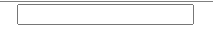
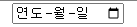
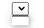
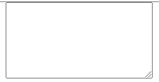
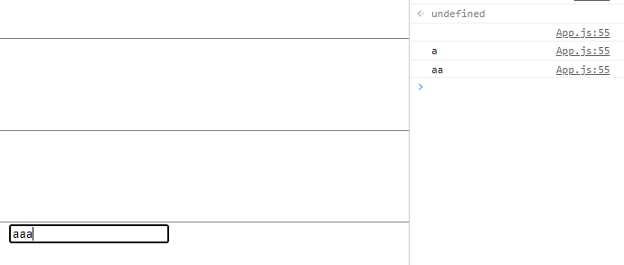
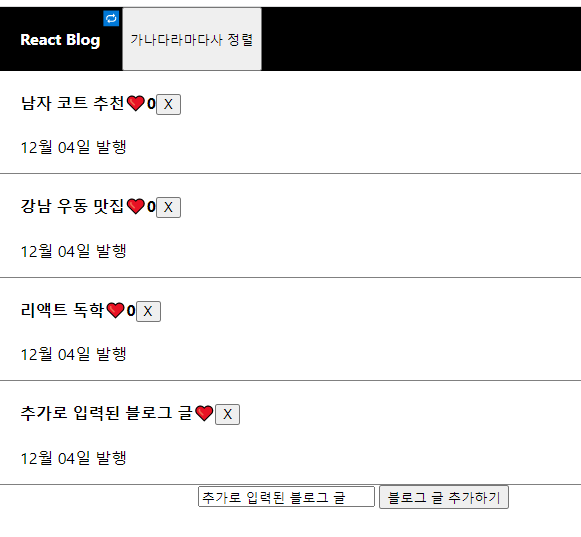
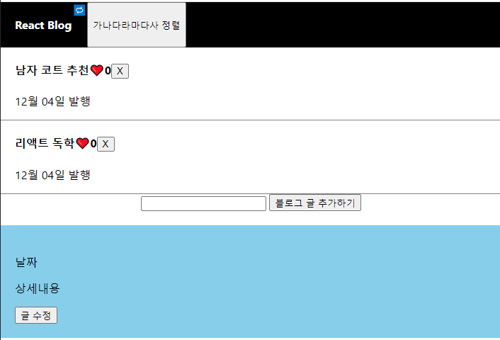

## 2022-12-07-Part-1--블로그-제작-&-기초-문법_2

## 목차

## 01.input 1 : 사용자가 입력한 글 다루기

- input, button 만들어서 블로그 글위에 추가하는 것 만들기

- input의 종류

  - type="text"

    

  - type="range"

    

  - type="checkbox"

    

  - type="date"

    

- `<select>`태그

  

  - 기능은 input가 비슷함

- `<textarea>`태그

  

  - 좀더 큰 input box

### 01.1 이벤트 핸들러

- onChange
  - onInput가 비슷
- onMouseOver
  - 마우스를 가져다 대면 코드 실행
- onScroll
  - 스크롤바 있다면 그것을 조작하면 실행

- input 입력값 가져오기

  - onChange={(e)=>{console.log(e)}}

  ```js
  <input  onChange={(e)=>{console.log(e.target.value)}} />
  ```

  - 이렇게 해야지 이벤트 발생한 html 태그에 입력한 값

### 01.2 이벤트 버블링 막기

- 버블링이 생기는것

  - 현재 태그만 보면

    ```react
    <div>
        <h4>
        	<span>
        	</span>
        </h4>
    </div>
    ```

    - 이렇게 div 안에 h4태그, 
      - h4 태그안애 span 태그가 있음 우리가 누르는 따봉은 span 태그를 누르는건데 제일 하위요소를 누르게 되는거라서 위의 부모 요소도 반응하는것

- before

  ```react
  <div className="list" key={i}>
      <h4 onClick={()=>{setModal(!modal); setTitle(i)}}>{subTitle[i]}<span onClick={() => {
          let copyLike = [...like];
          copyLike[i] = copyLike[i]+1;
          likeChange(copyLike)
      }}>❤️</span>{like[i]}</h4>
          <p>12월 04일 발행</p>
  </div>
  ```

- after

  ```react
  <div className="list" key={i}>
      <h4 onClick={()=>{setModal(!modal); setTitle(i)}}>{subTitle[i]}<span onClick={(e) => {
          e.stopPropagation();
          let copyLike = [...like];
          copyLike[i] = copyLike[i]+1;
          likeChange(copyLike)
      }}>❤️</span>{like[i]}</h4>
          <p>12월 04일 발행</p>
  </div>
  ```

  - 이런거 잘하려면 쌩 자바 스크립트 잘해야함

### 01.3 state 입력의 느림



```react
<input onChange={(e) => { 
        setInputValue(e.target.value);
        console.log(inputValue);
    }} />
```

- 이렇게 하면 입력값을 받을 수 있지만 
  - 문제는 첫 번째 문자는 못받음
    - 위와 같이됨
    - 그 이유는 state 변경함수는 늦게 처리되기 때문

### 01.4 오늘의 숙제

```
(힌트)

- html 직접 만질 필요는 없습니다. 지금 글제목 state만 바꾸면 html도 알아서 바뀌지 않겠습니까 

- array에 자료를 추가하거나 삭제하는 문법은 모르면 구글찾아봐야지 생각한다고 나오는 것은 아닙니다. 
```

#### 1번숙제  input에 뭐 입력하고 발행버튼누르면 블로그에 글이 하나 추가되는 기능을 만들어보십시오

```react
const [inputValue, setInputValue]=useState('');

const InputButtonHandle = (e) =>{
    let copySubTitle = [...subTitle,e];
    setSubTitle(copySubTitle);
}

<div>
    <input onChange={(e) => {
            e.preventDefault();
            setInputValue(e.target.value);
            console.log(inputValue);
        }} /> <button onClick={()=>{InputButtonHandle(inputValue)}}>블로그 글 추가하기</button>
</div>
```



#### 2번 숙제 글마다 옆에 삭제버튼 하나씩 만들어놓고 삭제버튼누르면 글이 없어지는 기능을 만들어보십시오.

```react
const DeleteButtonHandle = (e) =>{
    console.log(e);
    let copySubTitle = [...subTitle];
    subTitle.map(function(obj,index){
        if(e==obj){
            delete(copySubTitle[index]);
        }
    })
    setSubTitle(copySubTitle);
}


subTitle.map(function (a, i) {
    return (
        <div className="list" key={i}>
            <h4 onClick={() => { setModal(!modal); setTitle(i) }}>{subTitle[i]}
                <span onClick={(e) => {
                        e.stopPropagation();
                        let copyLike = [...like];
                        copyLike[i] = copyLike[i] + 1;
                        likeChange(copyLike)
                    }}>❤️</span>{like[i]}<button onClick={()=>{DeleteButtonHandle(a)}}>X</button></h4>
            <p>12월 04일 발행</p>
        </div>
    )
})
```



 - 지워지긴 함
   - 현재는 like랑 글이 분리되어있어서 문제가 있긴함

## 02.input 다루기 2 : 블로그 글발행 기능 만들기

- 숙제 검사하기 | 블로그 글 추가하기

  ```js
  let copy = [..subTitle];
  copy.unShift(inputValue);
  setSubTitle(copy);
  ```

  - 새로 고침하면 돌아가는 이유
    - 초기값으로 돌아가니까 서버로 보내서 데이터 베이스에 영구적으로 보관해야함

  - 숙제 비교하기

    ```js
    const InputButtonHandle = (e) =>{
        let copySubTitle = [...subTitle,e];
        setSubTitle(copySubTitle);
    }
    ```

  - 개선해보기

    ```js
    const InputButtonHandle = () =>{
        let copySubTitle = [...subTitle];
        copySubTitle.unShift(inputValue);
        setSubTitle(copySubTitle);
    }
    ```

    

- 숙제 검사하기 2 | 삭제 버튼 만들기

  ```js
  let copy = [...subTitle];
  copy.splice(0,1);//0번쨰 항목
  copy.splice(1,1);//1번쨰 항목
  copy.splice(2,1);//2번쨰 항목
  setSubTitle(copy);
  ```

   - 숙제 비교하기2

     ```js
       const DeleteButtonHandle = (e) =>{
         console.log(e);
         let copySubTitle = [...subTitle];
         subTitle.map(function(obj,index){
           if(e==obj){
             delete(copySubTitle[index]);
           }
         })
         setSubTitle(copySubTitle);
       }
     ```

   - 개선해보기 2

     ```js
     const DeleteButtonHandle = (e) =>{
         let copySubTitle = [...subTitle];
     	copySubTitle.splice(e,1);
         setSubTitle(copySubTitle);
     }
     ```

## 02.1 응용

### 02.1.1 글에 아무것도 입력안하고 발행버튼 누르는거 막으려면?

- 유저의 의도치않은 행동을 막는 코드도 많이 짜야 안전한 사이트가 됩니다. 

  ```js
    const InputButtonHandle = (e) => {
      if(e===''){
      alert("입력하세요");
      e.preventDefault();
      }
      let copySubTitle = [...subTitle];
      copySubTitle.unshift(inputValue);
      setSubTitle(copySubTitle);
    }
  ```

### 02.1.2  글을 하나 추가하면 따봉갯수 개별적용하던 것도 이상해질 수 있습니다.

- 어떻게 해결하면 될까요? 

- 아마 글이 하나 추가되면 따봉기록할 곳도 하나 더 만들어줘야할듯요.

  - before

    ```js
    import logo from './logo.svg';
    import './App.css';
    import { useState } from 'react';
    
    function App() {
    
      const [blogTitle, setLogo] = useState('React Blog');
      const [subTitle, setSubTitle] = useState(['남자 코트 추천', '강남 우동 맛집', '리액트 독학']);
      const [modal, setModal] = useState(false);
      const [like, likeChange] = useState([0, 0, 0]);
      const [title, setTitle] = useState(0);
      const [inputValue, setInputValue] = useState('');
    
      // const InputButtonHandle = (e) =>{
      //   let copySubTitle = [...subTitle,e];
      //   setSubTitle(copySubTitle);
      // }
      const InputButtonHandle = (e) => {
        if(e===''){
        alert("입력하세요");
        e.preventDefault();
        }
        let copySubTitle = [...subTitle];
        copySubTitle.unshift(inputValue);
        setSubTitle(copySubTitle);
      }
    
      // const DeleteButtonHandle = (e) =>{
      //   console.log(e);
      //   let copySubTitle = [...subTitle];
      //   subTitle.map(function(obj,index){
      //     if(e==obj){
      //       delete(copySubTitle[index]);
      //     }
      //   })
      //   setSubTitle(copySubTitle);
      // }
      const DeleteButtonHandle = (e) => {
        let copySubTitle = [...subTitle];
        copySubTitle.splice(e, 1);
        setSubTitle(copySubTitle);
      }
    
      function changeWrite() {
        let copyTitle = [...subTitle];
        copyTitle[0] = '여자코트 추천';
        setSubTitle(copyTitle);
      }
    
      return (
        <div className="App">
          <div className="black-nav">
            <h4>{blogTitle}</h4>
            <span onClick={() => {
              let copyTitle = [...subTitle];
              copyTitle[0] = '여자코트 추천';
              setSubTitle(copyTitle);
            }
            }>🔁</span>
            <button onClick={() => {
              let copy = [...subTitle]
              copy.sort();
              setSubTitle(copy);
            }}>
              가나다라마다사  정렬
            </button>
          </div>
          {
            subTitle.map(function (a, i) {
              return (
                <div className="list" key={i}>
                  <h4 onClick={() => { setModal(!modal); setTitle(i) }}>{subTitle[i]}
                    <span onClick={(e) => {
                      e.stopPropagation();
                      let copyLike = [...like];
                      copyLike[i] = copyLike[i] + 1;
                      likeChange(copyLike)
                    }}>❤️</span>{like[i]}<button onClick={() => { DeleteButtonHandle(i) }}>X</button></h4>
                  <p>12월 04일 발행</p>
                </div>
              )
            })
          }
          <div>
            <input onChange={(e) => {
              e.preventDefault();
              setInputValue(e.target.value);
              console.log(inputValue);
            }} /> <button onClick={() => InputButtonHandle(inputValue)}>블로그 글 추가하기</button>
          </div>
          {
            modal == true ? <Modal title={title} color={'skyblue'} subTitle={subTitle} /> : null
          }
        </div>
      );
    }
    
    
    function Modal(props) {
      return (
        <div className="modal" style={{ background: props.color }}>
          <h4>{props.subTitle[props.title]}</h4>
          <p>날짜</p>
          <p>상세내용</p>
          <button>글 수정</button>
        </div>
      )
    }
    export default App;
    ```

  - after

    - 1차 핸들러 정리

      ```js
      import logo from './logo.svg';
      import './App.css';
      import { useState } from 'react';
      
      function App() {
      
        const [blogTitle, setLogo] = useState('React Blog');
        const [subTitle, setSubTitle] = useState(['남자 코트 추천', '강남 우동 맛집', '리액트 독학']);
        const [posts, setPosts] = useState([
          {
            id:0,
            title: "남자 코트 추천",
            likeCount: 0
          },
          {
            id:1,
            title: "강남 우동 맛집",
            likeCount: 0
          },
          {
            id:2,
            title: "리액 강의 독학",
            likeCount: 0
          }
        ]);
        const [modal, setModal] = useState(false);
        const [like, likeChange] = useState([0, 0, 0]);
        const [title, setTitle] = useState(0);
        const [inputValue, setInputValue] = useState('');
      
        // const InputButtonHandle = (e) =>{
        //   let copySubTitle = [...subTitle,e];
        //   setSubTitle(copySubTitle);
        // }
        const InputButtonHandle = (e) => {
          if(e===''){
          alert("입력하세요");
          e.preventDefault();
          }
          let copySubTitle = [...subTitle];
          copySubTitle.unshift(inputValue);
          setSubTitle(copySubTitle);
        }
      
        // const DeleteButtonHandle = (e) =>{
        //   console.log(e);
        //   let copySubTitle = [...subTitle];
        //   subTitle.map(function(obj,index){
        //     if(e==obj){
        //       delete(copySubTitle[index]);
        //     }
        //   })
        //   setSubTitle(copySubTitle);
        // }
        const DeleteButtonHandle = (e) => {
          let copySubTitle = [...subTitle];
          copySubTitle.splice(e, 1);
          setSubTitle(copySubTitle);
        }
      
        // function changeWrite() {
        //   let copyTitle = [...subTitle];
        //   copyTitle[0] = '여자코트 추천';
        //   setSubTitle(copyTitle);
        // }
        const changeCoatHandler = () =>{
          let copyTitle = [...subTitle];
          copyTitle[0] = '여자코트 추천';
          setSubTitle(copyTitle);
        };
      
        const sortBlogHandler = () => {
          let copy = [...subTitle]
          copy.sort();
          setSubTitle(copy);
        }
      
        const likeCountHandler = (i) => {
          let copyLike = [...like];
          copyLike[i] = copyLike[i] + 1;
          likeChange(copyLike);
        };
      
        const inputValueHandler = (_inputValue) => {
          setInputValue(_inputValue);
          console.log(_inputValue);
        }
        return (
          <div className="App">
            <div className="black-nav">
              <h4>{blogTitle}</h4>
              <span onClick={() => {changeCoatHandler()}}>🔁</span>
              <button onClick={() => {sortBlogHandler()}}>블로그 정렬</button>
            </div>
            {
              subTitle.map(function (a, i) {
                return (
                  <div className="list" key={i}>
                    <h4 onClick={() => { setModal(!modal); setTitle(i) }}>{subTitle[i]}
                      <span onClick={(e) => {
                        e.stopPropagation();
                        likeCountHandler(i);}}>❤️
                      </span>{like[i]}
                      <button onClick={(e) => {
                        e.stopPropagation();
                        DeleteButtonHandle(i) }}>X</button>
                    </h4>
                    <p>12월 04일 발행</p>
                  </div>
                )
              })
            }
            <div>
              <input onChange={(e) => {
                e.preventDefault();
                inputValueHandler(e.target.value);}}/>
              <button onClick={() => InputButtonHandle(inputValue)}>블로그 글 추가하기</button>
            </div>
            {
              modal == true ? <Modal title={title} color={'skyblue'} subTitle={subTitle} /> : null
            }
          </div>
        );
      }
      
      
      function Modal({title, color, subTitle}) {
        return (
          <div className="modal" style={{ background: color }}>
            <h4>{subTitle[title]}</h4>
            <p>날짜</p>
            <p>상세내용</p>
            <button>글 수정</button>
          </div>
        )
      }
      export default App;
      ```

    - title, like 합쳐서 배포하기

      ```js
      import logo from './logo.svg';
      import './App.css';
      import { useState } from 'react';
      
      function App() {
      
        const [blogTitle, setLogo] = useState('React Blog');
        // const [subTitle, setSubTitle] = useState(['남자 코트 추천', '강남 우동 맛집', '리액트 독학']);
        const [posts, setPosts] = useState([
          {
            id:0,
            title: "남자 코트 추천",
            likeCount: 0
          },
          {
            id:1,
            title: "강남 우동 맛집",
            likeCount: 0
          },
          {
            id:2,
            title: "리액 강의 독학",
            likeCount: 0
          }
        ]);
        const [modal, setModal] = useState(false);
        // const [like, likeChange] = useState([0, 0, 0]);
        const [title, setTitle] = useState(0);
        const [inputValue, setInputValue] = useState('');
      
        // const InputButtonHandle = (e) =>{
        //   let copySubTitle = [...subTitle,e];
        //   setSubTitle(copySubTitle);
        // }
        const InputButtonHandle = (_inputValue) => {
          if(_inputValue===''){
          alert("입력하세요");
          _inputValue.preventDefault();
          }
          let copyPosts = [...posts];
          copyPosts.unshift(
            {
              id: new Date().getTime,
              title: _inputValue,
              likeCount: 0
            });
          setPosts(copyPosts);
        }
      
        // const DeleteButtonHandle = (e) =>{
        //   console.log(e);
        //   let copySubTitle = [...subTitle];
        //   subTitle.map(function(obj,index){
        //     if(e==obj){
        //       delete(copySubTitle[index]);
        //     }
        //   })
        //   setSubTitle(copySubTitle);
        // }
        const DeleteButtonHandle = (e) => {
          let copySubTitle = [...posts];
          copySubTitle.splice(e, 1);
          setPosts(copySubTitle);
        }
      
        // function changeWrite() {
        //   let copyTitle = [...subTitle];
        //   copyTitle[0] = '여자코트 추천';
        //   setSubTitle(copyTitle);
        // }
        const changeCoatHandler = () =>{
          let copyPosts = [...posts];
          copyPosts.map(function(obj){
            if(obj.title.match('남자 코트')){
              console.log(obj.title);
              obj.title = '여자 코트 추천';
            }
          })
          setPosts(copyPosts);
        };
      
        const sortBlogHandler = () => {
          //대소문자 구분 없이
          let copyPosts = [...posts]
          console.log(copyPosts);
          copyPosts.sort((a,b)=>{
            const upperCaseA = a.title.toUpperCase();
            const upperCaseB = b.title.toUpperCase();
            if(upperCaseA > upperCaseB) return 1;
            if(upperCaseA< upperCaseB) return -1;
            if(upperCaseA===upperCaseB) return 0;
          });
          console.log(copyPosts);
          setPosts(copyPosts);
        }
      
        const likeCountHandler = (i) => {
          let copyPosts = [...posts];
          copyPosts[i].likeCount = copyPosts[i].likeCount + 1;
          setPosts(copyPosts);
        };
      
        const inputValueHandler = (_inputValue) => {
          setInputValue(_inputValue);
          console.log(_inputValue);
        }
      
      
      
        return (
          <div className="App">
            <div className="black-nav">
              <h4>{blogTitle}</h4>
              <span onClick={() => {changeCoatHandler()}}>🔁</span>
              <button onClick={() => {sortBlogHandler()}}>블로그 정렬</button>
            </div>
            {
              posts.map(function (a, i) {
                return (
                  <div className="list" key={i}>
                    <h4 onClick={() => { setModal(!modal); setTitle(i) }}>{posts[i].title}
                      <span onClick={(e) => {
                        e.stopPropagation();
                        likeCountHandler(i);}}>❤️
                      </span>{posts[i].likeCount}
                      <button onClick={(e) => {
                        e.stopPropagation();
                        DeleteButtonHandle(i) }}>X</button>
                    </h4>
                    <p>12월 04일 발행</p>
                  </div>
                )
              })
            }
            <div>
              <input onChange={(e) => {inputValueHandler(e.target.value)}}/>
              <button onClick={() => InputButtonHandle(inputValue)}>블로그 글 추가하기</button>
            </div>
            {
              modal === true ? <Modal title={title} color={'skyblue'} posts={posts} /> : null
            }
          </div>
        );
      }
      
      
      function Modal({title, color, posts}) {
        return (
          <div className="modal" style={{ background: color }}>
            <h4>{posts[title].title}</h4>
            <p>날짜</p>
            <p>상세내용</p>
            <button>글 수정</button>
          </div>
        )
      }
      export default App;
      ```

### 02.1.3 날짜 데이터는?

- state에 글만 저장되어있는데 날짜같은 것도 저장해두고 보여주는 식으로 하면 재밌을 것 같군요. 

- 자바스크립트로 현재 날짜같은 것도 출력해볼 수 있어서 글 발행시 그런 기능을 더해줄 수도 있겠네요.

```react
import logo from './logo.svg';
import './App.css';
import { useState } from 'react';

function App() {

  const [blogTitle, setLogo] = useState('React Blog');
  // const [subTitle, setSubTitle] = useState(['남자 코트 추천', '강남 우동 맛집', '리액트 독학']);
  const [posts, setPosts] = useState([
    {
      id:0,
      title: "남자 코트 추천",
      likeCount: 0,
      date: '2022-12-04 12:00:00 '
    },
    {
      id:1,
      title: "강남 우동 맛집",
      likeCount: 0,
      date: '2022-12-05 12:00:00 '
    },
    {
      id:2,
      title: "리액 강의 독학",
      likeCount: 0,
      date: '2022-12-06 12:00:00 '
    }
  ]);
  const [modal, setModal] = useState(false);
  // const [like, likeChange] = useState([0, 0, 0]);
  const [title, setTitle] = useState(0);
  const [inputValue, setInputValue] = useState('');

  // const InputButtonHandle = (e) =>{
  //   let copySubTitle = [...subTitle,e];
  //   setSubTitle(copySubTitle);
  // }
  const InputButtonHandle = (_inputValue) => {
    if(_inputValue===''){
    alert("입력하세요");
    _inputValue.preventDefault();
    }
    let copyPosts = [...posts];
    const copyDate = new Date();
    const year = copyDate.getFullYear();
    const month = String(copyDate.getMonth()).padStart(2,"0");
    const day = String(copyDate.getDay()).padStart(2,"0");
    const hour = String(copyDate.getHours()).padStart(2,"0");
    const minute = String(copyDate.getMinutes()).padStart(2,"0");
    const seconds = String(copyDate.getSeconds()).padStart(2,"0");
    const postsDate = `${year}-${month}-${day} ${hour}:${minute}:${seconds} `
    console.log(year);
    copyPosts.unshift(
      {
        id: copyDate.getTime(),
        title: _inputValue,
        likeCount: 0,
        date: postsDate
      });
    setPosts(copyPosts);
  }

  // const DeleteButtonHandle = (e) =>{
  //   console.log(e);
  //   let copySubTitle = [...subTitle];
  //   subTitle.map(function(obj,index){
  //     if(e==obj){
  //       delete(copySubTitle[index]);
  //     }
  //   })
  //   setSubTitle(copySubTitle);
  // }
  const DeleteButtonHandle = (e) => {
    let copySubTitle = [...posts];
    copySubTitle.splice(e, 1);
    setPosts(copySubTitle);
  }

  // function changeWrite() {
  //   let copyTitle = [...subTitle];
  //   copyTitle[0] = '여자코트 추천';
  //   setSubTitle(copyTitle);
  // }
  const changeCoatHandler = () =>{
    let copyPosts = [...posts];
    copyPosts.map(function(obj){
      if(obj.title.match('남자 코트')){
        console.log(obj.title);
        obj.title = '여자 코트 추천';
      }
    })
    setPosts(copyPosts);
  };

  const sortBlogHandler = () => {
    //대소문자 구분 없이
    let copyPosts = [...posts]
    console.log(copyPosts);
    copyPosts.sort((a,b)=>{
      const upperCaseA = a.title.toUpperCase();
      const upperCaseB = b.title.toUpperCase();
      if(upperCaseA > upperCaseB) return 1;
      if(upperCaseA< upperCaseB) return -1;
      if(upperCaseA===upperCaseB) return 0;
    });
    console.log(copyPosts);
    setPosts(copyPosts);
  }

  const likeCountHandler = (i) => {
    let copyPosts = [...posts];
    copyPosts[i].likeCount = copyPosts[i].likeCount + 1;
    setPosts(copyPosts);
  };

  const inputValueHandler = (_inputValue) => {
    setInputValue(_inputValue);
    console.log(_inputValue);
  }

  return (
    <div className="App">
      <div className="black-nav">
        <h4>{blogTitle}</h4>
        <span onClick={() => {changeCoatHandler()}}>코트성별🔁</span>
        <button onClick={() => {sortBlogHandler()}}>블로그 정렬</button>
      </div>
      {
        posts.map(function (obj, i) {
          return (
            <div className="list" key={i}>
              <h4 onClick={() => { setModal(!modal); setTitle(i) }}>{obj.title}
                <span onClick={(e) => {
                  e.stopPropagation();
                  likeCountHandler(i);}}>❤️
                </span>{obj.likeCount}
                <button onClick={(e) => {
                  e.stopPropagation();
                  DeleteButtonHandle(i) }}>X</button>
              </h4>
              <p>{obj.date}발행</p>
            </div>
          )
        })
      }
      <div>
        <input onChange={(e) => {inputValueHandler(e.target.value)}}/>
        <button onClick={() => InputButtonHandle(inputValue)}>블로그 글 추가하기</button>
      </div>
      {
        modal === true ? <Modal title={title} color={'skyblue'} posts={posts} /> : null
      }
    </div>
  );
}

function Modal({title, color, posts}) {
  return (
    <div className="modal" style={{ background: color }}>
      <h4>{posts[title].title}</h4>
      <p>{posts[title].date}발행</p>
      <p>상세내용</p>
      <button>글 수정</button>
    </div>
  )
}
export default App;
```

- 글발행시 날짜 시간 추가

## 03.class를 이용한 옛날 React 문법

```react
class Modal2 extends React.Component{
    constructor(){
        super()
    }
    render(){
        retjurn(
        	<div>안녕</div>
        )
    }
}

<Modal2></Modal2>
```

- 구닥다리 임

### 03.1 State

```react
class Modal2 extends React.Component{
    constructor(){
        super()
        this.state ={
            name: 'kim',
            age: 20
        }
    }
    render(){
        retjurn(
        	<div>안녕{this.state.kim}{this.state.age}</div>
        )
    }
}


```

### 03.2 SetState

```react
class Modal2 extends React.Component{
    constructor(){
        super()
        this.state ={
            name: 'kim',
            age: 20
        }
    }
    render(){
        retjurn(
        	<div>안녕{this.state.kim}{this.state.age}
            	<button  onClick={()=>{
                        this.setState({age:21})
                    }}
               버튼 </button>
            </div>
        )
    }
}

```

### 03.3 Props

```react
class Modal2 extends React.Component{
    constructor(props){
        super(props)
        this.state ={
            name: 'kim',
            age: 20
        }
    }
    render(){
        retjurn(
        	<div>안녕{this.props}
            	<button  onClick={()=>{
                        this.setState({age:21})
                    }}
               버튼 </button>
            </div>
        )
    }
}

```

## 04.배포하기

- 웹서버가 따로 있다면

  - `npm run build`
    - 이렇게 해서 우선 빌드를 해줘야함
    - 웹이 이해할 수 언어로 변경한다고 생각하자

  - 빌드하고 Build폴더에 있는 것을 웹서버나 github에 올리면됨
