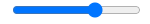

## 2022-12-07-Part-1--블로그-제작-&-기초-문법_2

## 목차

## 01.input 1 : 사용자가 입력한 글 다루기

- input, button 만들어서 블로그 글위에 추가하는 것 만들기

- input의 종류

  - type="text"

    

  - type="range"

    

  - type="checkbox"

    

  - type="date"

    

- `<select>`태그

  

  - 기능은 input가 비슷함

- `<textarea>`태그

  

  - 좀더 큰 input box

### 01.1 이벤트 핸들러

- onChange
  - onInput가 비슷
- onMouseOver
  - 마우스를 가져다 대면 코드 실행
- onScroll
  - 스크롤바 있다면 그것을 조작하면 실행

- input 입력값 가져오기

  - onChange={(e)=>{console.log(e)}}

  ```js
  <input  onChange={(e)=>{console.log(e.target.value)}} />
  ```

  - 이렇게 해야지 이벤트 발생한 html 태그에 입력한 값

### 01.2 이벤트 버블링 막기

- 버블링이 생기는것

  - 현재 태그만 보면

    ```react
    <div>
        <h4>
        	<span>
        	</span>
        </h4>
    </div>
    ```

    - 이렇게 div 안에 h4태그, 
      - h4 태그안애 span 태그가 있음 우리가 누르는 따봉은 span 태그를 누르는건데 제일 하위요소를 누르게 되는거라서 위의 부모 요소도 반응하는것

- before

  ```react
  <div className="list" key={i}>
      <h4 onClick={()=>{setModal(!modal); setTitle(i)}}>{subTitle[i]}<span onClick={() => {
          let copyLike = [...like];
          copyLike[i] = copyLike[i]+1;
          likeChange(copyLike)
      }}>❤️</span>{like[i]}</h4>
          <p>12월 04일 발행</p>
  </div>
  ```

- after

  ```react
  <div className="list" key={i}>
      <h4 onClick={()=>{setModal(!modal); setTitle(i)}}>{subTitle[i]}<span onClick={(e) => {
          e.stopPropagation();
          let copyLike = [...like];
          copyLike[i] = copyLike[i]+1;
          likeChange(copyLike)
      }}>❤️</span>{like[i]}</h4>
          <p>12월 04일 발행</p>
  </div>
  ```

  - 이런거 잘하려면 쌩 자바 스크립트 잘해야함

### 01.3 state 입력의 느림


```react
<input onChange={(e) => { 
        setInputValue(e.target.value);
        console.log(inputValue);
    }} />
```

- 이렇게 하면 입력값을 받을 수 있지만 
  - 문제는 첫 번째 문자는 못받음
    - 위와 같이됨
    - 그 이유는 state 변경함수는 늦게 처리되기 때문

### 01.4 오늘의 숙제

```
(힌트)

- html 직접 만질 필요는 없습니다. 지금 글제목 state만 바꾸면 html도 알아서 바뀌지 않겠습니까 

- array에 자료를 추가하거나 삭제하는 문법은 모르면 구글찾아봐야지 생각한다고 나오는 것은 아닙니다. 
```

#### 1번숙제  input에 뭐 입력하고 발행버튼누르면 블로그에 글이 하나 추가되는 기능을 만들어보십시오

```react
const [inputValue, setInputValue]=useState('');

const InputButtonHandle = (e) =>{
    let copySubTitle = [...subTitle,e];
    setSubTitle(copySubTitle);
}

<div>
    <input onChange={(e) => {
            e.preventDefault();
            setInputValue(e.target.value);
            console.log(inputValue);
        }} /> <button onClick={()=>{InputButtonHandle(inputValue)}}>블로그 글 추가하기</button>
</div>
```


#### 2번 숙제 글마다 옆에 삭제버튼 하나씩 만들어놓고 삭제버튼누르면 글이 없어지는 기능을 만들어보십시오.

```react
const DeleteButtonHandle = (e) =>{
    console.log(e);
    let copySubTitle = [...subTitle];
    subTitle.map(function(obj,index){
        if(e==obj){
            delete(copySubTitle[index]);
        }
    })
    setSubTitle(copySubTitle);
}


subTitle.map(function (a, i) {
    return (
        <div className="list" key={i}>
            <h4 onClick={() => { setModal(!modal); setTitle(i) }}>{subTitle[i]}
                <span onClick={(e) => {
                        e.stopPropagation();
                        let copyLike = [...like];
                        copyLike[i] = copyLike[i] + 1;
                        likeChange(copyLike)
                    }}>❤️</span>{like[i]}<button onClick={()=>{DeleteButtonHandle(a)}}>X</button></h4>
            <p>12월 04일 발행</p>
        </div>
    )
})
```


 - 지워지긴 함
   - 현재는 like랑 글이 분리되어있어서 문제가 있긴함

## 02.input 다루기 2 : 블로그 글발행 기능 만들기
