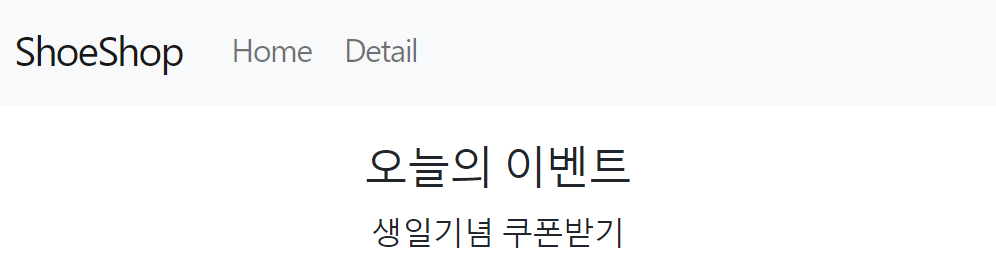

## 2022-12-08-Part-2--쇼핑몰-프로젝트-2

## 목차

## 01.리액트 라우터 1 : 셋팅이랑 기본 라우팅

- 여러가지 페이지 만드는 법

- 다른 사이트의 페이지 나누기
  - /detail로 접속하면 상세페이지
  - /cart로 하면 cart로
- 리액트 미사용
  - 1.html 파일 만들어서 상세페이지 채움
  - 2./detail로 접속시 html로 파일 보냄
- 리액트 사용
  - 1.index.html 하나만 씀
    - 컴포넌트로 만들어서 상세페이지내용 채움
  - 2./detail 접속하면 그 컴포넌트 보여줌

- react-router-dom 라이브러리 쓰면 쉽게 만들수 있음

### 01.1 react-router-dom 라이브러리

```sh
npm install react-router-dom@6
```

- 설치하고 index.js로 감

  - before

    ```react
    import React from 'react';
    import ReactDOM from 'react-dom/client';
    import './index.css';
    import App from './App';
    import reportWebVitals from './reportWebVitals';
    
    const root = ReactDOM.createRoot(document.getElementById('root'));
    root.render(
      <React.StrictMode>
        <App />
      </React.StrictMode>
    );
    
    // If you want to start measuring performance in your app, pass a function
    // to log results (for example: reportWebVitals(console.log))
    // or send to an analytics endpoint. Learn more: https://bit.ly/CRA-vitals
    reportWebVitals();
    ```

  - after

    ```react
    import React from 'react';
    import ReactDOM from 'react-dom/client';
    import './index.css';
    import App from './App';
    import reportWebVitals from './reportWebVitals';
    import { BrowserRouter } from "react-router-dom";
    
    const root = ReactDOM.createRoot(document.getElementById('root'));
    root.render(
      <React.StrictMode>
        <BrowserRouter>
            <App />
        </BrowserRouter>
      </React.StrictMode>
    );
    
    // If you want to start measuring performance in your app, pass a function
    // to log results (for example: reportWebVitals(console.log))
    // or send to an analytics endpoint. Learn more: https://bit.ly/CRA-vitals
    reportWebVitals();
    
    ```

    - 이렇게 import 하고 <App/>을 감싸주면됨

## 01.2 라우터 사용하기

- App.js로 이동

  ```react
  import { Routes, Route, Link} from 'react-router-dom'
  
  <Routes>
      <Route path="/detail" element={<div>상세페이지</div>}/>
  <Route/>
  </Routes>
  ```

  

- 상세 페이지 접속시 저렇게 상세페이지가 나옴

- 적용하기

  - div 쓰기 싫은 경우 플래그먼트 문법 사용
    - <></>

  ```react
  <Routes>
      <Route path="/" element={
              <>
              <div className='main-bg'></div>
              <Container>
                  <Row>
                      {
                          modeling.map(function (obj, i) {
                              return (
                                  <Items key={i} data={data} i={i} />)
                          })
                      }
                  </Row>
              </Container>
              </>
          }/>
      <Route path="/detail" element={<div>상세페이지</div>}/>
  </Routes>
  ```

  - 이런 이유때문에 페이지 컴포넌트로 만들면 좋은 것

- 버튼 클릭시 이동하기

  ```react
  <Link to="/">홈</Link>
  <Link to="/detail">상세페이지</Link>
  ```

## 01.3 숙제 상세 페이지 디자인 채우기

- 컴포넌트로 만들어서 넣기

  - 길다고 하면 다른 파일로 빼서 해보기

    ```react
    <div className="container">
        <div className="row">
            <div className="col-md-6">
                
            </div>
            <div className="col-md-6">
                <h4 className="pt-5">상품명</h4>
                <p>상품설명</p>
                <p>120000원</p>
                <button className="btn btn-danger">주문하기</button>
            </div>
        </div>
    </div>
    ```

## 02.리액트 라우터 2 : navigate, nested routes, outlet

- routers 폴더에 Detail.js 생성

  ```react
  function Detail() {
      return (
          <div className="container">
              <div className="row">
                  <div className="col-md-6">
                      
                  </div>
                  <div className="col-md-6">
                      <h4 className="pt-5">상품명</h4>
                      <p>상품설명</p>
                      <p>120000원</p>
                      <button className="btn btn-danger">주문하기</button>
                  </div>
              </div>
          </div>
      )
  }
  
  export default Detail;
  ```

  - App.js

    ```react
    import Detail from './routers/Detail.js';
    
    <Route path="/detail" element={<Detail/>} />
    ```

    - 이렇게 써주면 됨

      

### 02.1 useNavigate

- 페이지 이동 도와주는 것

  ```react
  let navigate = useNavigate();
  
  <Nav.Link onClick={()=>{navigate('/')}}>HOME</Nav.Link>
  <Nav.Link onClick={()=>{navigate('/detail')}}>Detail</Nav.Link>
  ```

  - 페이지 할때 Link 썼는데 쓰던 곳에 그대로 적용하고 싶은경우
    - 이렇게 좀 ui 그대로 두고 쓸 수 있음

- 페이지 앞 뒤 이동

  ```react
  <Nav.Link onClick={()=>{navigate(-1)}}>이전페이지</Nav.Link>
  <Nav.Link onClick={()=>{navigate(1)}}>다음페이지</Nav.Link>
  ```

  - 뒤로가기 앞으로 가기와 비슷한 역할을 한다.

### 02.2 404 페이지 만들기

- 이상한 접속시, 아무런 페이지 없을 수 있지만

  - 없는페이지 표시하고 싶은 경우사용

    ```react
    <Route path="*" element={<div>없는 페이지</div>} />
    ```

    

### 02.3 Nested Routes

- /about 만들고 싶을때

  ```react
  function About(){
    return(
      <div>
            <h4>회사 정보임</h4>
        </div>
    );
  }
  
  ```

  - about 했는데 about/member, /about/location 등등 만들고 싶은 경우
    - 아래 처럼 해도되긴함

```react
<Route path="/about" element={<About></About>} />
<Route path="/about/member" element={<About></About>} />
<Route path="/about/location" element={<About></About>} />
```

- Nested 적용

  - 태그안에 태그 들어간것을 의미

  ```react
  <Route path="/about" element={<About></About>}>
      <Route path="member" element={<About></About>} />
      <Route path="location" element={<About></About>} />
  </Route>
  ```

  - 이런 식으로 쓸 수 있음

  - 장점

    - 작성이 간단해짐

    - 한페이지에 동시에 element 2개 이상 보여줌

      ```react
      <Route path="/about" element={<About></About>}>
          <Route path="member" element={<div>멤버임</div>} />
          <Route path="location" element={<div>위치임</div>} />
      </Route>
      
      
      function About() {
          return (
              <div>
                  <h4>회사 정보임</h4>
                  <Outlet></Outlet>
              </div>
          );
      }
      ```

      - 이렇게 하면 여러개 한번에 볼 수 있음

        `<Outlet></Outlet>`

        - 이것이 핵심

        

- 이것 언제 쓸까?

  - 여러페이지 필요할때
  - 여러 유사한 페이지 필요할때, 일부만 갈아치우고 보여주고 싶을때
    - 잘보면 이런것도 동적UI 같은 것

- 라우터로 만들면 장점

  - 이렇게 해놓으면 뒤로가지 버튼 이용가능
  - 페이지 이동이 쉬움

## 02.4 숙제

▼ /event/one 페이지로 접속하면 하단처럼 생긴 페이지가 떠야합니다.

- [ ] 

 

 

▼ /event/two 페이지로 접속하면 하단처럼 생긴 페이지가 떠야합니다.



 

 

위 2개의 페이지들을 nested routes 써서 아무렇게나 만들어봅시다. 

 ```react
         <Route path="/detail" element={<Detail />} />
         <Route path="/event" element={<Event></Event>}>
           <Route path="one" element={<div><h3>첫 주문시 양배추즙 서비스</h3></div>} />
           <Route path="two" element={<div><h3>생일 기념 쿠폰받기</h3></div>} />
         </Route>
         <Route path="*" element={<div>없는 페이지</div>} />
       </Routes>
 
     </div>
   );
 }
 
 function Event({navigate}) {
   return (
     <div>
       <h2>오늘의 이벤트</h2>
       <Outlet></Outlet>
     </div>
   );
 }
 ```

## 03.리액트 라우터 3 : URL 파라미터로 상세페이지 100개 만들기

- 상세페이지 상품명 넣기

  - props 보내주고

    - Detail.js

      ```react
      function Detail({modeling}) {
          return (
              <div className="container">
                  <div className="row">
                      <div className="col-md-6">
                          
                      </div>
                      <div className="col-md-6">
                          <h4 className="pt-5">{modeling[0].title}</h4>
                          <p>{modeling[0].content}</p>
                          <p>{modeling[0].price} Won</p>
                          <button className="btn btn-danger">주문하기</button>
                      </div>
                  </div>
              </div>
          )
      }
      
      export default Detail;
      ```

- 각 상품들 어떻게 보여줄까?

  ```react
  <Route path="/detail1" element={<Detail modeling={modeling}/>} />
  <Route path="/detail2" element={<Detail modeling={modeling}/>} />
  <Route path="/detail3" element={<Detail modeling={modeling}/>} />
  ```

  - 이렇게?

  - 이럴때는 다른 홈페이지 벤치마킹하면됨

    ```react
    <Route path="/detail/0" element={<Detail modeling={modeling}/>} />
    <Route path="/detail/1" element={<Detail modeling={modeling}/>} />
    <Route path="/detail/2" element={<Detail modeling={modeling}/>} />
    ```

    - 이렇게 하면 끝도 없이 여러번써야하는데 이때 반복문써야하거나?

- url 파라미터 문법사용

  ```react
  <Route path="/detail/:id" element={<Detail modeling={modeling}/>} />
  ```

  - 이렇게 하면 상세페이지 수백만개 가능함
    - 지금은 똑같은 페이지가 나오는데 이러려면
      -  100만개 만들던지 
      - 하나의 컴포넌트로 각각 다른 내용 보여주면됨

- 개선하기

  - 상세페이지의 현재 입력한 url에 입력한 숫자 입력해야함

  ```react
  useParams();
  ```

  - 이외의 숫자나 다른 값의 경우 if해서 조건줘서 원하는 화면 보여주면됨
  - `:id:id1:id2` 많이쓰는것 가능

## 03.1 숙제 가나다 순 정렬순서 바꾸기

- /detail/0 접속시 0번쨰 상품이 아닌 

- 상품 id가 0인걸 보여주는 식으로 하는게 좋음

  ```
  응용문제 :
  Q. 자료의 순서가 변경되면 상세페이지도 고장나는 문제는 어떻게 해결할까요?
  
  상품 순서를 가나다순으로 변경하는 버튼을 만들어버렸다고 가정합시다.
  그거 누르면 shoes라는 state 안의 상품이 가나다순으로 정렬됩니다. 
  그럼 Grey Yordan이 0번 상품이 되겠군요. 
  
  그럼 평소엔 /detail/0으로 접속하면 0번째 상품을 보여주니까 White and Black 이 뜰텐데
  버튼 누른 후엔 /detail/0으로 접속하면 0번째 상품을 보여주니까 Grey Yordan 이 뜨겠군요.
  이처럼 상세페이지가 불규칙해지는 문제는 어떻게 해결하면 좋을까요? 
  ```

  - 해결한 소스

    - Detail.js

    ```react
    import { useParams } from "react-router-dom";
    
    function Detail({modeling}) {
        let {id} = useParams();
        let realObj;
        let realID;
        modeling.map(function(obj){
            if(obj.id==id){
                console.log(id);
                realObj = obj;
                realID = obj.id;
                console.log(realObj);
            }
        })
        return (
            <div className="container">
                <div className="row">
                    <div className="col-md-6">
                        
                    </div>
                    <div className="col-md-6">
                        <h4 className="pt-5">{realObj.title}</h4>
                        <p>{realObj.content}</p>
                        <p>{realObj.price} Won</p>
                        <button className="btn btn-danger">주문하기</button>
                    </div>
                </div>
            </div>
        )
    }
    
    export default Detail;
    ```

- 전체소스 

  - app.js

    ```react
    import './App.css';
    import { Button, Navbar, Container, Nav, Row, Col } from 'react-bootstrap';
    import data from './Data.js';
    import { useState } from 'react';
    import { Routes, Route, Link, useNavigate, Outlet } from 'react-router-dom'
    import Detail from './routers/Detail.js';
    
    function App() {
    
      let [modeling] = useState(data);
      let navigate = useNavigate();
    
      // let [imgs] = usestate([
      //   {
      //     id: 0,
      //     imgName : "./basic.png"
      //   },
      //   {
      //     id: 1,
      //     imgName : "./basic.png"
      //   },
      //   {
      //     id: 2,
      //     imgName : "./basic.png"
      //   },
      // ])
    
      return (
        <div className="App">
          <Navbar bg="dark" variant="dark">
            <Container>
              <Navbar.Brand href="#home">3DPIT SHOP</Navbar.Brand>
              <Nav className="me-auto">
                {/* <Link className="navbar-nav nav-link " to="/">홈</Link>
                <Link className="navbar-nav nav-link " to="/detail">상세페이지</Link> */}
                {/* <Nav.Link href="#Shop">Shop</Nav.Link>
                <Nav.Link href="#F&Q">F&Q</Nav.Link> */}
                <Nav.Link onClick={() => { navigate('/') }}>HOME</Nav.Link>
                <Nav.Link onClick={() => { navigate('/detail') }}>DETAIL</Nav.Link>
                <Nav.Link onClick={() => { navigate('/event') }}>EVENT</Nav.Link>
              </Nav>
            </Container>
          </Navbar>
          <Routes>
            <Route path="/" element={
              <>
                <div className='main-bg'></div>
                <Container>
                  <Row>
                    {
                      modeling.map(function (obj, i) {
                        return (
                          <Items key={i} data={data} i={i} />)
                      })
                    }
                  </Row>
                </Container>
              </>
            } />
            <Route path="/detail/:id" element={<Detail modeling={modeling}/>} />
            <Route path="/event" element={<Event></Event>}>
              <Route path="one" element={<div><h3>첫 주문시 양배추즙 서비스</h3></div>} />
              <Route path="two" element={<div><h3>생일 기념 쿠폰받기</h3></div>} />
            </Route>
            <Route path="*" element={<div>없는 페이지</div>} />
          </Routes>
        </div>
      );
    }
    
    function Event({navigate}) {
      return (
        <div>
          <h2>오늘의 이벤트</h2>
          <Outlet></Outlet>
        </div>
      );
    }
    
    function About() {
      return (
        <div>
          <h4>회사 정보임</h4>
          <Outlet></Outlet>
        </div>
      );
    }
    
    function Items({ data, i }) {
      return (
        <Col>
          
          <h4>{data[i].title}</h4>
          <p>{data[i].price}</p>
        </Col>
      );
    }
    
    export default App;

## 04.styled-components 쓰면 CSS 파일 없어도 되는데

- 써보자 왜? 인기가 많을까?

  ```sh
  npm install styled-components
  ```

- import

  ```sh
  import styled from 'styled-components'
  ```

- 써보기

  ```react
  let YellowBtn = styled.button`
      background: yellow;
      color: black;
      padding: 10px;
  `
  <YellowBtn>버튼</YellowBtn>
  ```

  - 컴포넌트 같은 거라서 대문자 시작

- 장점

  - **1.css파일 안열고 자바스크립트에서 가능**

  - **2.다른 js파일 오염시키지 않음**

    - App.css가 App.js에만 먹는게 아니고 Detail.js에도 먹힐 수 있어서
      - 이런 오염되는게 싫다면 styled 쓰면됨 오염이 덜되서 사용하기는 좋음

  - [참고]App.module.css라고 css 만들면 App.js에만 종속된다.

    - 명칭의 중요성

  - **3.페이지 로딩시간 단축**

  - **다른 색상으로 만들고 싶은경우**

    ```js
    let YellowBtn = styled.button`
        background:  ${props=>props.bg};
        color: black;
        padding: 10px;
    `
    
    <YellowBtn bg="blue">버튼</YellowBtn>
    <YellowBtn bg="orange">버튼</YellowBtn>
    ```

    - bg의 색상만 변경하면됨
      - props 뚫어서 사용함

  - **자바스크립트도 작성하니까 코드적인 요소도 개입가능**

    ```js
    let YellowBtn = styled.button`
        background:  ${props=>props.bg};
        color: ${props=>props.bg=='blue'?'white':'red'};
        padding: 10px;
    `      
    <YellowBtn bg="blue">버튼</YellowBtn>
    <YellowBtn bg="orange">버튼</YellowBtn>
    ```

    - 파란 배경일때 글씨 흰색, 이외의 색은 레드 글씨로 가능함

  - **기존 스타일 복사도 가능**

    ```js
    let NewBtn = styled.button(YellowBtn);
    
    let NewBtn = styled.button(YellowBtn)`
    //수정도 가능
    `
    ```

- 단점
  - html 구조 복잡해지면 styled도 길어지고, 일단 컴포넌트인지 styled 컴포넌트인지 구분 어려움
  - 중복 스타일은 컴포넌트가 import 하는데css랑 별반 차이가 없음, 그렇게 쓴다면
  - 팀으로 일할때 css 담당하는 사람없다면 상관없지만, 잘하는 사람이 있다면 못알아 먹을 수 있음