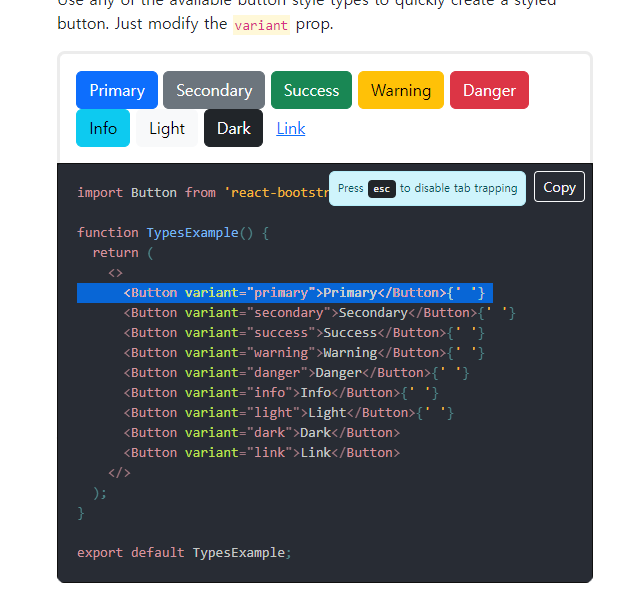
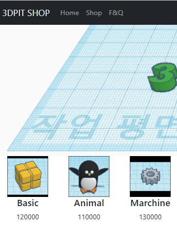
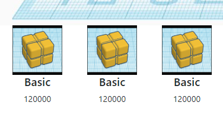
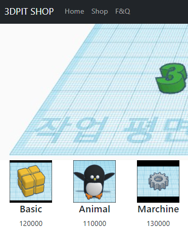

## 2022-12-08-Part-2--쇼핑몰-프로젝트

## 목차

## 01.새로운 프로젝트 생성 & Bootstrap 사용하기

- shop 폴더 생성
  - npx create-react-app shop

### 01.1 Bootstrap

- 쉽게 개발 가능한 라이브러리
  - react-bootstrap.github.io
    - 우리가 설치할 라이브러리

```sh
npm install react-bootstrap bootstrap
```

- css

  ```sh
  // App.js 
  import 'bootstrap/dist/css/bootstrap.min.css';
  
  
  // /public/index.html
  //<head/> 아래에 넣는다.
  <link
    rel="stylesheet"
    href="https://cdn.jsdelivr.net/npm/bootstrap@5.2.3/dist/css/bootstrap.min.css"
    integrity="sha384-rbsA2VBKQhggwzxH7pPCaAqO46MgnOM80zW1RWuH61DGLwZJEdK2Kadq2F9CUG65"
    crossorigin="anonymous"
  />
  ```

## 01.2 붙여넣기식 UI 개발



```js
import { Button } from 'react-bootstrap';


<div className="App">
    <Button variant="primary">Primary</Button>{' '}
</div>
```

- 이렇게 import는 해주고 가져와주자.

- nav바

  ```js
  import { Button, Navbar, Container, Nav } from 'react-bootstrap';
  
  <Navbar bg="dark" variant="dark">
      <Container>
      <Navbar.Brand href="#home">Navbar</Navbar.Brand>
  <Nav className="me-auto">
      <Nav.Link href="#home">Home</Nav.Link>
  <Nav.Link href="#features">Features</Nav.Link>
  <Nav.Link href="#pricing">Pricing</Nav.Link>
  </Nav>
  </Container>
  </Navbar>
  ```

## 02.이미지 넣는 법 & public 폴더 이용하기

- 이미지 대문 사진 넣기

  - css를 이용

    ```react
    //app.css
    .main-bg{
      height: 300px;
      background-image: url('./img/modeling.jpg');
      background-size:cover;
    }
    
    //app.js
    <div className='main-bg'></div>
    ```

  - html에서 사용

    ```react
    import  imgbg from './img/modeling.jpg';
    
    
    <div sytle={{backgroundImage:'url('+imgbg+')'}}></div>
    ```

### 02.1 항목 넣기

```react
<Container>
    <Row>
        <Col>안녕</Col>
        <Col>안녕</Col>
        <Col>안녕</Col>
    </Row>
</Container>
```

- 이미지 넣는 법

  ```react
  <Container>
      <Row>
          <Col>
              
              <h4>상품명</h4>
              <p>상품 설명</p>
          </Col>
          <Col>
              
              <h4>상품명</h4>
              <p>상품 설명</p>
          </Col>
          <Col>
              
              <h4>상품명</h4>
              <p>상품 설명</p>
          </Col>
      </Row>
  </Container>
  ```

  - public은 압축 안됨
    - public에서 이미지 사용시
      - /logo.png 이런식으로 사용
      - 권장하는 방식
        - src={process.env.PUBLIC_URL + '/logo.png'} 
  - src있는 것은 압축됨
    - 여기에 넣은것 거의 압축되는것

## 03. 코드 길어지면 import export 하면 됩니다

- Data.js 파일 만들어주고

- import 해서 App.js에서 써보자.

  - Data.js

    ```react
    let a = 10;
    
    export default a;
    ```

  - App.js

    ```react
    import a from './Data.js';
    
    {a}
    ```

- 두개이상 쓰고 싶은 경우

  ```react
  // Data.js
  let a = 10;
  let b = 100;
  
  export default {a, b};
  
  // App.js
  import {a,b} from './Data.js';
  ```

  - {} 중괄호 가져올때 같은 이름써야함, 구조분해 할당이라서
  - 변수 뿐아니라 , 함수, 컴포넌트 등도 가능함

- 실습을 위한 Data.js

  ```react
  let data = [
    {
      id : 0,
      title : "Basic",
      content : "Born in France",
      price : 120000
    },
  
    {
      id : 1,
      title : "Animal",
      content : "Born in Seoul",
      price : 110000
    },
  
    {
      id : 2,
      title : "Marchine",
      content : "Born in the States",
      price : 130000
    }
  ]
  
  export default data;
  ```

- App.js

  ```react
  import data from './Data.js';
  import {useState} from 'react';
  function App() {
  
    let [modeling] = useState(data);
      ...
  }
  ```

### 03.1 object 설명

- array

  ```js
  let a = ['kim', 20] //선언
  
  a[0]; //인덱싱
  ```

- object

  ```js
  let b = { name:'kim', age: 20} //선언
  
  b.name;// 사용법
  b.age;
  ```

## 03.2 적용해보기

- App.js

  ```react
  import './App.css';
  import { Button, Navbar, Container, Nav, Row, Col } from 'react-bootstrap';
  import data from './Data.js';
  import {useState} from 'react';
  function App() {
  
    let [modeling] = useState(data);
  
  
    return (
      <div className="App">
        <Navbar bg="dark" variant="dark">
          <Container>
            <Navbar.Brand href="#home">3DPIT SHOP</Navbar.Brand>
            <Nav className="me-auto">
              <Nav.Link href="#home">Home</Nav.Link>
              <Nav.Link href="#Shop">Shop</Nav.Link>
              <Nav.Link href="#F&Q">F&Q</Nav.Link>
            </Nav>
          </Container>
        </Navbar>
        <div className='main-bg'></div>
  
        <Container>
          <Row>
            <Col>
              
              <h4>{modeling[0].title}</h4>
              <p>{modeling[0].price}</p>
            </Col>
            <Col>
              
              <h4>{modeling[1].title}</h4>
              <p>{modeling[1].price}</p>
            </Col>
            <Col>
              
              <h4>{modeling[2].title}</h4>
              <p>{modeling[2].price}</p>
            </Col>
          </Row>
        </Container>
      </div>
    );
  }
  
  export default App;
  ```

  

### 03.3 숙제

#### 1.상품목록 컴포넌트화

- 컴포넌트화

  ```react
  function Items(){
    return (
      <Col>
      
      <h4>2</h4>
      <p>3</p>
    </Col>
    );
  }
  ```

- 컴포넌트화 한것 3개 일단 적용

  ```react
  <Container>
      <Row>
          <Items/>
          <Items/>
          <Items/>
      </Row>
  </Container>
  ```

#### 2.상품명 데이터 바인딩 적용

- props 적용

```react
...
<Container>
        <Row>
          <Items data={data}/>
          <Items data={data}/>
          <Items data={data}/>
        </Row>
      </Container>
    </div>
  );
}

function Items({data}){
  return (
    <Col>
    
    <h4>{data[0].title}</h4>
    <p>{data[0].price}</p>
  </Col>
  );
}
```



#### 3.컴포넘트 축약 후 반복적인 부분 map 반복문 써보기

- map 적용

  ```react
        <Container>
          <Row>
            {
              modeling.map(function(obj, i){
                return (
                  <Items  key = {i} data = {data}  i= {i}/>)
              })
            }
          </Row>
        </Container>
      </div>
    );
  }
  
  function Items({ data, i }) {
    return (
      <Col>
        
        <h4>{data[i].title}</h4>
        <p>{data[i].price}</p>
      </Col>
    );
  }
  ```

  

## 04.저번시간 숙제 해설 (Card 컴포넌트 만들기)

- 숙제 검사

  - 컴포넌트 만들어보기

    ```react
    function Card(){
    	return (
              <Col>
                
                <h4>{modeling[0].title}</h4>
                <p>{modeling[0].price}</p>
              </Col>
        )
    }
    ```

  -  데이터 바인딩

    ```js
    <Card modeling={modeling}> </Card>
    
    function Card(props){
    	return (
              <Col>
                
                <h4>{props.moeling[0].title}</h4>
                <p>{props.moeling[0].price}</p>
              </Col>
        )
    }
    ```

  - map

    ```react
    modeling.map(funtion(obj, i){
       return (
           <Card modeling={modeling[i]} i={i}></Card>
       )
    })
    ```

    

  