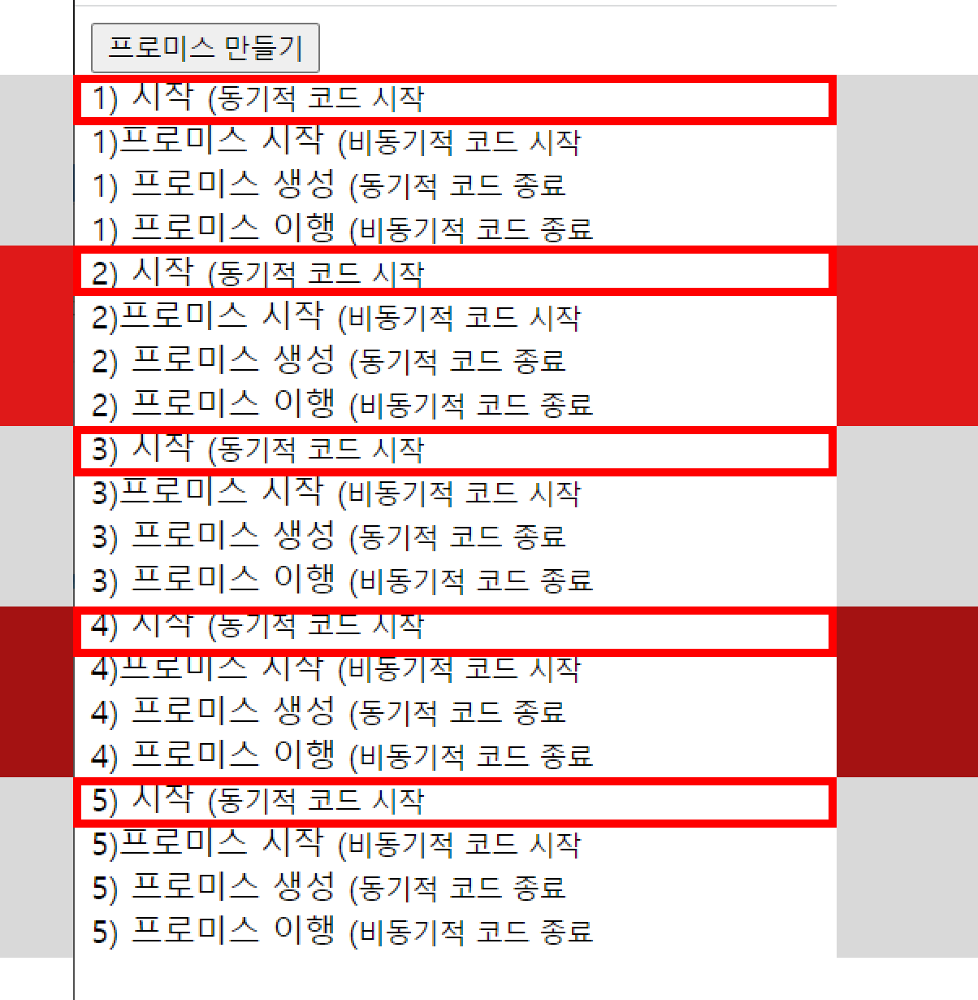

## 2022-12-09-JS-알아야하는-개념-정리1

## 정리할 것

- [x] 트랜스파일링
  - [x] 트랜스 파일러
- [x] 구조분해 할당
- [x] 스프레드 연산자 (전개 연산자)
- [x] 프로미스

## 목차

> 01.트랜스파일링
>
> > 01.1 리액트에서 쓰는 이유
>
> 02.구조분해 할당
>
> 03.스프레드 연산자
>
> 04.프로미스
>
> 참고자료

## 01.트랜스파일링

- 하나의 프로그래밍 언어를 다른 언어로 컴파일하는 특별한 형태

  - 자바스크립트에서 많이쓰고,
    - 이를 이식가능하고, 실행 가능한 형식으로 쓰는 것
      - `+`  JS의 범용성과 안정성을 이용하는 것

- **트랜스 파일러가 만들어지는 이유**

  | 용도          | 만들어지는 이유                                              |
  | ------------- | ------------------------------------------------------------ |
  | 실험적인 용도 | 실험적인 언어와 기능을 만들고 테스트하는데 트랜스 파일러는 이상적인 방법 |
  | 특수화        | 특별한 목적으로 만들어진 언어를 구현하기 위해 사용           |
  |               | , 이러한 언어들은 관련 일에 소요되는 작업량을 줄여줌         |
  | 유산          | 유명하지 않은 언어들을 JS로 변환함으로써                     |
  |               | , 오래된 프로그램이 동작할 수 있게하고 그런 언어를 보호하는 수단으로 사용되기도 함 |
  | 유행          | 유행을 타는 개발자들에 의해 사용될 수도 있음                 |
  | 얼리 액세스   | 트랜스 파일링을 통해 다음 버전 JS의 새로운 기능을 현재 버전 JS로 변환 함으로써 즉시 사용해 볼 수 있음 |
  | 보안          | JS가 가진 고유한 보안 최약점을 트랜스파일러가 제거하고       |
  |               | , 잘못된 동작의 점검 등 보안 취약점을 완화                   |
  | 성능          | ASM.js나 웹 어셈블리를 이용한 개발은 JS에서 사용하지 않은 기능들을 제거함으로써 |
  |               | , 실행 성능상 이득을 얻음                                    |

  - 트랜스 파일러는 상용 생산 단계에서는 사용해서는 안됨

### 01.1리액트에서 쓰는 이유

- 브라우저와 Node.js는 파일을 이해할 수 없는데
  - 그것을 이해할수 있게 트랜스 파일링을 통해서 브라우저가 해석할 수 있게 만듦

## 02.구조분해 할당

- 개념

  - 배열이나 객체의 속성을 해체하여 그 값을 개별 변수에 담을수 있게하는 것
    - 각각의 값이나 프로퍼티를 분해하여 손쉽게 변수에 넣음

- 실습

  ```js
  // array
  let a, b, rest;
  
  [a,b]=[10,20];//(2) [10, 20]
  console.log(a);//10
  console.log(b);//20
  
  [a,b,...rest] = [10,20,30,40,50];//(5) [10, 20, 30, 40, 50]
  
  console.log(a); //10
  console.log(b); //20
  console.log(rest);//(3) [30, 40, 50]
  
  // object
  ({ a, b } = { a: 10, b: 20 });//{a: 10, b: 20}
  
  console.log(a);//10
  console.log(b);//20
  
  ({a,b,...rest} = {a:10, b:20, c:30, d:40});//{a: 10, b: 20, c: 30, d: 40}
  
  console.log(a);//10
  console.log(b);//20
  console.log(rest);//{c: 30, d: 40}
  ```

- 배열 구조 분해 할당

  ```js
  var foo = ["one", "two", "three"];
  
  var [red, yellow, green] = foo;
  console.log(red);//"one"
  console.log(yellow);//"two"
  console.log(green)//"three"
  
  //변수 값 교환
  var a = 1;
  var b = 3;
  
  [a, b] = [b, a];
  console.log(a);//3
  console.log(b);//1
  ```

- 객체 구조 분해

  ```js
  var o = {p:42, q:true};
  var {p, q} = o;
  
  console.log(p);// 42
  console.log(q);// true
  
  // 기본값 갖는 새로운 이름의 변수에 할당
  var {a: aa =10, b: bb=5} = {a:3};
  console.log(aa);//3
  console.log(bb);//5
  ```

## 03.스프레드 연산자

- ES6에 추가됨
  - ... , 스프레드 오퍼레이터, 스프레드 연산자, 전개 구문, 펼침 연산자 를 나타냄
    - 배열, 객체, 함수 등을 다루는데 있어서 편리함
- 이를 사용하면 배열, 문자열, 객체 등 반복 가능한 객체를 개별 요소로 분리 할 수 있음

- 사용해보기

  ```js
  //array
  let arr1 = [1,2,3,4,5];
  let arr2 = [...arr1, 6,7,8,9];
  console.log(arr2); //[1,2,3,4,5,6,7,8,9]
  
  //string 
  let str1 = 'paper block';
  let str2 = [...str1];
  console.log(str2);// ['p', 'a', 'p', 'e', 'r', ' ', 'b', 'l', 'o', 'c', 'k']
  ```

  - 연결 또는 복사등의 용도로 꽤 활용도가 높은편

- 함수에서 Spread Operator

  ```js
  function add(...rest){
      let sum = 0;
      for(let item of rest){
          sum+=item;
      }
      return sum;
  }
  
  console.log(add(1));//1
  console.log(add(1,2));//2
  console.log(add(1,2,3));//6
  ```

- 함수 호출 인자로 사용

  ```js
  let numbers = [9,4,7,1];
  Math.min(...numbers);
  
  let input = [{name: '철수', age:12},{name: '영희', age: 12}, {name: '바둑이', age: 1}]
  //가장 어린 나이 구하기
  let minAge = Math.min(...input.map((item)=>item.age));
  console.log(minAge);//1
  ```

- 객체에서의 Spread Operator

  - ES2018(ES9)에서는 객체와 관련된 사항 추가	

  - 객체 복사 또는 업데이트

    ```js
    var currentState = {name: '철수', species: 'human'};
    currentState = {...currentState, age:10};
    
    console.log(currentState);//name: '철수', species: 'human', age: 10}
    
    currentState = {...currentState, name: '영희', age:11};
    console.log(currentState);//{name: '영희', species: 'human', age: 11}
    ```

## 04.프로미스

- promise 객체는 비동기 작업이 맞이할 미래의 완료 또는 실패와 그 결과를 나타냄

  - 프로미스가 생성된 시점에는 알려지지 않을 수도 있는 값을 위한 대리자
    - 비동기 연산이 종료된 이후 결과 값과 실패 사유를 처리하기 위한 처리기를 연결할 수 있음
  - 이를 사용하면 비동기 메서드에서 마치 동기 메서드 처럼 값을 반환 할 수 있음
  - 단, 최종값을 반환하는 것 아님
  - 미래의 어떤 시점에 결과를 제공하겠다는 `약속` 프로미스를  반환

- 상태

  - 대기 | pending : 이행하지도 , 거부하지도 않은 초기 상태
  - 이행 | fullfilled : 연산이 성공적으로 완료됨
  - 거부 | rejected:  연산이 실패함

- 기본 예제

  ```js
  let myFirstPromise = new Promise((resolve, reject)=>{
      setTimeout(function(){
                 resolve("성공!")//문제 없음 성공
                 },250)
  })
  
  myFirstPromise.then((sucessMessage)=>{
      console.log("와!"+sucessMessage) //와!성공!
  }); 
  ```

- 고급 예제

  - testPromise() 함수는 버튼 클릭할 때마다 호출
    - 1~3초의 무작위 간격 이후 프로미스 횟수(1부터 시작하는 숫자)로 이행하는 프로미스 생성
  - 프로미스 이행은 p1.then()을 사용하는 이행 콜백 세트를 통해 로그 남김
    - 약간의 로그를 통해서
      - 동기부분이 비동기적 프로미스의 완료와 어떻게 분리되어 있는지 확인

  ```js
  //html
  <!DOCTYPE html>
  <html lang="en">
  <head>
      <meta charset="UTF-8">
      <meta http-equiv="X-UA-Compatible" content="IE=edge">
      <meta name="viewport" content="width=device-width, initial-scale=1.0">
      <title>Document</title>
  </head>
  <body>
      <div>
          <button id="btn">프로미스 만들기</button>
          <div id="log"></div>
      </div>
  </body>
  <script type="text/javascript" src="./index.js"></script>
  </html>
  
  //js
  'use strict';
  var promiseCount = 0;
  
  function testPromise(){
      const thisPromiseCount = ++promiseCount;
  
      const log = document.getElementById('log');
      log.insertAdjacentHTML('beforeend',thisPromiseCount +
      ') 시작 (<small>동기적 코드 시작</small><br/>');
  
      const p1 = new Promise(
          function(resolve, reject){
              log.insertAdjacentHTML('beforeend',thisPromiseCount +
              ')프로미스 시작 (<small>비동기적 코드 시작</small><br/>');
  
              window.setTimeout(
                  function(){
  
                      resolve(thisPromiseCount);
                  }, Math.random() * 2000 + 1000);
          }
      );
  
      p1.then(
  
          function(val){
              log.insertAdjacentHTML('beforeend', val +
              ') 프로미스 이행 (<small>비동기적 코드 종료</small><br/>')
          })
      .catch(
  
          function(reason){
              console.log('여기서 거부된 프로미스 ('+reson+')를 처리하세요.');
          });
          log.insertAdjacentHTML('beforeend', thisPromiseCount +
          ') 프로미스 생성 (<small>동기적 코드 종료</small><br/>');
  }
  
  
  if("Promise" in window){
      var btn = document.getElementById("btn");
      btn.addEventListener("click",testPromise);
  }else{
      log = document.getElementById('log');
      log.innerHTML = "Live example not available as your browser doesn't support the <code>Promise</code> interface.";
  }
  ```

  

## 참고자료

- 트랜스 파일링
  - [트랜스파일링](https://grepper.tistory.com/63)
  - [타입스크립트 - 트랜스파일링](https://taenami.tistory.com/81)

- 구조분해 할당
  - [구조 분해 할당](https://developer.mozilla.org/ko/docs/Web/JavaScript/Reference/Operators/Destructuring_assignment)
  - [avaScript의 구조 분해 할당(Destructuring Assignment) 활용하기](https://chanhuiseok.github.io/posts/js-10/)

- 스프레드 연산자
  - [[ES6] Spread Operator (스프레드 연산자)](https://paperblock.tistory.com/62)

- 프로미스
  - [프로미스](https://developer.mozilla.org/ko/docs/Web/JavaScript/Reference/Global_Objects/Promise)