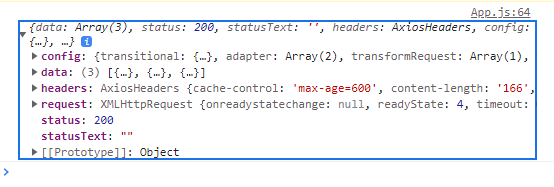
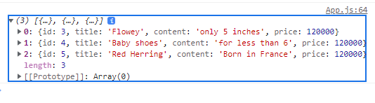
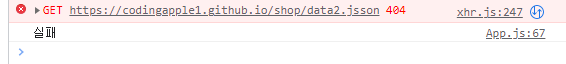
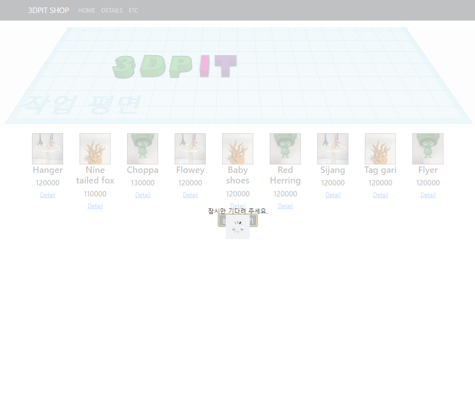
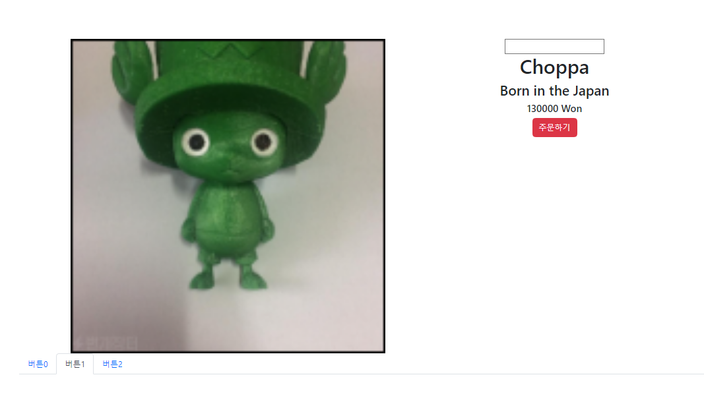
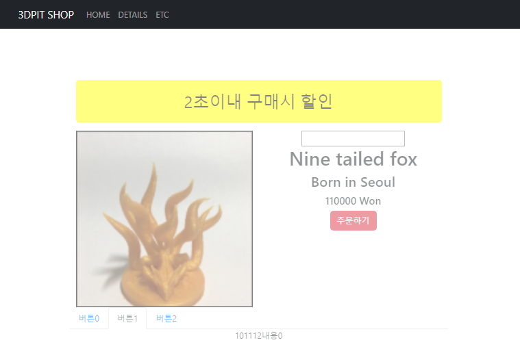

## 2022-12-16-Part-2--쇼핑몰-프로젝트-2

## 목차

## 01.Lifecycle과 useEffect 1

- 라이프사이클, 컴포넌트도 사람처럼 살고 죽는다는것

  - Detail컴포넌트 보이는 순간 마운트 
  - 컴포넌트에서 스태이트 변경시 업데이트
  - 홈으로 돌아갔을때 사라지는것 언마운트
    - 이런 과정을 가진다.
    - 이거 알아서 뭐하나?

- 라이프사이클 배우는 이유

  - 중간중간 간섭할 수 있음,
  - 그냥 코드실행임

- 특정 시점에서 어떤 특정코드를 실행하기 위해서 배우는 것

  - 갈고리를 달아서 코드를 거는 형식이라고 생각하자

- Detail

  ```react
  class Detail extends React.Compoent{
      ComponentDidMount(){
          
      }
      ComponentDidUpDate(){
          
      }
      ComponentWillUnmount(){
          
      }
  }
  ```

  - 예전스타일

- 최신 스타일

  ```react
  //mount, update
  function Detail(props){
      useEffect(()=>{
          console.log('안녕');
      })
  }
  ```

  - 두번 출력이되는데 그이유 디버깅 위해서 두번 동작하는 것
    -  두번 출력되는 것 없애기 위해서는
      - index.js파일가서 <React.StrictMode>를 없애야함

- 소스코드

  ```react
  import {useEffect, useState} from "react";
  function Detail(props){
      useEffect{()={
          console.log("HI")
      }}
  	let [count, setCount] = useState(0);
  	
  <button onClick={()=>{setCount(count+1)}}>버튼</button>
  ...
  }
  ```

  - 콘솔 밖에 써도 똑같이 구현되는거 아닌가?
    - 그럼 왜 필요하나?
    - 언제쓸까?

### 01.1 useEffect 쓰는 이유

- 실행시점이 다름

  - 그냥 실행이되는 것이 아니고
    - 랜더링이 다되고 나서 실행이 됨

  ```react
  for(var i=0; i<10000;i++){
      console.log(1);
  }
  ```

  - 디테일 필요했을때, 그냥쓰면 반복문 실행 후 html이 그려지게 된다.
    - 이런것을 useEffect안에 쓰면 html 다그려지고 실행되서 효율적으로 사용할 수 있음
    - 그렇게 해서 사용자에게 빠르다는 느낌도 줄 수 있음
  - 쓰는 곳
    - 연산이 오래걸리는것이나
    - 서버에서 데이터 가져오는 작업
    - 타이머 장착

- Effect라는 이름쓰는 이유

  - side effect
    - 함수의 핵심기능과 상관없는 부가기능
      - 이런것에 차용해서 만든 이름이라서 그것과 비슷해서 이름 만든것

### 01.2 숙제

```react

setTimeout(()=>{실행할 코드},1000)//타이머주는법 활용

<div className="alert alert-warnig">2초이내 구매시 할인</div>
```

- 내가 해결해본 소스

  ```react
  const [hidden, setHidden] = useState(true);
  const onHidden = (() => {
      setHidden(false);
  })
  
  useEffect(() => {
      setTimeout(() => {
          onHidden()
      }, 2000);
  })
  
  {
      hidden == true ? <div className="alert alert-warnig">2초이내 구매시 할인</div> : null
  }
  ```

  - css

    ```css
    .alert{
     font-size : 2em;
     color: white;
    }
    .alert-warnig{
    background: yellow;
    }
    ```


## 02.Lifecycle과 useEffect 2

- [] 디팬던시 같은것임

  - 좀더 정확히 쓰는법

    ```react
    const [hidden, setHidden] = useState(true);
    const onHidden = (() => {
        setHidden(false);
    })
    
    useEffect(() => {
        setTimeout(() => {
            onHidden()
        }, 2000);
    },[hidden])
    
    {
        hidden == true ? <div className="alert alert-warnig">2초이내 구매시 할인</div> : null
    }
    ```

    - hidden이 달라질때마다 실행함

- 다른 형식

  ```re
  useEffect(() => {
      setTimeout(() => {
          onHidden()
      }, 2000);
  },[])
  ```

  - 이렇게 하면 딱 한번 실행 하고 싶다면 위와 같이 하면됨	
    - 딱한번만 마운트하고 싶을때

- 추가문법

  - return을 추가 할 수 있음

    ```react
    useEffect(() => {
        setTimeout(() => {
            onHidden()
        }, 2000)
        return () => {
            //코드
        }
    },[])
    ```

    - useEffect실행되기전만 됨	

      - 이런것을 클린업펑션이라고 함

        - 주변을 치우고 해야 더 잘되는 것 처럼
        - 타이머 만들때 useEffect안에 만들면 재랜더링이 매번되기 때문에 어떤 경우는 100개 1000개 될 수 도 있어서
          - return안에 기존 타이머를 제거해주라는 명령을 넣는 경우 사용할 수 있음
          - 기존 코드 지우는 역할로 많이 사용함

      - 타이머 제거

        ```react
        useEffect(() => {
           let a = setTimeout(() => {
                onHidden()
            }, 2000)
            return () => {
               clearTimeout(a)
            }
        },[])
        ```

        - 좀더 안전한 코드
        - clean up function의 경우  mount시 실행안되고
        - unmount시 실행된다.
          - 다른 페이지 넘어가는것이 unmount라고 생각하면됨

### 02.1 빡통식 정리

```react
useEffect(()=>{}) /* 1.재렌더링마다 코드 실행하고 싶으면*/

useEffect(()=>{}, []) /* 2.mount시 1회 코드 실행하고 싶으면*/

useEffect(()=>{ /* 3.unmount시 1회 코드 실행하고 싶으면*/
	return () => {
    }
},[])

/* 4.useEffect 실행 전에 뭔가 실행하려면 언제나 return ()=>{}*/
/* 5.특정 state 변경시에만 실행하려면 [state명] [hidden] */
```

### 02.2 숙제

- <input>에 숫자말고 다른거 입력하면 그러지 말라고 안내메세지 띄우기

  

- 내가 해결한 소스코드

  ```react
  const [view, setView] = useState(false);
  const [inputValue, setInputValue] = useState('');
  const onInputValueHandler = (inputValue) => {
      if (isNaN(inputValue)) {
          //alert("숫자만 입력하세요");
          setView(true);
      }
      else {
          setView(false);
          setInputValue(inputValue);
          console.log(inputValue);
      }
  }
  
  const onHidden = (() => {
      setHidden(false);
  })
  
  useEffect(() => {
      setTimeout(() => {
          onHidden()
          return () => {
              setView(true);
          }
      }, 2000);
  }, [hidden],[view])
  
  {
      view == false ? null : <div className="alert alert-caution">경고: 숫자만입력하세요</div>
  }
  ```

  - css

    ```css
    .alert{
     font-size : 2em;
     color: white;
    }
    .alert-warnig{
    background: yellow;
    }
    .alert-caution{
    background: red;
    }
    ```

    

## 03.리액트에서 서버와 통신하려면 ajax 1

- app.js에서 버튼 만들기
  - 더보기에서 상품데이터 3개더 추가할것
  - ajax로 가져올것임
- 서버에 데이터 요청할것인데
  - 서버랑 요청이 무엇인가
  - 서버: 부탁하면 진짜로 들어주는 프로그램
    - 유튜브 서버
      - 동영상 요청하는 보내주는 프로그램
    - 웹툰 서버
      - 웹툰 요청하는 보내주는 프로그램임
    - 서버 개발시 짜는 코드
      - 누가 A요청하면 A 보내주세요임
      - 규격에 맞춰서 줘야함
        - 1.방법	get/post
        - 2.어떤자료 적어서 보내라 url
      - **웹툰을 보고 싶은 경우** (데이터 가져올때)
        - 예를 들면 GET 요청, comic.naver.com 해서 네이버 웹툰 서버로 요청하면
        - 서버는 웹툰을 보내주는 것
      - **네이버 블로그 작성하는 경우** (데이터 보낼때)
        - POST 요청, blog.naver.com으로 네이버 웹툰 서버로 요청하면
        - 서버는 글잘받았다고 알려주는 것

### 03.1 테스트 서버로 get 요청해보기

- https://codingapple1.github.io/shop/data2.json

  - get 요청하면 상품데이터 줌

- ajax 쓰려면 옵션 3개 중 택 1

  - 1.XMLHttpRequest

  - 2.fetch()

  - 3.axios같은것

    - 주로쓰고, 간편함

    - 설치

      ```sh
      npm install axios
      ```

- 소스코드

  ```react
  <button  onClick={()=>{
          axios.get('https://codingapple1.github.io/shop/data2.json')
              .then((data)=>{
              console.log(data)
          })
  
      }}>버튼</button>
  ```



- 실제 데이터 data.data로 접근

  ```js
  <button  onClick={()=>{
      axios.get('https://codingapple1.github.io/shop/data2.json')
          .then((result)=>{
          console.log(result.data)
      })
  
  }}>버튼</button>
  ```

  

- ajax 요청 실패할 경우?

  - 실패한 코드는 .catch로 해서 하면됨

    ```js
    <button  onClick={()=>{
        axios.get('https://codingapple1.github.io/shop/data2.json')
            .then((result)=>{
            console.log(result.data)
        })
        .catch(()=>{
            console.log("실패");
        })
    
    }}>버튼</button>
    ```

    

### 03.2 숙제 - 가져온데이터를 html로 보여주기

- 기능 구현만 완료 추후 디자인 부분 수정예정

  ```js
  let [modeling, setModeling] = useState(data);
  
  const onAddButton = () =>{
      axios.get('https://codingapple1.github.io/shop/data2.json')
          .then((result) => {
          console.log(result.data)
  		let copyModeling =[...modeling, ...result.data];
          setModeling(copyModeling);
      })
          .catch(() => {
          console.log("실패");
      })
  }
  
  <button className="btn-add" onClick={() => {onAddButton()}}>상품 더보기</button>
  ```

## 04.리액트에서 서버와 통신하려면 ajax 2 : post, fetch

- 숙제 확인

  ```js
  let [modeling, setModeling] = useState(data);
  
  const onAddButton = () =>{
      axios.get('https://codingapple1.github.io/shop/data2.json')
          .then((result) => {
          console.log(result.data)
  		let copyModeling =[...modeling, ...result.data];
          setModeling(copyModeling);
      })
          .catch(() => {
          console.log("실패");
      })
  }
  ```

- 숙제 concat 이용

  ```react
  let [modeling, setModeling] = useState(data);
  
  const onAddButton = () =>{
      axios.get('https://codingapple1.github.io/shop/data2.json')
          .then((result) => {
          console.log(result.data)
          let copyModeling = modeling.concat(result.data);
          console.log(copyModeling);
          setModeling(copyModeling);
      })
          .catch(() => {
          console.log("실패");
      })
  }
  ```

- 응용

  - 1번 누를때 data2.json 데이터 가져오기

  - 2번 누를때  data3.json 데이터 가져오기

    - 힌트 버튼 누른횟수 저장함녀됨

  - 3번 누르는 경우 상품 더 없다고 알려주기

    - 버튼 비활성하거나, 알려주는것 적용하기

  - 버튼 누르면 로딩중이라는 글자 표시해주기

    ```js
    const onAddButton = () =>{
        //로딩중 UI 띄우기
        axios.get('https://codingapple1.github.io/shop/data2.json')
            .then((result) => {
            console.log(result.data)
            let copyModeling = modeling.concat(result.data);
            console.log(copyModeling);
            setModeling(copyModeling);
            //로딩중 UI 숨기기
        })
            .catch(() => {
            console.log("실패");
            //로딩중 UI 숨기기
        })
    }
    ```

### 04.1 post요청

- axios.post('/url', {name: 'kim'})
  - 이렇게 사용 할 수 있음

- 동시에 여러곳 요청하고 싶은 경우

  ```js
  Promise.all([axios.get('/url1'),axios.get('/url2')])
  .then(()=>{
      
  })
  ```

  - 두개다 성공할 때 쓸 수 있는 방법

- 서버에서는 문자 자료만 주고 받을 수있음

  - array 가져오는게 가능한것이

    ```js
    "{"name":"kim"}"
    ```

    - 이렇게 따옴표를 해놓으면 array, object를 주고 받기가 가능
      - 이런것을 json이라고 함

### 04.2 fetch

```react
fetch('https://codingapple1.github.io/shop/data2.json')
.then(결과 => 결과.json())
.then(data => {})
```

- 이렇게 해줘야함
  - 이것으로 가져오면 json 변환 과정이 필요하기 때문에 위와 같이해준다.
- axios는 이런 과정없이 편하게 할 수 있기에 axios쓰면 좋음

### 04.3 응용

- 1번 누를때 data2.json 데이터 가져오기

- 2번 누를때  data3.json 데이터 가져오기

  - 힌트 버튼 누른횟수 저장하면 됨

- 3번 누르는 경우 상품 더 없다고 알려주기

  - 버튼 비활성하거나, 알려주는것 적용하기

  - Alert로 알려주기

    ```react
      let [btnCount, setBtnCount] = useState(0);
    
      const onAddButton = () =>{
        //로딩중 UI 띄우기
        if(btnCount===0){
          setBtnCount(btnCount+=1);
        axios.get('https://codingapple1.github.io/shop/data2.json')
            .then((result) => {
            console.log(result.data)
    		let copyModeling = modeling.concat(result.data);
            console.log(copyModeling);
            setModeling(copyModeling);
            //로딩중 UI 숨기기
        })
            .catch(() => {
            console.log("실패");
          //로딩중 UI 숨기기
        })
      }else if(btnCount===1){
        setBtnCount(btnCount+=1);
        axios.get('https://codingapple1.github.io/shop/data3.json')
            .then((result) => {
            console.log(result.data)
    		let copyModeling = modeling.concat(result.data);
            console.log(copyModeling);
            setModeling(copyModeling);
            //로딩중 UI 숨기기
        })
            .catch(() => {
            console.log("실패");
          //로딩중 UI 숨기기
        })
      }else if(btnCount===2){
        alert("더보기 없음")
    
      }
      console.log(btnCount)
    }
    ```

  - 버튼 비활성화

    ```react
      let [btnCount, setBtnCount] = useState(0);
      let [btnHidden, setBtnHidden] = useState(0);
    
      const onAddButton = () => {
        //로딩중 UI 띄우기
        if (btnCount === 0) {
          setBtnCount(btnCount += 1);
          axios.get('https://codingapple1.github.io/shop/data2.json')
            .then((result) => {
              console.log(result.data)
              let copyModeling = modeling.concat(result.data);
              console.log(copyModeling);
              setModeling(copyModeling);
              //로딩중 UI 숨기기
            })
            .catch(() => {
              console.log("실패");
              //로딩중 UI 숨기기
            })
        } else if (btnCount === 1) {
          setBtnCount(btnCount += 1);
          axios.get('https://codingapple1.github.io/shop/data3.json')
            .then((result) => {
              console.log(result.data)
              let copyModeling = modeling.concat(result.data);
              console.log(copyModeling);
              setModeling(copyModeling);
              //로딩중 UI 숨기기
            })
            .catch(() => {
              console.log("실패");
              //로딩중 UI 숨기기
            })
        } else if (btnCount === 2) {
          let copyBtnHidden = btnHidden;
          copyBtnHidden=1;
          console.log(copyBtnHidden);
          setBtnHidden(copyBtnHidden);
          alert("상품이 더 이상 존재하지 않습니다.")
        }
        console.log(btnCount)
      }
    ```

- 버튼 누르면 로딩중이라는 글자 표시해주기

  - Loading.js

    ```js
    import React from 'react';
    import {Background, LoadingText} from './Styles';
    import Spinner from '../assets/spinner.gif';
    
    export default () => {
      return (
        <Background>
          <LoadingText>잠시만 기다려 주세요.</LoadingText>
          
        </Background>
      );
    };
    ```

  - Styles.js

    ```js
    import styled from 'styled-components';
    
    export const Background = styled.div`
      position: absolute;
      width: 100vw;
      height: 100vh;
      top: 0;
      left: 0;
      background: #ffffffb7;
      z-index: 999;
      display: flex;
      flex-direction: column;
      align-items: center;
      justify-content: center;
    `;
    
    export const LoadingText = styled.div`
      font: 1rem 'Noto Sans KR';
      text-align: center;
    `;
    ```

    - 완성된 모습

    

## 05.리액트에서 탭 UI 만들기

- 상세 페이지에 탭 만들기

- 탭 UI만들기

  - 버튼 세개 미리 , 내용 미리 세개
  - 각 버튼에 맞는 내용만 보여주면됨
    - 모달창이 세개 있다고 생각하면됨

- 1.html css로 미리 디자인

  - Nav바 사용

    ```react
    <Nav variant="tabs" defaultActiveKey="link0">
        <Nav.Item>
            <Nav.Link eventKey="link0">버튼0</Nav.Link>
        </Nav.Item>
        <Nav.Item>
            <Nav.Link eventKey="link1">버튼1</Nav.Link>
        </Nav.Item>
        <Nav.Item>
            <Nav.Link eventKey="link2">버튼2</Nav.Link>
        </Nav.Item>
    </Nav>
    ```

  - 사용시 유의 사항

    - 각 하나가 Nav.Item인데

      - 각 하나 eventKey가있고 작명 알아서
      - 디폴트 키 넣을 수 있는데 
        - 딱 처음 어떤 버튼이 먼저 눌러있을지 선택하는것

      

  - 탭의 내용도 미리 디자인하기

- 2.탭 상태 저장해둘 state 필요

  ```react
  const [tab, setTab]= useState(0);
  ```

- 3.state에 따라서 UI가 어떻게 보일지 작성

  ```react
  {
      tab ==0 ? <div>내용0</div> :null
  }
  {
      tab ==1 ? <div>내용1</div> :null
  }
  {
      tab ==2 ? <div>내용2</div> :null
  }
  ```

  - if else if 사용

    ```react
    if(tab == 0){
        <div>내용0</div>
    }else if(tab == 1){
        <div>내용1</div>
    }else if(tab == 2){
        <div>내용2</div>
    }
    // 컴포넌트 만들기
    function TabContent({tab}){
        if(tab == 0){
           return  <div>내용0</div>
        }else if(tab == 1){
          return  <div>내용1</div>
        }else if(tab == 2){
           return <div>내용2</div>
        }
    }
    //본문 사용 전체
    <Nav variant="tabs" defaultActiveKey="link1">
        <Nav.Item>
            <Nav.Link  onClick={()=>{setTab(0)}} eventKey="link0">버튼0</Nav.Link>
        </Nav.Item>
        <Nav.Item>
            <Nav.Link onClick={()=>{setTab(1)}} eventKey="link1">버튼1</Nav.Link>
        </Nav.Item>
        <Nav.Item>
            <Nav.Link onClick={()=>{setTab(2)}} eventKey="link2">버튼2</Nav.Link>
        </Nav.Item>
    </Nav>
    <TabContent tab = {tab}/>
    ```

### 05.1 팁

- props로 하지않고 {tab}이런식으로 적어도됨

- array자료에 div 넣고 나서 탭 스크립트 넣기

  - 컴포넌튼 if else 개선

    ```react
    function TabContent({tab}){
        return  [<div>내용0</div>,<div>내용1</div>, <div>내용2</div>][tab]
    }
    ```

    

## 06.멋있게 컴포넌트 전환 애니메이션 주는 법 (transition)

- 전환 애니메이션 만들기
  - className 만들고 원할때 부착하면됨
- 스탭
  - 1.애니메이션 동작전 className 만들기
  - 2.애니메이션 동작 후 clsssName 만들기
  - 3.className에 transition 속성 추가
  - 4.원할 때 2번 className 부착

### 06.1 스탭

- 1.애니메이션 동작전 className 만들기
- 2.애니메이션 동작 후 clsssName 만들기
- 3.className에 transition 속성 추가

```css
.start{
  opacity:0;
}
.end{
  opacity: 1;
  transition: opacity 0.5s;
}
```

- 컴포넌트 변경

  ```react
  function TabContent({tab}){
      return 
      (<div className="start end">
           [<div>내용0</div>,<div>내용1</div>, <div>내용2</div>][tab]
       </div>)
  }
  ```

  - 2차변경

    ```react
    function TabContent({tab}){
        const [fade, setFade] = useState('')
        useEffect(()=>{
            fade = "end";
        },[tab])
        
        return 
        (<div className="start fade">
             [<div>내용0</div>,<div>내용1</div>, <div>내용2</div>][tab]
         </div>)
    }
    ```

- 4.탭  state가 변할 때 end 뗐다가 부착

  ```react
  function TabContent({tab}){
      const [fade, setFade] = useState('')
      useEffect(()=>{
          const a = setTimeout(()=>{setFade('end')},100)
          return ()=>{
              clearTimeout(a)
              setFade('');
          }
      },[tab])
      {/* <div className={'start ' + fade}> */}
      return (
          <div className={`start ${fade}`}>
              {[<div>내용0</div>,<div>내용1</div>, <div>내용2</div>][tab]}
          </div>
      )
  }
  ```

  - 리액트 18버전 이상
    - automatic batching 기능
      - 근처에 state 있으면 합쳐서 마지막꺼만 랜더링을 해주기 때문에 
      - 공백 했다 앤드처리해야하는데 그냥 앤드처리만 되기 때문에 따로 분리를 해서 해야한다.

- 애니메이션적용 크기 조절

  ```css
  .start{
      transform: scale(0);
    }
  .end{
      transform: scale(1);
      transition: all 0.5s;
  }
  ```

### 06.2 숙제

- Detail  페이지 로드시 

  - 투명도 0 -> 1  애니메이션 적용

  - Detail.css

    ```css
    .start-opacity{
        opacity:0;
      }
    .end-opacity{
        opacity: 1;
        transition: opacity 3s;
    }
    ```

  - Detail.js

    ```react
    const [fadeOpacity, setFadeOpacity] = useState('')
    useEffect(()=>{
        setFadeOpacity('end-opacity')
        return ()=>{
            setFadeOpacity('')
        }
    },[])
    
    ...
    return (
        <div className={'container start-opacity ' + fadeOpacity}>
            ...
        </div>
    )
    ```

    

## 07.props 싫으면 Context API 써도 됩니다

- Single Page Application 단점

  - 컴포넌트간 state 공유가 어려움
    - 대신 부모 자식 관계면 props로 전송은 가능

  ```react
  <App>
  	<Detail>
      	<TabContent>
          </TabContent>
      </Tab>
  </App>
  ```

  - 이렇게 있다면 App컴포넌트의 shose라는 컴포넌트를 사용하고 싶다면
    - App -> Detail -> TabContent로 보내야함
  - 삼중첩이면 그러려니 하지만 여러개라면?
    - 방지하는 방법 
      - 1.ContextAPI 기본문법
      - 2.Redux등 외부라이브러리 사용

### 07.1 ContextAPI사용해보기

- 성능 이유와 컴포넌트 재활용이 어려워서 잘 안쓰지만 알고 만 있자

  ```react
  //App.js 
  import { createContext, useState } from 'react';
  export let Context1 = createContext() //state 보관함
  
  let [재고] = useState([10,11,12]);
  
          <Route path="/detail/:id" element={
          <Context1.Provider>
          <Detail modeling={modeling} />
          </Context1.Provider>
          } />

- 감싸줘야하고 그리고 value로 필요한 state 넣기

  - value={{재고, modeling}}

  ```react
  <Route path="/detail/:id" element={
          <Context1.Provider value={{재고, modeling}}>
              <Detail modeling={modeling} />
          </Context1.Provider>
      } />
  ```

  - Details.js

    ```js
    import {Context1} from './../App.js'
    
    const {재고, modeling} = useContext(Context1);
    
    
    {[<div>{재고}내용0</div>,<div>내용1</div>, <div>내용2</div>][tab]}
    
    ```

    - 자식 컴포넌트도 사용 가능함

    

    -  중첩시 좀 편하긴함

### 07.2 Context API 특징 

- 1.state 변경시
  - 쓸데없는 것까지 재 렌더링됨
  - 비효율적 재렌더링으로 성능이슈
- 2.나중에 컴포넌트 재사용이 어려움
  - 관리가 힘들어지는 문제도 있음
- 간단한 프로젝트 할때는 써도 되지만 외부라이브러리인 Redux를 사용하는 것이 좋음