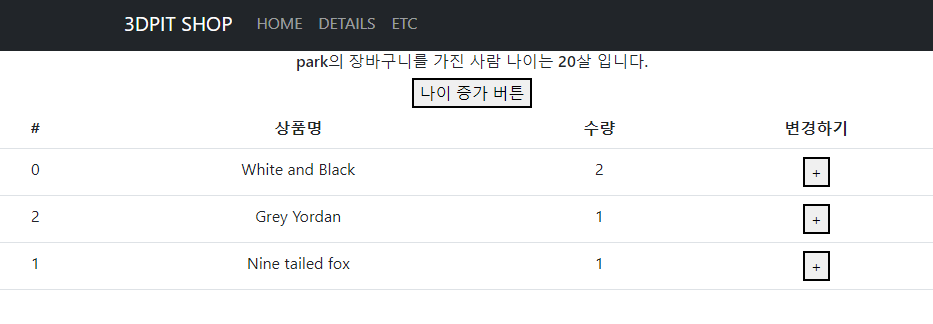

## 2022-12-16-Part-2--쇼핑몰-프로젝트-3

## 목차

## 01.장바구니 페이지 만들기 & Redux 1 : Redux Toolkit 설치

- 장바구니 만들기

  - 장바구니 페이지 

    

- Cart.js

  ```js
  import { Table } from 'react-bootstrap';
  
  function Cart() {
      return (
          <div>
              <Table>
                  <thead>
                      <tr>
                          <th>#</th>
                          <th>상품명</th>
                          <th>수량</th>
                          <th>변경하기</th>
                      </tr>
                  </thead>
                  <tbody>
                      <tr>
                          <td>1</td>
                          <td>안녕</td>
                          <td>안녕</td>
                          <td>안녕</td>
                      </tr>
                  </tbody>
              </Table>
          </div>
      )
  }
  
  export default Cart
  ```

- App.js

  ```js
  <Route path="/cart" element={
      <Cart></Cart>
  } />
  ```

  - tr 가로줄 생성된
  - 그안에서 세로줄 열 
    - th, td 쓰면됨
  - thead 표 제목
  - tbody 표 내용

- 장바구니 state가 App, Detail, Cart에 필요한 경우
  - 어디에 만드는것이 좋을까 어짜피 여러군데에서 쓰이니까 App에서 만들면됨

### 01.1 Redux사용하기

- 컴포넌트들이 props없이 state공유 가능
  - 컴포넌트들이 state빼서씀

- package.json 파일에서 확인 할 것

  

  - 리액트가 18.1 이상이어야 설치가능

- Redux 설치 하기

  ```sh
  npm install @reduxjs/toolkit react-redux
  ```

- 초기 셋업

  - src 폴더 안에 store.js 파일 생성

    ```js
    import { configureStore } from '@reduxjs/toolkit'
    
    export default configureStore({
      reducer: { }
    }) 
    ```

  - index.js 에서 선언

    ```js
      <React.StrictMode>
        <BrowserRouter>
            <App />
        </BrowserRouter>
      </React.StrictMode>
    ```

    - 이것을 <Provider>로 감싼다.

      ```js
      import {Provider} from "react-redux";
      import store from './store.js'
      
        <Provider store={store}>
          <React.StrictMode>
            <BrowserRouter>
                <App />
            </BrowserRouter>
          </React.StrictMode>
        </Provider>
      ```

## 02.Redux 2 : store에 state 보관하고 쓰는 법

- 리덕스 쓰는 이유
  - 컴포넌트간 state공유가 편해짐
    - 그럼 좋아지는것 props전송이 필요 없어지는 것

- 선언

  ````js
  import { configureStore, createSlice } from '@reduxjs/toolkit'
  
  let user =createSlice({
      name: 'user',
      initialState: 'park'
  })
  
  export default configureStore({
    reducer: {
      user : user.reducer
    }
  })
  ````

- 사용 하기

  ```js
  import { useSelector } from 'react-redux';
  
  function Cart() {
  
      let allData = useSelector((state)=>{ return state})
      console.log(allData);
      ...
  ```

  

- 리덕스 추가

  ```js
  import { configureStore, createSlice } from '@reduxjs/toolkit'
  
  let user =createSlice({
      name: 'user',
      initialState: 'park'
  })
  
  let stock =createSlice({
      name: 'stock',
      initialState: [10,11,12]
  })
  
  export default configureStore({
    reducer: {
      user : user.reducer,
      stock : stock.reducer
    }
  })
  ```

- useSelector 편하게 쓰기

  - () => {} 이렇게 쓰근게 기본틀

    - state 작명한 부분

      - 모든 state를 의미하는 것

      - 일부만 가져오려면

        (state)=>{return state.user}

        - 이렇게 원하는것만 쓸 수도 있음

  - 이렇게도 표현가능

    ```js
    let state = useSelector((state)=>{ return state})
    
    let state = useSelector((state)=> state)
    ```

    - 위의 두개 자체가 같은 것

### 02.1 리덕스 편한데 왜 props쓰는가?

- 간단한 프로젝트에서는 그냥 props가 더 소스가 짧아서
- 10개 20개같이 많아지면 redux가 더 좋음
  - 컴포넌트가 공유가 필요한것이 아니라면 굳이 다 넣을 필요는 없음

### 02.2 숙제 - 유저가 장바구니에 추가한 상품들

- 리덕스 보관해서

- cart.js에서 가져와서 바인딩해보기

  ```js
  {
      state.shoppingItems.map((obj, i)=>(
          <tr>
          <td>{obj.id}</td>
          <td>{obj.name}</td>
          <td>{obj.count}</td>
          <td>안녕</td>
          </tr>
      ))
  }
  ```

## 03.Redux 3 : store의 state 변경하는 법

### 03.1 state 변경하기

- park => jon park으로 하려면

  ```js
  //before
  let user =createSlice({
      name: 'user',
      initialState: 'park'
  })
  
  //after
  let user =createSlice({
      name: 'user',
      initialState: 'park',
      reducers : {
          changeName(){
              return 'john park'
          }
      }
  })
  
  let user =createSlice({
      name: 'user',
      initialState: 'park',
      reducers : {
          changeName(state){//여기 state 기존 state park임
              return 'john' + state
          },
          function2(){//함수 추가
              
          }
      }
  })
  ```

  - 스탭

    - 1.state수정해주는 함수 미리 만들기

    - 2.export 해주기

      ```js
      export let {changeName } = user.actions //변경 함수 남음
      ```

    - 3.만든함수 import해서 사용

      - dispatch(state변경함수())식으로 작성

      ```js
      import { changeName } from './../store';
      
      let dispatch = useDispatch()//store.js로 요청보내주는 함수
      
      
      //이렇게 쓰면안됨
      <button onClick={()=>{
          changeName();
      }}>+</button>
      
      
      //이렇게 써야함
      <button onClick={()=>{
          dispatch(changeName());
      }}>+</button>
      ```

      - 이런방식이 좋은 방식임
        - 이런것이 버그를 방지를 할 수 있기 때문이다.
      - 그리고 버그나도 그곳만 확인 하면되기 때문에

### 03.2 버튼 눌렀을때 1씩 증가하기 만들어보기 

- 실패

  - arry/objet변경 모르겠음

  - 실패 흔적

    ```js
    let shoppingItems = createSlice({
        name: 'shoppingItems',
        initialState:[
            {id : 0, name : 'White and Black', count : 2},
            {id : 2, name : 'Grey Yordan', count : 1}
          ],
          reducers:{
            addCount(){
                return [
                    {id : 2, name : 'White and Black', count : 3},
                    {id : 3, name : 'Grey Yordan', count : 4}
                  ]
            }
          }
    })
    ```

## 04.Redux 4 : state가 object/array일 경우 변경하는 법

```js
let user =createSlice({
    name: 'user',
    initialState: {name:'park', age:20},
    reducers : {
        changeName(state){//여기 state 기존 state park임 //1
            return {name:'kim', age:25}
        }
    }
})
```

- 위와 같이 바꾸는 방법도 있긴함

- 직접 수정해도됨

  ```js
  let user =createSlice({
      name: 'user',
      initialState: {name:'park', age:20},
      reducers : {
          changeName(state){//여기 state 기존 state park임 //1
              state.name = 'kim'
          }
      }
  })
  ```

  - 이렇게 하더라도 immer.js가 바꿔서 가능함

### 04.1 퀴즈

```js
let user =createSlice({
    name: 'user',
    initialState: {name:'park', age:20},
    reducers : {
        changeName(state){//여기 state 기존 state park임 //1
           // return {name:'kim', age:25}
           state.name='kim'
        },
        changeAge(state){
            state.age+=1;
        }
    }
})
```


- 강사 답변
  - 비슷하게 사용함

### 04.2 파라미터 문법 사용하기

```js
let user =createSlice({
    name: 'user',
    initialState: {name:'park', age:20},
    reducers : {
        changeName(state){//여기 state 기존 state park임 //1
           // return {name:'kim', age:25}
           state.name='kim'
        },
        changeAge(state, action){
            state.age+=action.payload;
        }
    }
})
```

- action선언후 payload해주면 그 값에 맞춰서 사용 할 수 있음
- 왜? payload인가?
  - 메세지와 함께 화물같이 보내서 payload임
    - 대개 action이라고 씀

### 04.3 숙제3-1

- 옆의 수량이 증가 할 수 있도록 

  - 0번째 버튼 누르면 0번째 상품 +1 되도록

  - 1번째면 1번째

    - 대충 짜면 표가 정렬되면 0번째 버튼 누르면 0번째 상품이 아닌 것을 제대로 맞춰서 해야함
    - 근본적 확인 하려면 장바구니 상품의 id를 가지고 코드를 짜보자

    ```js
    let shoppingItems = createSlice({
      name: 'shoppingItems',
      initialState:[
        {id : 0, name : 'White and Black', count : 2},
        {id : 2, name : 'Grey Yordan', count : 1}
       ],
        reducers:{
          addCount(state, action){
            state.map(function(obj,i){
              console.log(action.payload.id);
              if(obj.id === action.payload.id){
                  obj.count+=1;
              }
            })
          }
        }
    })
    ```

### 04.4 3숙제-2

detail 페이지 접속시

​	주문하기 누르면 장바구니에 state에 추가 하는것 구현해보기

```js
let shoppingItems = createSlice({
  name: 'shoppingItems',
  initialState:[
    {id : 0, name : 'White and Black', count : 2},
    {id : 2, name : 'Grey Yordan', count : 1}
   ],
    reducers:{
      addCount(state, action){
        console.log(state)
        state.map(function(obj,i){
          console.log(action.payload.id);
          if(obj.id === action.payload.id){
              obj.count+=1;
          }
        })
      },
      addItem(state, action){
        const item = new Object();
        item.id = action.payload.id;
        item.name = action.payload.title;
        item.count = 1;
        state.push(item)
        return state;
      }
    }c
})
```

- state 안에 추가되는것 까지는 확인했고
  - 페이지로 넘어가서 저장되는것은 확인 못함
  
- 페이지 네비게이터로 넘겨서 확인 완료

  ```js
  import { useParams,useNavigate } from "react-router-dom";
  let navigate = useNavigate();
  
  <button className="btn btn-info" onClick={() => {
      dispatch(addItem(findID))
      navigate('/cart')
  }}>장바구니</button>
  ```



## 05.Redux 5 : 장바구니 기능 만들기 숙제 & 응용문제

### 05.1 숙제 1 | 수량 + 기능 만들기

- 내가 짠것

  ```js
  let shoppingItems = createSlice({
    name: 'shoppingItems',
    initialState:[
      {id : 0, name : 'White and Black', count : 2},
      {id : 2, name : 'Grey Yordan', count : 1}
     ],
      reducers:{
        addCount(state, action){
          console.log(state)
          state.map(function(obj,i){
            console.log(action.payload.id);
            if(obj.id === action.payload.id){
                obj.count+=1;
            }
          })
        }
      }
  })
  
  
  //사용처
  <button onClick={()=>{
      console.log(obj.id);
      dispatch(addCount(obj));
      //dispatch(addCount());
  }}>+</button>
  ```

- 강의 답

  - state수정은 어떻게 한다?
    - 1.수정함수 만들기
    - 2.export하기
    - 3.import해서 사용 하기

  ```js
  //순서대로만 증가 
  let shoppingItems = createSlice({
    name: 'shoppingItems',
    initialState:[
      {id : 0, name : 'White and Black', count : 2},
      {id : 2, name : 'Grey Yordan', count : 1}
     ],
      reducers:{
        addCount(state, action){
          state[action.payload].count++
        }
      }
  })
  
  export let {addCount}= cart.actions
  
  
  
  //사용하는 곳
  dispatch(addCount(i))
  
  
  //id에 따라서 개선하기
  let shoppingItems = createSlice({
    name: 'shoppingItems',
    initialState:[
      {id : 0, name : 'White and Black', count : 2},
      {id : 2, name : 'Grey Yordan', count : 1}
     ],
      reducers:{
        addCount(state, action){
          const findDataIndex = state.findIndex((a)=>{return a.id == action.payload})
          state[findDataIndex].count++
        }
      }
  })
  
  <button onClick={()=>{
      console.log(obj.id);
      dispatch(addCount(obj.id));
      //dispatch(addCount());
  }}>+</button>
  
  ```

### 05.2 숙제 2

- 내가 구현한 것

  ```js
  let shoppingItems = createSlice({
    name: 'shoppingItems',
    initialState:[
      {id : 0, name : 'White and Black', count : 2},
      {id : 2, name : 'Grey Yordan', count : 1}
     ],
      reducers:{
        addCount(state, action){
          console.log(state)
          state.map(function(obj,i){
            console.log(action.payload.id);
            if(obj.id === action.payload.id){
                obj.count+=1;
            }
          })
        },
        addItem(state, action){
          const item = new Object();
          item.id = action.payload.id;
          item.name = action.payload.title;
          item.count = 1;
          state.push(item)
          return state;
        }
      }
  })
  
  
  //구현된곳
  <button className="btn btn-info" onClick={() => {
      dispatch(addItem(findID))
      navigate('/cart')
  }}>장바구니</button>
  ```

- 강의 구현한 것

  ```js
  let shoppingItems = createSlice({
    name: 'shoppingItems',
    initialState:[
      {id : 0, name : 'White and Black', count : 2},
      {id : 2, name : 'Grey Yordan', count : 1}
     ],
      reducers:{
        addCount(state, action){
          const findDataIndex = state.findIndex((a)=>{return a.id == action.payload})
          state[findDataIndex].count++
        },
        addItem(state, action){
            state.push(action.payload)
        }
      }
  })
  
  
  //구현된 곳
  //구현된곳
  <button className="btn btn-info" onClick={() => {
      dispatch({id:찾은상품.id, name: 찾은상품.title, count:1} )
  
  }}>장바구니</button>
  ```

- 현재까지 쓴것 redux toolkit 이전redux 개선 된것 더 쉽게 사용할 수 있음

### 05.3 응용

- 숙제1: 장바구니 항목 삭제 기능

  ```js
  let stock =createSlice({
      name: 'stock',
      initialState: [10,11,12]
  })
  
  let shoppingItems = createSlice({
    name: 'shoppingItems',
    initialState:[
      {id : 0, name : 'White and Black', count : 2},
      {id : 2, name : 'Grey Yordan', count : 1}
     ],
      reducers:{
        addCount(state, action){
          console.log(state)
          state.map(function(obj,i){
            console.log(action.payload.id);
            if(obj.id === action.payload.id){
                obj.count+=1;
            }
          })
        },
        minusCount(state, action){
          const findDataIndex = state.findIndex((a)=>{
            return a.id == action.payload.id
          })
          state[findDataIndex].count--;
          if(state[findDataIndex].count===0){
            state.splice(findDataIndex,1);
          }
        },
        addItem(state, action){
          const item = new Object();
          item.id = action.payload.id;
          item.name = action.payload.title;
          item.count = 1;
          state.push(item)
          return state;
        },
      }
  })
  ```

- 숙제2: 중복 상품 추가 x  카운터만 증가하도록 구현

  ```js
  let shoppingItems = createSlice({
    name: 'shoppingItems',
    initialState:[
      {id : 0, name : 'White and Black', count : 2},
      {id : 2, name : 'Grey Yordan', count : 1}
     ],
      reducers:{
        addCount(state, action){
          console.log(state)
          state.map(function(obj,i){
            console.log(action.payload.id);
            if(obj.id === action.payload.id){
                obj.count+=1;
            }
          })
        },
        minusCount(state, action){
          const findDataIndex = state.findIndex((a)=>{
            return a.id == action.payload.id
          })
          state[findDataIndex].count--;
          if(state[findDataIndex].count===0){
            state.splice(findDataIndex,1);
          }
        },
        addItem(state, action){
          const findDataIndex = state.findIndex((a)=>{
            return a.id == action.payload.id;
          })
          if(findDataIndex==-1){
          const item = new Object();
          item.id = action.payload.id;
          item.name = action.payload.title;
          item.count = 1;
          state.push(item)
          return state;
          }
          else{
            state[findDataIndex].count++;
          }
        },
      }
  })
  ```

  

  - 

