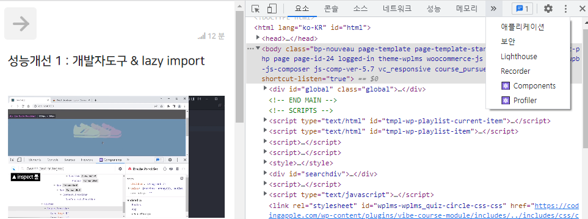
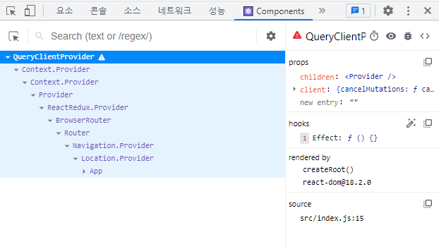

## 2022-12-23-Part-2--쇼핑몰-프로젝트-4

## 목차

## 01.리액트에서 자주쓰는 if문 작성패턴 5개

### 01.1 컴포넌트 안에서 쓰는 if/else

```js
function Component(){
    if(true){
		return <p> 참이면 보여줄 HTML </P>
    } else{
        return null;
    }// 생략하고 return null 해도됨
}
```

- 안되는 것
  - `<div>if (조건 식) {동작 소스} </div>`
- 그래서 보통 return + JSX전체를 뱉는 if문 작성하여 사용함

### 01.2 JSX안에서 쓰는 삼항 연산자

- 영어로

  - ternary operator
  - 조건문 ? 조건문 참일 때 실행할 코드 : 거짓일때 실행할 코드

- 사용 하기

  ```js
  function Component(){
  	return(
      	<div>
          	1 === 1
          	? <p> 참이면 보여줄 HTML </p>
          	: null
          </div>
      )
  }
  ```

- 상항 연산자 중첩

  ```js
  function Component(){
  	return(
      	<div>
          	1 === 1
          	? <p> 참이면 보여줄 HTML </p>
          	: ( 2 === 2
                	? <p>안녕</p>
                  : <p>반갑</p>
                )
          </div>
      )
  }
  ```

### 01.3 && 연산자로 if 역할 대신하기

- 왼쪽 오른쪽 둘다 true이면 전체 true로 바꿔주세요.

  ```js
  true && false; //false
  true && true: //true
  ```

- 자료형을 넣는 경우

  ```js
  true && '안녕'; //안녕
  false && '안녕'; // false
  true && false && '안녕'; // false
  ```

- 자바스크립트는 그냥 && 로 연결된 값들 중에 처음 등장한 false값을 찾아주고 그게아니면 마지막을 남겨줌으로 이해하기

  - 이걸 이랙트에서 약간 exploit하면 if문을 조금 더 간략하게 쓸 수 있음

  - html 조건부로 보여줄 때 이런 경우가 많음

    - `만약 이 변수가 참이면 <p></p>를 이자리에 뱉고 참이 아니면 null뱉고`

      - ui만들때 이런거 자주씀

      ```js
      function Component(){
      	return(
          	<div>
              	1 === 1
              	? <p> 참이면 보여줄 HTML </p>
              	:null
              </div>
          )
      }
      
      //&& 사용
      function Component(){
      	return(
          	<div>
              	{ 1===1 && <p>참이면 보여줄 HTML</p>}
      		</div>
          )
      }
      ```

      - true이면 jsx가 남고 false이면 false가 남음 
        - false가 남으면 html로 랜더링 하지 않음

### 01.4 switch/ case 조건문

- if문이 중첩된 경우 가끔씀

  ```js
  function Component(){
  	return(
      	<div>
          	1 === 1
          	? <p> 참이면 보여줄 HTML </p>
          	: ( 2 === 2
                	? <p>안녕</p>
                  : <p>반갑</p>
                )
          </div>
      )
  }
  ```

- switch /case 적용

  ```js
  function Component2(){
    var user = 'seller';
    switch (user){
      case 'seller' :
        return <h4>판매자 로그인</h4>
      case 'customer' :
        return <h4>구매자 로그인</h4>
      default : 
        return <h4>그냥 로그인</h4>
    }
  }
  ```

### 01.5 object/array 자료형 응용

- 경우에 따라서 다른 html 태그들을 보여주고 싶은 경우

  - if문 여러개 혹은 삼항연산자 여러개 작성하지만 이럴수 있음

    - 현재 state가 info면 <p>상품정보</p>

      현재 state가 shipping이면 <p>배송정보</p>

      현재 state가 refund면 <p>환불약관</p>

      - 이런것을 보여주는 경우

      ```js
      var 탭UI = { 
        info : <p>상품정보</p>,
        shipping : <p>배송관련</p>,
        refund : <p>환불약관</p>
      }
      
      function Component() {
        var 현재상태 = 'info';
        return (
          <div>
            {
              탭UI[현재상태]
            }
          </div>
        )
      } 
      ```

## 02.localStorage로 만드는 최근 본 상품 기능 1

- 원래 새로고침하면 state초기값으로 돌아감
  - state db에 영구적 저장하면됨
  - 차선책 localStorage사용하기
- 1.key:value 형태로 저장가능

- 2.문자 데이터만 가능 5MB정도 사용가능
- 3.사이트 재접속시 사용 가능함

- SessionStorage
  - 휘발성 자료 쓰고 싶은 경우 여기에 저장

### 02.1 사용 해보기

- console로 사용해보기

  ```sh
  localStorage.setItem('','');//localStorage.setItem('이름','값');
  localStorage.getItem('이름');//조회 하는법
  localStorage.removeItem('이름');//삭제하는 법
  // 수정하는 문법은 없고, 수정해서 다시 집어넣어야함
  ```

- arry/object 저장하고 싶은 경우

  ```js
    let obj = {name: 'park'}
    JSON.stringify(obj)//이렇게 하면 따옴표 다해줌
    localStorage.setItem('data',obj);  
    localStorage.setItem('data',JSON.stringify(obj));//json으로 저장
  ```

  - json으로 해서 넣으면됨

- json -> arry/object 변환
  - JSON.parse(꺼낸 json)

### 02.2  숙제 | 최근본 상품 UI 만들기 가이드

- 상세페이지에서 봤던것 번호 localStorage저장

  - watched 해서 [0,1,2] 몇번 상품을 봤는지 저장하기

  - 주의점

    - 1번을 연달아서 보는경우 같은 상품은 그냥 두기

      - 또는 set을 이용하기

      ```js
      useEffect(()=>{
          localStorage.setItem('watched', JSON.stringify([]))
      },[])
      ```

  - 배열 중복 제거해보기

    - set

      ```js
      const dupArr = [1,2,3,1,2];
      const set = new Set(dupArr);
      const uniqueArr = [...set];
      console.log(Array.isArray(uniqueArr));//Array유무 판별
      console.log(uniqueArr);//값 출력
      ```

    - indexOf(), filter()

      ```js
      const dupArr = [1,2,3,1,2];
      
      const uniqueArr = dupArr.filter((element, index)=>{
          return dupArr.indexOf(element) === index;
      })
      
      console.log(uniqueArr);//값 출력
      ```

    - forEach(), includes()

      ```js
      const dupArr = [1,2,3,1,2];
      
      const uniqueArr = [];
      dupArr.forEach((element)=>{
      	if(!uniqueArr.includes(element)){
              uniqueArr.push(element);
          }
      });
      
      console.log(uniqueArr);//값 출력
      ```


### 02.3 최근 본 상품 기능 - 숙제 리뷰

- 1. 누가 Detail 페이지 접속하면
  2. 상품번호 가져와서
  3. localStorage에 보관 watcbed에 추가

- Detail.js

  ```js
  useEffect(()=>{
      findID.id
      let getItems = localStorage.getItem('watched',[find.id])
      getItems = JSON.parse(getItems)
      getItems.push(findID.id)
      getItems = new Set(getItems)
      getItems = Array.from(getItems)
      localStorage.setItem('watched',JSON.stringify(getItems))
  },[])
  ```

  - 이렇게 하면 버그가 있음, 새로고침 하는 경우 localStorage가 없어짐
  - 방법은 App.js에서 watched항목이 있으면 setItem() 하지 말아주세요 하면됨  

- 자동으로 state를 localStorage에 자동 저장
  - redux-persist를 씀
  - jotai, Zustand
    - 리덕스와 비슷하고 더 쉬움

## 03.실시간 데이터가 중요하면 react-query

- ajax 성공시/실패시 html 보여주려면?

- 몇 초마다 자동으로 ajax요청?

- 실패시 몇초 후 요청 재시도?

- prefetch?

  - 이런것 이 귀찮으면 react-query쓰면됨
  - 쉽게 구현이 가능해짐
  - 항상 유용하진 않음
    - 실시간 sns, 코인 거래소 같은 것 쓰면 좋음

- 설치하기

  ```sh
  npm install react-query
  ```

- index.cs

  - 설정하기

    - before

      ```js
       import React from 'react';
      import ReactDOM from 'react-dom/client';
      import './index.css';
      import App from './App';
      import reportWebVitals from './reportWebVitals';
      import { BrowserRouter } from "react-router-dom";
      import store from './store.js'
      import {Provider} from "react-redux";
      
      
      const root = ReactDOM.createRoot(document.getElementById('root'));
      root.render(
        
        <Provider store={store}>
          <React.StrictMode>
            <BrowserRouter>
                <App />
            </BrowserRouter>
          </React.StrictMode>
        </Provider>
      );
      
      // If you want to start measuring performance in your app, pass a function
      // to log results (for example: reportWebVitals(console.log))
      // or send to an analytics endpoint. Learn more: https://bit.ly/CRA-vitals
      reportWebVitals();
      ```

    - after

      ```js
      import React from 'react';
      import ReactDOM from 'react-dom/client';
      import './index.css';
      import App from './App';
      import reportWebVitals from './reportWebVitals';
      import { BrowserRouter } from "react-router-dom";
      import store from './store.js'
      import {Provider} from "react-redux";
      import {QueryClient, QueryClientProvider} from "react-query"
      
      const queryClient = new QueryClient();
      
      const root = ReactDOM.createRoot(document.getElementById('root'));
      root.render(
        <QueryClientProvider client={queryClient}>
        <Provider store={store}>
          <React.StrictMode>
            <BrowserRouter>
                <App />
            </BrowserRouter>
          </React.StrictMode>
        </Provider>
        </QueryClientProvider>
      );
      
      // If you want to start measuring performance in your app, pass a function
      // to log results (for example: reportWebVitals(console.log))
      // or send to an analytics endpoint. Learn more: https://bit.ly/CRA-vitals
      reportWebVitals();
      
      ```

- 서버에서 유저이름 가져와서 보여주기

  - https://codingapple1.github.io/userdata.json

  ```js
  <Nav className="ms-auto">반가워요 Park</Nav>
  ```

  - useQuery

    ```js
    const resultUser = useQuery('userName',()=>{
        return axios.get('https://codingapple1.github.io/userdata.json').then(()=>{
            return a.data
        })
    })
    ```

    - 이렇게 하며 좋은 장점

      - 1.성공/실패/로딩중 쉽게 파악가능

        - resultUser를 뽑아보면 유용한 정보있음

          ```js
          resultUser.data//성공시 가져오는 데이터
          resultUser.isLoading//로딩요청중 일때 true
          resultUser.error//에러시 true
          ```

          - 로딩중일때 로딩중입니다. 보여주고 싶은 경우

            ```js
            <Nav className="ms-auto">
            {
                resultUser.isLoading ? '로딩중' : resultUserData
                //resultUser.isLoading && '로딩중'
            }    
            </Nav>
            ```

          - 활용해서 정보 보여주기

            ```js
            <Nav className="ms-auto">
            {resultUser.isLoading && '로딩중'}    {resultUser.error && '에러남'}    
            {resultUser.data && result.data.name}    
            </Nav>
            ```

      - 2.틈만나면 자동으로 재요청해줌

        - 간격 조절하는법

          - return 있는 것

            ```js
            const resultUser = useQuery('userName', () => {
                return  axios.get('https://codingapple1.github.io/userdata.json')
                    .then((a) => {
                    console.log('요청됨')
                    return a.data
                }),
                    {staleTime : 2000}
            })
            ```

          - return 없는 것

            ```js
            const resultUser = useQuery('userName', () => axios.get('https://codingapple1.github.io/userdata.json')
                                        .then((a) => {
                console.log('요청됨')
                return a.data
            }),
                                        { staleTime: 2000 }
                                       )
            ```

          - 물론 refetch로 끌수 있음

      - 3.실패시 retry해줌

      - 4.state공유 안해도 됨

        - 자식 컴포넌트에 ajax 요청 해도 하나로 합쳐서 되기 때문에 
        - 그냥 state 없이 그냥 써도 상관 없음

      - 5.ajax 결과 캐싱기능
        - 이미했던 결과면 그냥 이전꺼 씀
        - 기존 성공 결과를 가져와서 더 빠른 효과가 있음

- redux-toolkit 설치시

  - RTK Query도 자동설치됨
    - 방금배운거랑 유사하지만 좀 더러움

## 04.성능개선 1 : 개발자도구 & lazy import

- 예를 들어 props보냈는데 왜 출력이 안되나?

  - 왜 이미지 안나오나?
  - 코드를 확인하거나 개발자 도구를 켜서 확인을 함

- [React Developer Tools](https://chrome.google.com/webstore/detail/react-developer-tools/fmkadmapgofadopljbjfkapdkoienihi?hl=ko)

  - 이것을 설치

    

    - compoents 를 볼수 있고 각 props를 확인 도 가능함

      

    - Profile
      - 이것의 경우 녹화 버튼을 누르고 조작해보면 
      - 각 현재 컴포넌트에 대해서 바형식으로 보여줌
      - 원인 분석이 가능해짐

- [Redux Dev Tools]()

  - 리덕스 가 설치 되어 있으면 어던 리덕스들이 변하는지
    - 한눈에 볼 수 있음


- 성능개선 하기

  - single Page Application특징

    - 발행하면 js파일 하나에 모든 코드 다 쑤셔넣음
    - 사이즈가 매우 커짐
      - 메인에 들어가는 경우 느려지는 경우가 있는데
      - 로딩이 좀 기본적으로 느린데 이를 개선하려면
        - 메인에 Deatil, Cart가 실행시 로드 할 필요 없는 경우

  - 메인에 Deatil, Cart가 실행시 로드 할 필요 없는 경우

    - before

      ```js
      import Detail from './routers/Detail.js';
      import Cart from './routers/Cart.js';
      ```

    - after

      ```js
      import { lazy, useEffect } from 'react';
      const Detail = lazy(()=>import('./routers/Detail.js'));
      const Cart = lazy(()=>import ('./routers/Cart.js'));
      ```

      - 이렇게 하면 js 별도로 만들어짐

      - 단점은

        - 컴포넌트 로딩 시간이 발생됨

        - 로딩시 뭔가 화면 보여주고 싶으면

          ```js
          <Suspense>
              <Detail modeling={modeling}></Detail>
          </Suspense>
          ```

          - 이렇게 감싸고

            ```js
            <Suspense fallback={<div>로딩중임</div>}>
                <Detail modeling={modeling}></Detail>
            </Suspense>
            ```

            - fallback에 로딩중일때 필요한 ui 넣으면됨

    - 원래 라우터 부분을 주고 감싸니까 전체를 Suspense로 감싸도됨

- 기능구현이 완료되면 성능 개선이 필요하다 그렇기 때문에 이런것을 적용해도 좋음


## 05.성능개선 2 : 재렌더링 막는 memo, useMemo

- 재랜더링 막는 방법

  ```js
  import {useState} from 'react';
  
  function Child(){
      console.log("재랜더링됨")
      return <div>자식임</div>
  }
  function Cart() {
  
      let state = useSelector((state)=>{ return state})
      let dispatch = useDispatch()//store.js로 요청보내주는 함수
      let [count, setCount]= useState(0);
      //console.log(state);
  
      return (
          <div>
              <Child></Child>
              <button onClick={()=>{setCount(count+1)}}>+</button>
  ...
  ```

  - 이렇게 했을때 버튼 눌를때 마다 자식 컴포넌트도 재랜더링됨

- 개선해보기

  ```js
  let Child =  memo(function(){
      console.log("재랜더링됨")
      return <div>자식임</div>
  })
  ```

  - 이렇게 메모로 감싸면 재렌더링안됨

- memo의 원리

  - props가 변할때만 재렌더링 해줌

    ```js
    <Child count={count}></Child>
    ```

    - 이렇게 하면 props가 변할 때마다 재랜더링 함을 알수 있음

  - 하지만 성능 이슈가 있을수 있음

    - 이전 state와 현재state를 매번 비교하기 때문에
    - props가 길고 복잡하면 안좋음

- useMemo 사용법

  - 어디에 쓸까?

    - Cart에 어렵고 복잡한 연산한다면?

      - before

        ```js
        function repeat10(){
            return '10억번 반복'
        }
        ...
        let result = repeat10();
        ```

      - after

        ```js
        import {memo, useMemo, useState} from 'react';
        
        let result = useMemo(()=>{return repeat10()})
        
        ```

        - 이렇게 하면 컴포넌트 렌더링시 1회만 실행

        - state 변경시 마다 하려면

          ```js
          let result = useMemo(()=>{return repeat10()},[state])
          ```

- **useEffect와 useMemo차이**
  - useEffect의 경우
    - html 보여지는것이 완료가 되면 그때 실행되고
  - useMemo의 경우
    - html랜더링 될때 같이됨
  - 즉, 시점의 차이일뿐 같음

## 06.성능개선 3 : useTransition, useDeferredValue

1.batch기능

```js
	state1변경()
	state2변경()
	state3변경()
```

- 이렇게 있는 경우 마지막 만 재렌더링 1회함
  - 단, ajax, setTimeout내부인경우
    - 세개 전부 재렌더링됨
      - 18버전의 경우로 바뀌고는 batch로 동작

2.useTransition으로 느린 컴포넌트 성능향상가능

- 카드 빚 돌려막기 같은것

  ```js
  import {useState} from "react"
  
  
  function App(){
      let[name, setName]=useState('');
      
      return (<div className="App">
      	<input onChange={(e)=>{setName(e.target.value)}}/>
      </div>
  )}
  ```

  - 이렇게 구현했는데 성능저하된 경우

    ```js
    import {useState} from "react"
    
    let a = new Array(1000).fill(0)
    
    function App(){
        let[name, setName]=useState('');
        
        return (<div className="App">
        	<input onChange={(e)=>{setName(e.target.value)}}/>
    {	
        a.map(()=>{
            return <div>{name}</div>
        })
    }
        </div>
    )}
    ```

    - 이렇게 성능이슈가 생기는 경우	

      - 조작 후 0.2초 넘으면 다떠남

    - 솔루션1

      - html 1000만개 지우기

        - 다른 창으로 보여주기

      - startTransition쓰기(18버전이후)

        ```js
        import {useState, useTransition} from "react"
        
        let a = new Array(1000).fill(0)
        // 이렇게 씀
        let [isPending, startTransiton]useTranstion()
        
        function App(){
            let[name, setName]=useState('');
        
            return (<div className="App">
                    <input onChange={(e)=>{
        	startTransition(()=>{
                setName(e.target.value)
            })
            }}/>
        {	
            a.map(()=>{
                return <div>{name}</div>
            })
        }
        </div>
        )}
        ```

        - startTransiton 이것으로 감싸면됨

          - {setName(e.target.value)이것이 성은 저하 원인

            ```js
            startTransition(()=>{
                setName(e.target.value)
            })
            ```

            - 이렇게 하면 개선됨

- startTransition동작원리

  - 브라우저 동시에 처리 힘듦 그래서 오래걸림
  - 이를 감싸주면 안에 있는 것을 늦게 처리해줌
    - 코드시작을 뒤로 늦춰줌
  - 그러면 브라우저는 할것 먼저하고 나중에 처리해줘서 좀더 개선됨

- isPending

  - startTransition이 처리중일때 true로 변함
    - 뭔가 입력시 로딩을 띄워주게 구현

- useDefferredValue

  - 느린 컴포넌트 성능향상 가능

    ```js
    let state = useDefferredValue(state)
    ```

    - 여기에 넣은 state 늦게 처리 해주는 것
      - 늦게 처리 원하는 state의 경우 넣어서 처리