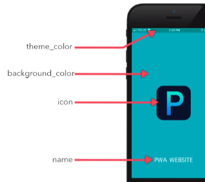
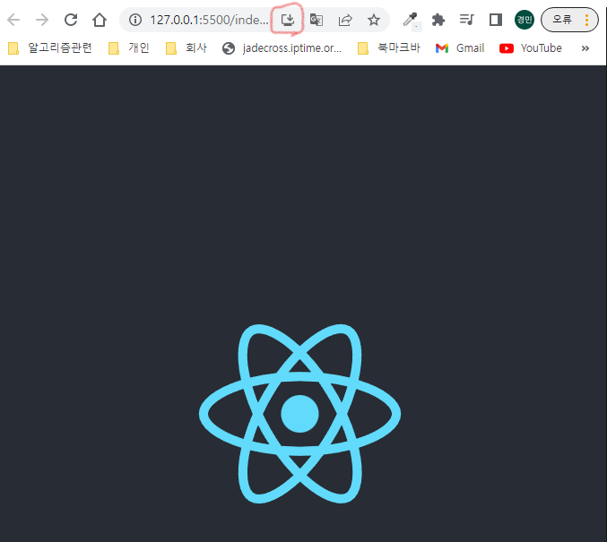

## 2022-12-28-Part2-쇼핑몰-프로젝트-5

## 목차

## 01.PWA 셋팅해서 앱으로 발행하기 (모바일앱인척하기)

- PWA

  - 웹사이트를 모바일 앱처럼 설치해서 쓸 수 있음
  - 장점
    - 1.설치 마케팅 비용이 적음
      - 방문 유도 비용 100 ~ 200 정도 밖에 안되서 쌈
    - 2.아날로그 유저들 배려
    - 3.html css js 만으로 앱까지 
    - 4.푸시알림, 센서 등 사용 가능

- pwa가 생성된 리액트 생성해야함

  - 생성이 명령어가 다름

    ```sh
    npx create-react-app my-app --template cra-template-pwa
    ```

  - PWA의 조건

    - 1.manifest.json

      

    - 2.service-worker.js 있어야함

      - index.js에서

        ```js
        //before
        serviceWorkerRegistration.unregister();
        
        //after
        serviceWorkerRegistration.register();
        ```

        - 이렇게 해주면 serviceworker.js가 자동으로 생성됨
          - build가 되어야 정확히 생긴다.

      - 오프라인에서도 사이트 열 수 있게 도와주는 것

      - 미리 하드에 저장해놓는것 캐싱이라고함

        - asset-manifiest.json에 미리 적어져있음

- build 후 실행해보면 아래와 같음

  

  - 저렇게 설치하기가 있으면 pwa로 실행된것
  - 특정파일 캐싱하기 싫다면?
    - 그런것 설정하고 싶다면 node_modules/reat-scripts/config/webpack.config.js
      - 여기서 injectManifest부분을 바꾸면됨
        - exclude에 추가하면된다.

## 02.state 변경함수 사용할 때 주의점 : async

### 02.1 자바스크립트의 sync/ async 관련 상식

- 자바스크립트는 일반적인 코드를 작성시 synchronous하게 처리됨

  - 번역하면 동기방식
  - 코드 적은 순서대로 윗줄부터 차례로 코드가 실행된다는 뜻

- 비동기도 가능

  - ajax, 이벤트리스너, setTimeout 이런 함수 쓸때 현상이 일어남
    - 이런 함수 처리들이 오래걸리기때문에 순차적으로 실행하지 않고 완료되면 실행

  ```js
  console.log(1+1)
  axios로 get요청하고나서 console.log(1+2) 실행해주셈~
  console.log(1+3)
  ```

  - 이랬다면?
  - 2,4 바로 출력되고, 3이 출력이됨
  - asynchronous처리를 지원하는 함수를 써야 이런 식으로 동작

### 02.2 리액트의 setState 함수 특징

```js
function App(){
    let [name, setName] = useState('park');
}
```

- kim으로 변경하고 싶을때?

  - setName('kim')하면 변경됨
  - 이런 함수는 전부 asynchronous(비동기적)으로 처리됨

- 위와같은 특성때문에 비정상적으로 동작할 수 도 있음

  ```js
  function App(){
    let [count, setCount] = useState(0);
    let [age, setAge] = useState(20);
  
    return (
      <div>
        <div>안녕하십니까 전 {age}</div>
        <button onClick{()=>{
         /* count+=1;
          if(count!==3){
          age+=1;
          setAge(age);
          }
          setCount(count); */
         setCount(count+1);
         if(count<3){
             setAge(age+1);
         }
        }}>누르면한살먹기</button>
      </div>
    )
  }
  ```

  - 이렇게 하면 23까지 증가하게됨

    - 우리가 원하는것은22가되면 증가하면안됨

    - 이것이 async라는 특징때문임

      - state변경함수는 async하게 처리되는 함수기때문에

        - 완료되기까지 시간이 오래걸리면 제쳐두고 다음 코드 실행

        - 실제로 코드는 이렇게 동작

          ```markdown
          1. 버튼을 세번째 누르면 setCount(count+1); 이걸 실행해서 count3 만듦
          2. 근데 count 3으로 만드는건 오래걸려서 제껴두고
          	if(count>3){} 이걸 먼저 실행
          3. 이때 count는 아직 2라서 if문 안에서setAge(age+1)이 잘 작동
          ```

          - 이모든 문제는 setCount()가 async함수라서 그런것

    - 그래서 sync스럽게 순차적으로 실행하고 싶은 경우

      - useEffect쓰면됨

        ```sh
        useEffect(()=>{
        
        },[count])
        ```

        - 이렇게 쓰면 state 변경될때 이코드 실행해주세요임

        - 해결책

          ```ㅓㄴ
          useEffect(()=>{
            if ( count < 3 ) {
              setAge(age+1)
            }
           }, [count]) 
          
          
          <button onClick={()=>{
          
            setCount(count+1);
          
          }}>누르면한살먹기</button> 
          ```

          - 이렇게하면 처음 로드때도 한번 실행이되기 때문에

            - count 0일때 실행안되게 해야함

            ```js
            useEffect(()=>{
              if ( count != 0 && count < 3 ) {
                setAge(age+1)
              }
             }, [count]) 
            ```

      - 위와 같이 해도 해결이 되지만

        - count와 age를 동시에 한곳의 state에 array/ object 자료형으로 넣거나
        - 하나는 굳이 state로 만들지 않고
          - 일반 변수로 만드는 것도 쉬운 방법임
          - 이유는 html 자동 재렌더링이 필요한 변수들은 state로 만들라고 했기 때문에

## 03.Node+Express 서버와 React 연동하려면

- 서버란?
  - a주라면 a주는것
- 웹서버
  - 웹 문서 주세요 하면 웹문서 주는 것
    - 웹문서 html임
- 어떤 서버를 써도 리액트 적용하는것 똑같음
  - html주라고 하면리액트로 만든 html주라면 주면됨

- nodejs 설치하는법

  - 검색후 설치

  - 작업폴더 만들고 에디터로 오픈

  - server.js 만들어서 코드 복붙

    ```js
    const express = require('express');
    const path = require('path');
    const app = express();
    
    app.listen(8080, function () {
      console.log('listening on 8080')
    });
    ```

  - 에디터 터미널 열어서 npm init -y 

  - npm install express도 입력

- 리액트 프로젝트 빌드

  - 그것을 가져다 써야함
    - npm run build

- server.js

  ```js
  const express = require('express');
  const path = require('path');
  const app = express();
  
  app.listen(8080, function () {
    console.log('listening on 8080')
  });
  
  app.use(express.static(path.join(__dirname, 'shop/build')));
  
  app.get('/',function(요청, 응답){
      응답.sendFile(path.join(__dirname, 'shop/build/index.html'))
  });
  ```

  - nodemon server.js 또는 node server.js

    

    - 위와 같이 제대로 나오게됨

- **다른 페이지 여러개 만들고 싶은경우?**

  - /detail

  - /about

    - 이거 서버에서 해도되지만 리액터 안에서도 가능함

  - 간혹 없으면 깨지는데

    ```js
    app.get('*',function(요청, 응답){
        응답.sendFile(path.join(__dirname, 'shop/build/index.html'))
    });
    ```

    - 이렇게 제일 아래적으면 리액터 라우터 제대로 사용가능

- **DB데이터 어떻게 리액트에서 보여줌?**

  - 리액트 방식

    - 데이터 디비에서 서버로 보내고 사용자에게 보냄

  - html을 서버가 만들면 server-side rendering

  - html을 리액트(js)가 만들면 client-side rendering

    ```js
    app.use(express.json());
    var cors = require('cors');
    app.use(cors());
    
    app.get('/product',function(요청, 응답){
        응답.json({name: 'black shoes'})
    });
    ```

    - 이렇게 해서 필요한것 get요청만 날리면 받을 수 있음
      - 이렇게 해야 ajax 잘받음
      - cors 설치는
        - npm install cors

    - express.json() 은 유저가 보낸 array/object 데이터를 출력해보기 위해 필요하고

      cors는 다른 도메인주소끼리 ajax 요청 주고받을 때 필요합니다. 

- **리액트 코드 수정할때 마다 build해야함?**

  - 굳이 빌드 할 필요없이 그냥 할때는 미리보기 해도되고

  - 업로드할때만 해도됨

    ```markdown
    서버주소 입력하는게 귀찮으면  
    
    리액트에서 package.json이라는 파일을 열어서 proxy라는 부분 설정을
    
    서버 미리보기 띄우던 localhost:어쩌구 주소로 설정해주면 됩니다. 
    
    그러면 리액트에서 ajax 요청 대충해도 localhost:어쩌구 주소로 ajax 요청을 알아서 보내줍니다. 
    
    https://create-react-app.dev/docs/proxying-api-requests-in-development/
    
    이걸 참고합시다. 
    ```

- **리액트말고 html 그냥 파일 하려면?**

  ```js
  (server.js)
  
  app.use( '/', express.static( path.join(__dirname, 'public') ))
  app.use( '/react', express.static( path.join(__dirname, 'react-project/build') ))
  
  app.get('/', function(요청,응답){
    응답.sendFile( path.join(__dirname, 'public/main.html') )
  }) 
  app.get('/react', function(요청,응답){
    응답.sendFile( path.join(__dirname, 'react-project/build/index.html') )
  })
  ```

  - 라우팅 이렇게 바꿔주고

  ```js
  (리액트프로젝트 내의 package.json)
  {
    "homepage": "/react",
    "version": "0.1.0",
    ... 등
  } 
  ```

  - 이렇게 하면 리액트 접속시 리액트 프로젝트 보내고
  - /접속시 일반 html 보내라고 했으니 그렇게 됨