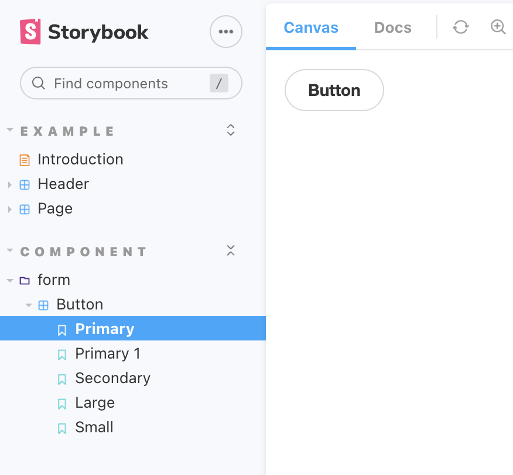

## 2023-02-05-StoryBook-Adjust

## 설치 및 setup

```sh
# js 버전 설치
npm create vite@latest project -- --template react

# ts 버전 설치
npm create vite@latest project -- --template react-ts

# 해당 프로젝트로 이동
cd project

# 해당 프로젝트에 storybook 설치 
npx sb init --builder @storybook/builder-vite

# storybook 실행
npm run storybook
```

```sh
npm -v
8.1.2
```

- 버전 정보

## 스토리북 설치 시

- 스토리북 자체에 나타나게 하기위한 파일 구성
  - button.jsx | button.tsx
  - button.module.css
  - button.stories.jsx | button.stories.tsx
    - 실제 x.stories.jsx | x.stories.tsx 파일이 보여지는 부분임
- 스토리북에 폴더 구조 나누는 방법

## css 공통

```css

.buttonMain {
  font-family: 'Nunito Sans', 'Helvetica Neue', Helvetica, Arial, sans-serif;
  font-weight: 700;
  border: 0;
  border-radius: 3em;
  cursor: pointer;
  display: inline-block;
  line-height: 1;
}
.buttonPrimary {
  color: white;
  background-color: #1ea7fd;
}
.buttonSecondary {
  color: #333;
  background-color: transparent;
  box-shadow: rgba(0, 0, 0, 0.15) 0px 0px 0px 1px inset;
}
.buttonSmall {
  font-size: 12px;
  padding: 10px 16px;
}
.buttonMedium {
  font-size: 14px;
  padding: 11px 20px;
}
.buttonLarge {
  font-size: 16px;
  padding: 12px 24px;
}

```

## js 버전 설치시 

### css 형식 적용시

```jsx
import React from "react";
import PropTypes from "prop-types";
import "./Button.css";

/**
 * Primary UI component for user interaction
 */
export const Button = ({ primary, backgroundColor, size, label, ...props }) => {
  const mode = primary ? "buttonPrimary" : "buttonSecondary";
  return (
    <button
      type="button"
      className={["buttonMain", `button${size}`, mode].join(" ")}
      style={backgroundColor && { backgroundColor }}
      {...props}
    >
      {label}
    </button>
  );
};

Button.propTypes = {
  /**
   * Is this the principal call to action on the page?
   */
  primary: PropTypes.bool,
  /**
   * What background color to use
   */
  backgroundColor: PropTypes.string,
  /**
   * How large should the button be?
   */
  size: PropTypes.oneOf(["Small", "Medium", "Large"]),
  /**
   * Button contents
   */
  label: PropTypes.string.isRequired,
  /**
   * Optional click handler
   */
  onClick: PropTypes.func,
};

Button.defaultProps = {
  backgroundColor: null,
  primary: false,
  size: "Medium",
  onClick: undefined,
};
```

### module.css 적용시

```jsx
import React from "react";
import PropTypes from "prop-types";
import css from "./Button.module.css";

/**
 * Primary UI component for user interaction
 */
export const Button = ({ primary, backgroundColor, size, label, ...props }) => {
  const mode = primary ? css.buttonPrimary : css.buttonSecondary;
  const sizeMode = {
    Small: css.buttonSmall,
    Medium: css.buttonMedium,
    Large: css.buttonLarge,
  };
  return (
    <button
      type="button"
      // className={["buttonMain", `button${size}`, mode].join(" ")}
      className={css.buttonMain + " " + sizeMode[size] + " " + mode}
      style={backgroundColor && { backgroundColor }}
      {...props}
      >
      {label}
    </button>
  );
};

Button.propTypes = {
  /**
   * Is this the principal call to action on the page?
   */
  primary: PropTypes.bool,
  /**
   * What background color to use
   */
  backgroundColor: PropTypes.string,
  /**
   * How large should the button be?
   */
  size: PropTypes.oneOf(["Small", "Medium", "Large"]),
  /**
   * Button contents
   */
  label: PropTypes.string.isRequired,
  /**
   * Optional click handler
   */
  onClick: PropTypes.func,
};

Button.defaultProps = {
  backgroundColor: null,
  primary: false,
  size: "Medium",
  onClick: undefined,
};

```

### .stories.jsx

```tsx
import React from 'react';
import { ComponentStory, ComponentMeta } from '@storybook/react';

import { Button } from './Button';

// More on default export: https://storybook.js.org/docs/react/writing-stories/introduction#default-export
export default {
  title: 'Example/Button',
  component: Button,
  // More on argTypes: https://storybook.js.org/docs/react/api/argtypes
  argTypes: {
    backgroundColor: { control: 'color' },
  },
} as ComponentMeta<typeof Button>;

// More on component templates: https://storybook.js.org/docs/react/writing-stories/introduction#using-args
const Template: ComponentStory<typeof Button> = (args) => <Button {...args} />;

export const Primary = Template.bind({});
// More on args: https://storybook.js.org/docs/react/writing-stories/args
Primary.args = {
  primary: true,
  label: 'Button',
};

export const Secondary = Template.bind({});
Secondary.args = {
  label: 'Button',
};

export const Large = Template.bind({});
Large.args = {
  size: 'large',
  label: 'Button',
};

export const Small = Template.bind({});
Small.args = {
  size: 'small',
  label: 'Button',
};

```

## ts 버전 설치시

### css 적용시

```tsx
import React from "react";
import "./button.css";

interface ButtonProps {
  /**
   * Is this the principal call to action on the page?
   */
  primary?: boolean;
  /**
   * What background color to use
   */
  backgroundColor?: string;
  /**
   * How large should the button be?
   */
  size?: "Small" | "Medium" | "Large";
  /**
   * Button contents
   */
  label: string;
  /**
   * Optional click handler
   */
  onClick?: () => void;
}

/**
 * Primary UI component for user interaction
 */
export const Button = ({
  primary = false,
  size = "Medium",
  backgroundColor,
  label,
  ...props
}: ButtonProps) => {
  const mode = primary ? "buttonPrimary" : "buttonSecondary";
  return (
    <button
      type="button"
      className={["buttonMain", `button${size}`, mode].join(" ")}
      style={{ backgroundColor }}
      {...props}
    >
      {label}
    </button>
  );
};

```

### module.css 적용시

```tsx
import React from "react";
import css from "./Button.module.css";

interface ButtonProps {
  /**
   * Is this the principal call to action on the page?
   */
  primary?: boolean;
  /**
   * What background color to use
   */
  backgroundColor?: string;
  /**
   * How large should the button be?
   */
  size?: "Small" | "Medium" | "Large";
  /**
   * Button contents
   */
  label: string;
  /**
   * Optional click handler
   */
  onClick?: () => void;
}

/**
 * Primary UI component for user interaction
 */
export const Button = ({
  primary = false,
  size = "Medium",
  backgroundColor,
  label,
  ...props
}: ButtonProps) => {
  const mode = primary ? css.buttonPrimary : css.buttonSecondary;
  const sizeMode = {
    Small: css.buttonSmall,
    Medium: css.buttonMedium,
    Large: css.buttonLarge,
  };
  return (
    <button
      type="button"
      className={css.buttonMain + " " + sizeMode[size] + " " + mode}
      style={{ backgroundColor }}
      {...props}
    >
      {label}
    </button>
  );
};

```

### stories.tsx

```tsx
import React from "react";
import { ComponentStory, ComponentMeta } from "@storybook/react";

import { Button } from "./Button";

// More on default export: https://storybook.js.org/docs/react/writing-stories/introduction#default-export
export default {
  title: "Example/Button",
  component: Button,
  // More on argTypes: https://storybook.js.org/docs/react/api/argtypes
  argTypes: {
    backgroundColor: { control: "color" },
  },
} as ComponentMeta<typeof Button>;

// More on component templates: https://storybook.js.org/docs/react/writing-stories/introduction#using-args
const Template: ComponentStory<typeof Button> = (args) => <Button {...args} />;

export const Primary = Template.bind({});
// More on args: https://storybook.js.org/docs/react/writing-stories/args
Primary.args = {
  primary: true,
  label: "Button",
};

export const Secondary = Template.bind({});
Secondary.args = {
  label: "Button",
};

export const Large = Template.bind({});
Large.args = {
  size: "Large",
  label: "Button",
};

export const Small = Template.bind({});
Small.args = {
  size: "Small",
  label: "Button",
};

```

## 폴더 구조 나누기

- x.stories.jsx | x.stories.tsx

  - .stories파일로 들어가서 

    ```tsx
      title: 'Example/Button',
    ```

    - 타이틀 첫번째가 큰 폴더 나머지는 안에 있는 폴더 라고 생각하면됨

- Components/form/Button을 만들고 싶으면 아래와 같이 하면됨

  ```tsx
    title: 'Component/form/Button',
  ```

  

  - 위와 같이 Component라는 큰 폴더 안에 저렇게 표현이 가능하게 관리가 가능하다.


## 참고 자료

[React에 Storybook 적용하기(feat vite)](https://velog.io/@sjyoung428/React%EC%97%90-Storybook-%EC%A0%81%EC%9A%A9%ED%95%98%EA%B8%B0feat-vite)