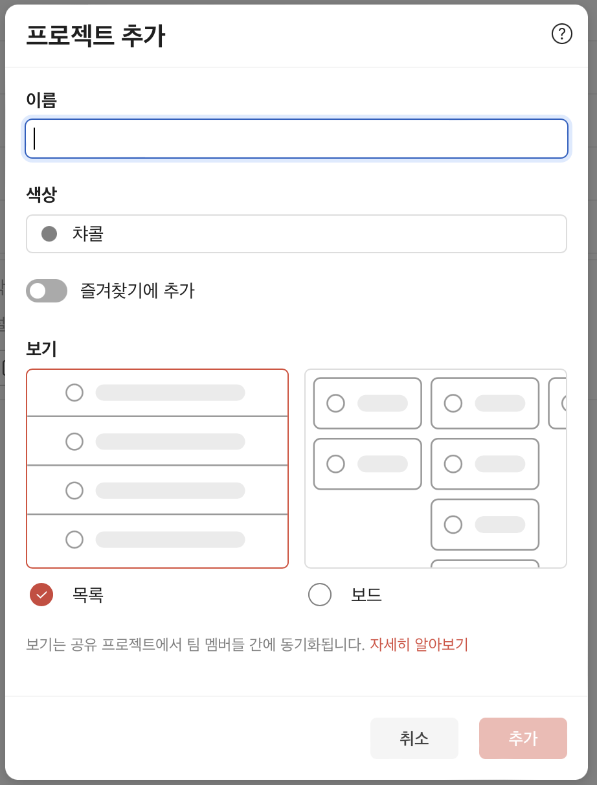
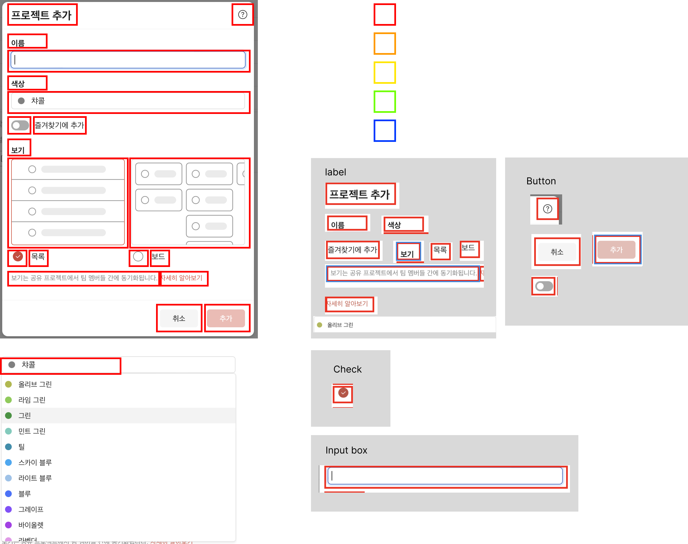
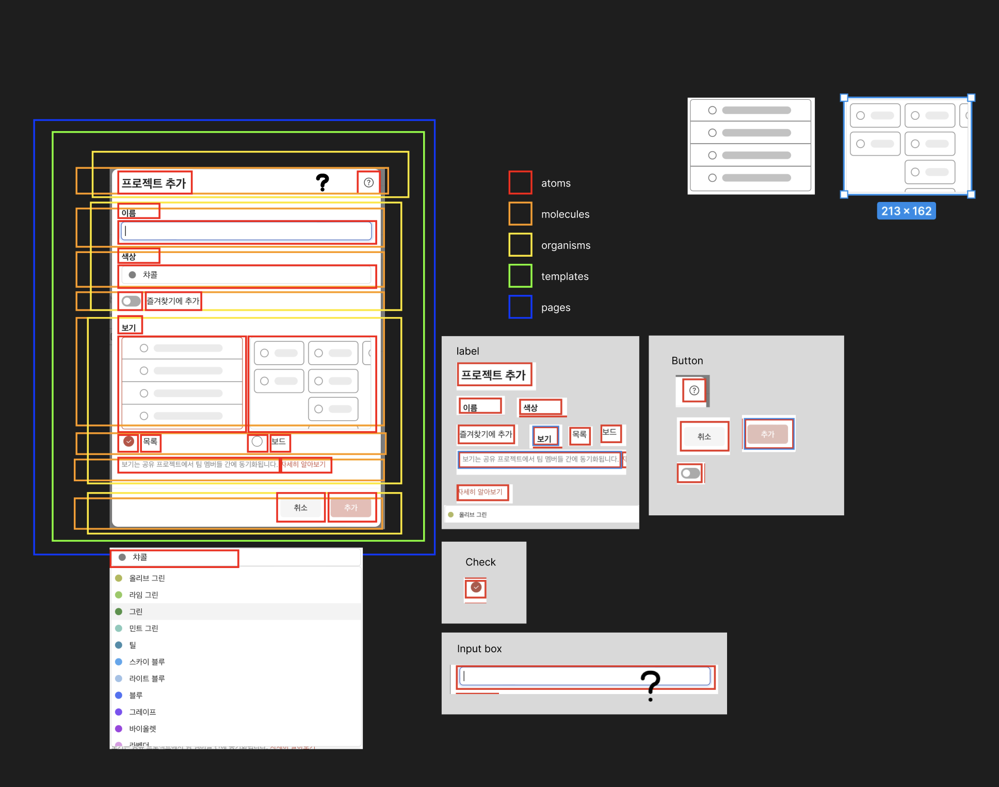
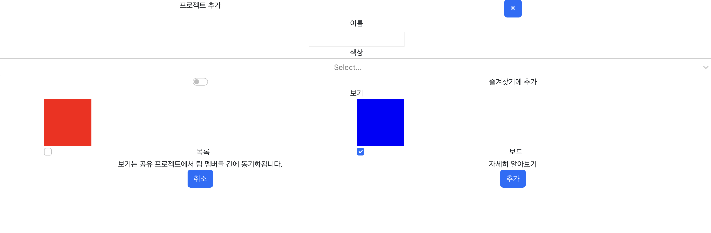
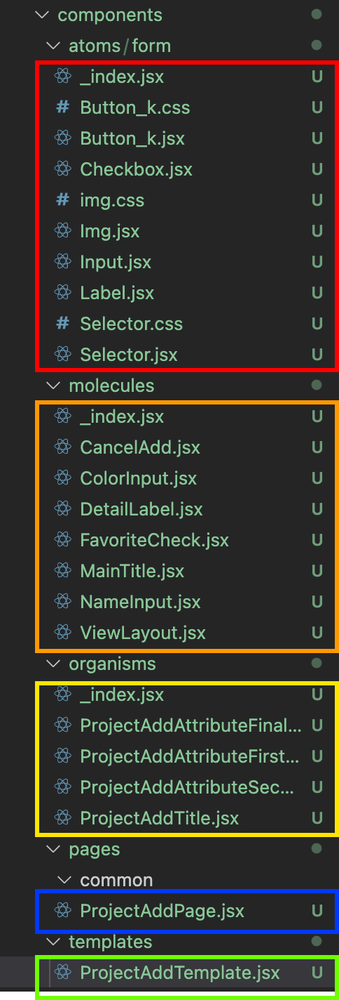
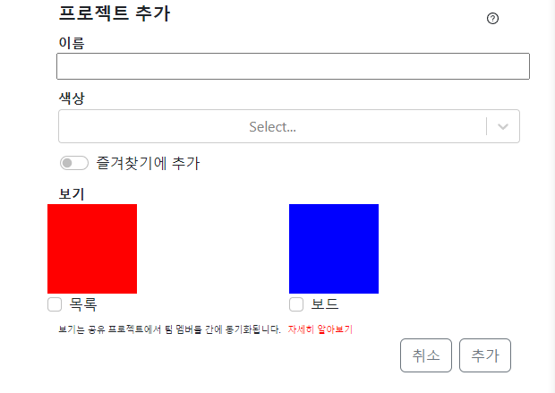
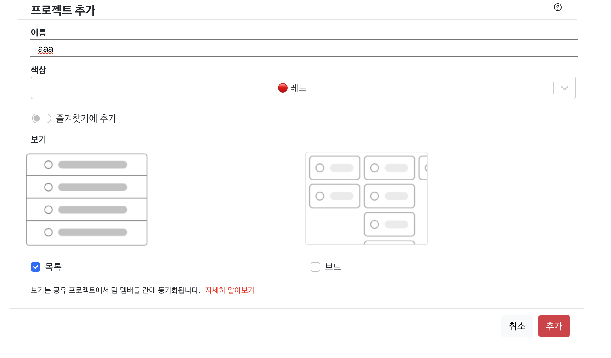

## 2022-11-12-Todoist-디자인-분석

## 01.프로젝트 추가 UI

- 현재 Organism까지 적용 후 테스트 완료

## 02.현재까지 나눈 부분 정리

- 설계 한 그림

- 실제 구현한 부분

  - 레이아웃 처리만 진행 

- 현재 폴더 구조

  

## 내 기준으로 합의 된것

- Template와 page경계가 애매 했는데
  - Template에서는 레이아웃 전반적인 크기나 색상을 완료 하는 것까지 사용
  - page의 경우 실제 글이나 그림등의 데이터를 넣는 부분과 실제 동작 부분을 명시하는 곳으로 사용
- 아직까지 명확하지 않은 것. [22.01.14일 13시 기준]
  - atoms, molecules 까지 props로 
  - organisms, templates, pages는 리덕스로 한다고 했었는데 그것이 와닿지 않음
- 각 className에 대한 것을 적용할 때 네이밍을 어떻게 가지고 갈지에 대한 명세도 필요함

## 1월 17일 기준 완성된 것

- 적용 된것
  - 이름 부분 데이터와 색상 부분과 보기에 대한 것 redux적용
  - 보기에 마우스 호버링시 이미지 바뀌는 부분 적용
  - 이미지 클릭시 토글되는 식 적용
  - 목록 또는 보드 클릭시 토글되는 부분 적용
  - 추가 누르면 이름, 색상, 보기에 대한 데이터 정보 출력까지 적용 완료
- 적용 못한 것
  - 즐겨찾기부분에 대한 것